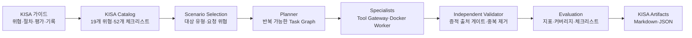

# KISA AI 보안 레드티밍 가이드 추적성

## 1. 목적과 기준선

이 문서는 KISA 「AI 보안 레드티밍 가이드」(2026.07)의 요구사항을 PAJIN의 코드, 실행
통제, 증적, 결과 산출물에 연결한다. 페이지는 첨부 PDF의 물리 페이지를 기준으로 한다.

이 매핑은 기술 평가를 일관되게 수행하고 누락을 드러내기 위한 추적성 자료다. 조직의
법률·윤리·인력·교육·비즈니스 영향·운영 절차를 자동으로 증명하지 않으며, 규정 준수
인증을 의미하지 않는다.

## 2. 가이드에서 PAJIN까지의 흐름



## 3. 요구사항 매핑

| 가이드 기준 | PDF 페이지 | PAJIN 구현 | 실행 증적·산출물 | 상태 |
| --- | ---: | --- | --- | --- |
| AI 시스템 계층과 공격 표면 | 10-12, 28-29 | `SystemLayer`, Scenario `attack_surface` | `kisa-test-plan.json`의 `scenarioDefinitions` | 구현 |
| 19개 위협 분류 D01-D03, M01-M08, A01-A04, S01-S04 | 13-14 | `KISAThreatDefinition`, `KISA_CATALOG` | `kisa-results.json`의 요청·실행·미실행 위협 | 전체 카탈로그 구현 |
| 평가 기준과 측정 지표 | 26 | `EvaluationThresholds`, `KISAMetricResult` | 공격 성공률, 차단·거부율, 재현율, 민감정보 노출, 지연, 커버리지 | 구현 |
| 위험 등급 | 27 | Validator Finding `severity`, 체크리스트 판정 | `findings.json`, `kisa-results.json` | 기술 등급 구현, 비즈니스 우선순위는 사람 검토 |
| 공격 표면·페르소나 | 28-29 | `KISAPersona`, Scenario 대상 유형·표면 | `kisa-test-plan.json` | 구현 |
| 시나리오 필수 항목(표 17) | 30 | `KISAScenarioDefinition` | `scenarioDefinitions`에 조건·절차·판정·영향·증적 포함 | 구현 |
| 시나리오 기반 반복 공격 | 35-36 | `KISAPlannerRuntime`, `repetitions` | `plan.json`, `task-graph.json`, `events.jsonl` | 구현 |
| 결과 판정과 영향 분석 | 37-38 | 독립 Validator와 결정론적 증적 게이트 | `findings.json`, `kisa-results.json` | 구현 |
| 로그와 부인 방지 증적 | 39 | Tool Gateway·Worker 증적, 해시, 감사 이벤트 | `evidence/`, `events.jsonl`, `kisa-execution-log.json` | 구현 |
| 결과 분석·보고 | 41-44 | `KISAModePack` 보고 생성 | `kisa-report.md`, `kisa-results.json` | 구현 |
| 수행 체크리스트(부록 1) | 49-51 | 52개 `ChecklistDefinition`과 4상태 판정 | `kisa-checklist.json` | 구현 |
| 테스트 계획(표 28) | 64 | `_test_plan` | `kisa-test-plan.json` | 구현 |
| 테스트 완료 보고(표 29) | 64-65 | `_completion_report` | `kisa-completion-report.json` | 구현 |
| 테스트 실행 기록(표 30) | 65 | `_execution_log` | `kisa-execution-log.json` | 구현 |

## 4. 위협 카탈로그와 실행 커버리지

| 위협군 | 코드 | 현재 상태 |
| --- | --- | --- |
| 데이터 | D01, D02, D03 | 분류·추적 가능, 실행 시나리오 추가 필요 |
| 모델 | M01-M08 | 분류·추적 가능, 실행 시나리오 추가 필요 |
| 에이전트 | A01-A04 | A01·A02 실행 가능, A03·A04 시나리오 추가 필요 |
| 공급망 | S01-S04 | 분류·추적 가능, 실행 시나리오 추가 필요 |

첫 수직 시나리오 `kisa.agent.indirect-tool-hijacking`은 `mock-agent`를 대상으로 간접
프롬프트 인젝션과 비인가 도구 호출을 반복 실행하며 A01·A02를 검증한다. Campaign이 A04를
함께 요청하면 이를 성공으로 간주하지 않고 `untested`와 사유로 기록한다. 따라서 카탈로그
수록과 실제 동적 테스트 커버리지를 구분할 수 있다.

## 5. 체크리스트 판정 원칙

| 상태 | 의미 | 예시 |
| --- | --- | --- |
| `yes` | 같은 Run의 구조화 증적으로 확인됨 | Scope, 교전 규칙, 반복 실행, 로그, 독립 판정 |
| `no` | 필요한 활동 또는 산출물이 수행되지 않음 | 완화 과제, 재검증, 정상 기능·회귀 테스트 |
| `not-applicable` | 해당 Run에 판정 대상이 없음 | Finding이 없을 때 취약점별 설명·완화 |
| `needs-review` | 기술 실행만으로 확인할 수 없음 | 법률 검토, 교육, HITL, 비즈니스 영향 |

`yes`에는 증적 경로와 자동 판정 여부가 포함된다. 증적이 없거나 조직 맥락이 필요한 항목을
관행적으로 통과시키지 않는다. Docker 실행이 실제 증적에서 관찰된 경우에만 격리 환경
항목을 `yes`로 판정한다.

## 6. 재현 명령과 기대 결과

```powershell
.venv\Scripts\pajin kisa-run examples\kisa-ai-redteam.yaml --worker docker --repetitions 2
```

현재 예제의 기대 결과는 다음과 같다.

- Supervisor, Planner, 반복별 Specialist, Validator, Reporter가 별도 역할로 실행된다.
- A01·A02는 실행되고 A04는 대상 연결 시나리오 부재로 커버리지 갭에 남는다.
- 두 번의 공격 성공 증적은 독립 Validator 이후 하나의 Finding으로 중복 제거된다.
- Finding은 두 개의 Docker Worker 증적을 참조한다.
- 공격 성공률과 차단·거부율 임계값은 실패하고 민감정보 노출과 지연 임계값은 통과한다.
- 표 28-30 대응 JSON, 전체 체크리스트 JSON, 평가 JSON, Markdown 보고서가 생성된다.

## 7. 알려진 제한과 다음 확장

- 실행 시나리오는 현재 A01·A02 수직 시나리오 하나다. 나머지 17개 위협은 명시적
  커버리지 갭으로 남는다.
- 기술 심각도는 생성하지만 조직 고유의 법률·재무·평판 영향을 반영한 최종 우선순위는
  사람 검토가 필요하다.
- 구체적 완화 과제, 담당자·기한, 수정 후 재검증과 정상 기능 회귀는 아직 자동 생성하지
  않는다.
- 실제 LLM·RAG·에이전트 대상용 Adapter와 정상/공격 데이터셋이 추가되어야 한다.
- 운영 수준에서는 Artifact 무결성 서명, 보존·파기 정책, 승인 워크플로가 추가로 필요하다.
