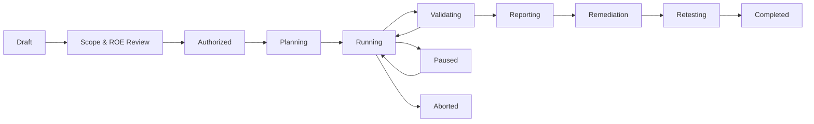
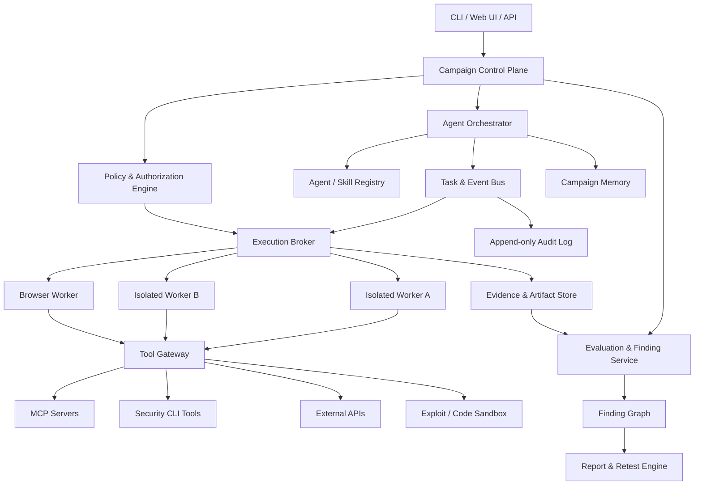
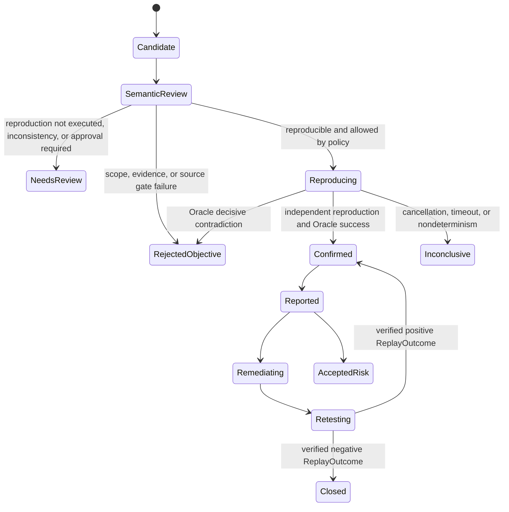

> Languages: [English](PAJIN_PRODUCT_PLAN.en.md) | [한국어](PAJIN_PRODUCT_PLAN.ko.md)

# PAJIN Product Plan

> Autonomous multi-agent AI red team and security validation orchestration platform

| Item | Content |
| --- | --- |
| Document Status | Product Baseline v0.3 |
| Date Created | 2026-07-12 |
| Last Updated | 2026-07-17 |
| Document Purpose | Define the baseline for product direction, scope, core requirements, safety principles, MVP, and roadmap |
| Key References | KISA "AI Security Red Teaming Guide" (2026.07), STRIX, HEXSTRIKE AI, XBOW |

---

## 0. Document Authority and Change Control

The authoritative Korean source at `docs/PAJIN_PRODUCT_PLAN.md` is the top-level baseline that defines PAJIN's
product goals, scope, terminology, and immutable quality criteria. This English localization mirrors that source; if
the two differ, the authoritative source takes precedence. Within the English localized document set, interpret
conflicts in the following order.

1. `docs/PAJIN_PRODUCT_PLAN.en.md` - localized product immutable principles and acceptance criteria
2. The most recent Accepted ADR that explicitly amends or supersedes a prior decision in the same scope - technical decisions that implement the immutable principles
3. `docs/KISA_TRACEABILITY.en.md` - the linkage status between KISA requirements and implementation evidence
4. `README.en.md` - how to run the current code, supported scope, and known implementation gaps

ADRs may concretize the immutable principles of the product plan, but they may not relax them implicitly. To
change an immutable principle, the authoritative plan must be revised first, and the reason for the change and
migration impact must be recorded in a new ADR. Only then may the implementation proceed. If the current behavior of the code
or README differs from the baseline, it is not treated as a new product plan and is instead managed as an
explicit implementation gap.

### 0.1 Fixed Finding Validation Principles

The following principles are concretized by [`ADR-0027`](adr/0027-independent-reproduction-confirmation-boundary.en.md)
and may not be weakened for implementation convenience.

- A Semantic Validator that rereads existing evidence and judges its meaning is an evidence reviewer, not an independent
  reproducer.
- A Candidate becomes `confirmed` only when a separate restricted Reproducer reproduces the same claim with a fresh request
  and fresh evidence lineage, and a mode-owned Oracle and objective evidence gate support it.
- The LLM does not directly generate or execute attack Tools, arbitrary commands, URLs, or Capability Grants.
  A non-executable `ReplayIntent` proposed by the LLM must pass through a compiler and policy checks inside the trust boundary.
- If independent reproduction has not yet been executed or is not an automatic reproduction target, the maximum status is
  `needs-review`; if execution disruption, cancellation, or timeout prevents a conclusion, the status is `inconclusive`.
- Previously sealed Runs are not rewritten. Historical `confirmed` decisions without reproduction are identified as legacy
  judgments and are not reinterpreted as `confirmed` under this baseline.
- Remediation complete (`fixed`) is claimed only when there is a separate Restricted Replay and canonical receipt exactly
  bound to a reproduction-backed Confirmed Finding in sealed `validation/v1alpha1`. In every expected repetition, the
  trusted negative Oracle must explicitly contradict the original vulnerability claim; mere absence of signals or a Worker
  judgment is not proof.
- Normal-functionality regressions are recorded separately from a vulnerability's `fixed` status. Even if an individual Finding
  is remediated, comprehensive release-level revalidation success additionally requires no new Findings from a separate
  fresh discovery and successful normal-functionality regression results.

---

## 1. Executive Summary

PAJIN is an autonomous multi-agent system in which AI plans the full security testing process, dynamically assembles
the necessary specialist agents, safely delegates MCP, Skills, CLI, browsers, and security tools, and explores,
validates, and reports real vulnerabilities.

PAJIN aims to provide the following three execution modes on top of one common engine.

1. **AI Red Team Mode**: security, safety, quality, and performance validation for LLMs, RAG, AI agents, MCP, guardrails, and AI applications
2. **Bug Bounty Mode**: reconnaissance, vulnerability discovery, PoC validation, and report generation compliant with program policy and allowed scope
3. **CTF Mode**: automated problem solving in isolated competition environments for web, pwnable, reversing, forensics, cryptography, and more

PAJIN's competitiveness does not come merely from connecting many offensive tools. It treats the following as core
product values.

- Practical autonomy that can carry execution through to completion inside approved scope
- Least privilege and attenuated delegation by agent and tool
- Event, conversation, tool-call, and environment evidence that makes the entire experiment reproducible
- Low false-positive rates by combining automated exploration, independent validation agents, and HITL when needed
- Planning, rules of engagement, execution logs, result reporting, and revalidation artifacts aligned with the KISA guide
- A structure that expands security domains on the same core through Mode Packs and Skill Packs

### 1.1 Current Implementation Baseline

As of 2026-07-17, PAJIN is **building a CLI-based policy-controlled multi-agent security validation backend MVP**.
Phases 0 and 1 are complete, and Phase 2 has implemented the execution core, Replay contract, Compiler, single-use ticket,
Restricted Reproducer, exact KISA M03, M06, A04 fresh-session materializer, live transcript Oracle, runner coordinator,
verified receipt reload common Gate, append-only `validation/v1alpha1` projection, and the baseline Candidate-bound
negative KISA retest Gate. The stable SQLite ledger and post-restart read-only verifier for M6-06 persist local KISA
positive and negative replay tickets. M6-07A added the exact KISA Candidate -> SQLite replay -> common Gate path with
explicit opt-in for general Local execution. Default Local execution does not perform automatic replay. Control Plane
replay-ticket orchestration is split into M6-07B. Before implementation,
[`ADR-0029`](adr/0029-control-plane-replay-orchestration.en.md) must be accepted to finalize artifact handoff, lease
fencing, PostgreSQL ticket/batch/item, and durable budget/rate design. Portable/off-host signed proof, materializers
and Oracles for other Modes, and structured collaboration memory are follow-on work.
Phase 3 Mode Packs are functional with restricted execution scenarios, and Phase 4 has been implemented through the
first vertical slice of the Control Plane.

| Area | Implementation Status | Current Boundary |
| --- | --- | --- |
| Common Engine | In progress | Supervisor, Planner, dynamic Specialists, Semantic Validator, Reporter, and task-graph execution; Replay contract, Compiler, single-use ticket, Restricted Reproducer, local KISA SQLite ticket ledger, Multi-Agent and explicit Local exact KISA orchestration, and receipt reload common Gate implemented; replay orchestration outside KISA is follow-on work |
| Policy and Authorization | Complete | Scope, Capability attenuation, lineage-based call budgets, risk tiering, approvals, Kill Switch |
| Execution Isolation | MVP complete | Docker Worker, default egress deny, allowlist proxy, registered MCP and fixed Tools |
| AI Red Team | In progress | Cataloged 19 KISA threats and 52 checklists and executes A01, A02, A04, M03, M06; hardened retest and normal-functionality regression linkage on a reproduction-backed baseline |
| Bug Bounty | In progress | Policy, Scope, deduplication, local reporting, and fixed Boolean SQLi local lab execution |
| CTF | In progress | Local Web backup exposure, offline Single-byte XOR, Web + Crypto Suite execution |
| Control Plane | Initial implementation | FastAPI, PostgreSQL Job queue, approval checkpoints, fence-style cancellation, lease and heartbeat, single Worker daemon; replay orchestration is M6-07B and requires acceptance of ADR-0029 first |
| Product UI and Ecosystem | Initial implementation | Same-origin Web Console for submit, inspect, approve, resume, and cancel; Agent Graph, Pack registry, and external integrations are follow-on work |

The current default interface is CLI + YAML, and it does not provide general offensive automation or automated
submission against external targets. For detailed safety boundaries and reproduction commands, refer to the repository
`README.en.md`; for KISA coverage, refer to `docs/KISA_TRACEABILITY.en.md`; for confirmed technical decisions, use
`docs/adr/` as the source of truth.

---

## 2. Background and Problem Definition

### 2.1 Limitations of Current Security Automation

Existing security scanners and LLM-based offensive automation tools have the following limitations.

- They automate individual tool executions, but adaptively evolving an end-to-end attack strategy remains difficult.
- They do not validate whether discovered results are actual vulnerabilities, so false positives accumulate.
- Even when multiple agents collaborate, permissions, scope, budget, and stop conditions are not applied consistently.
- Tool-call results and conversation context are separated, making attack-chain reproduction difficult.
- Powerful MCP and shell permissions can be overexposed to agents.
- AI red teaming, bug bounty, and CTF are fragmented across different tools and workflows.
- It is difficult to transform technical results into artifacts that executives, development teams, and regulatory responders can use.

### 2.2 Problems PAJIN Must Solve

PAJIN must answer the following questions consistently.

- What can be tested, why, and to what extent?
- Which agent was created on what basis?
- What tools and resources can each agent access?
- Does tool execution satisfy the rules of engagement, legal scope, and cost limits?
- Are the discovered results actually reproducible and impactful?
- Who executed what, when, with what inputs and environment?
- After remediation, has the vulnerability been removed and normal functionality preserved?

---

## 3. Product Vision

### 3.1 Vision

> Build a trustworthy autonomous AI red team platform where security experts define goals and rules of engagement, and PAJIN assembles the right agent team and performs exploration, attack, validation, reporting, and revalidation in allowed environments.

### 3.2 Mission

- Automate repetitive security testing while supporting expert-level attack-chain exploration.
- Ensure that stronger offensive capabilities receive stronger controls and evidence requirements.
- Connect AI security and traditional application security in a single campaign.
- Preserve automation results as structured data assets that can be used for audit and improvement.

### 3.3 Product Principles

1. **Scope First**: Every execution starts from explicit targets, allowed scope, and excluded scope.
2. **Least Privilege**: Agents temporarily hold only the minimum authority required for the task.
3. **Authority Attenuation**: Child agents cannot receive broader authority than their parent.
4. **Evidence or It Did Not Happen**: A success claim without evidence is not a validated Finding.
5. **Validate Before Report**: Results from exploration agents are confirmed by an independent validation procedure.
6. **Reproducibility by Default**: Version the model, prompt, tools, input, output, and environment.
7. **Safe Autonomy**: Autonomy is not absence of control but unattended execution within preapproved policy.
8. **Human Escalation on Uncertainty**: Escalate high-risk, ambiguous, or policy-conflict situations to a human.
9. **Mode-Aware Behavior**: CTF, bug bounty, and AI red team have different default policies.
10. **Extensible but Governed**: New MCPs, Skills, and Tools are used only after registration, validation, and authority classification.

---

## 4. Definition of Autonomy

In PAJIN, **fully automated** does not mean that agents act without limits.

> It means a state in which a campaign can be completed without additional input, within user-preapproved goals, scope, resources, time, cost, tool tiers, data handling rules, and stop conditions.

### 4.1 Autonomy Levels

| Level | Name | Description | Recommended Use |
| --- | --- | --- | --- |
| L0 | Manual | The user directly requests every tool execution | Debugging, sensitive production environments |
| L1 | Assisted | AI proposes plans and commands and the user executes them | Initial adoption, training |
| L2 | Supervised | Low-risk tools execute automatically and high-risk tools require per-action approval | General operational checks |
| L3 | Policy-Autonomous | Automatic execution within preapproved policy and budget | Staging, bug bounty, regular checks |
| L4 | Lab-Autonomous | Automatic execution including aggressive tools in an isolated laboratory | CTF, owned test labs |

The default for the initial product is **L2**, and after trustworthy isolation and the policy engine are validated,
**L3** will be the primary offering. **L4** is allowed only in explicitly isolated CTF and lab environments.

---

## 5. Goals and Non-Goals

### 5.1 Product Goals

- Manage goals, scope, access level, rules of engagement, and success criteria at the campaign level.
- Dynamically create and terminate specialist agents according to the task.
- Provide MCP, Skills, CLI, API, browser, and code executors through an integrated tool model.
- Grant different tool, network, file, and secret permissions to each agent.
- Provide collaborative memory that shares reconnaissance results and connects attack chains.
- Report candidate Findings only after reproduction, independent validation, and deduplication.
- Support the KISA guide's flow of planning, execution, recordkeeping, result reporting, and follow-up actions.
- Generate outputs in Markdown, JSON, SARIF, and future PDF formats.
- Start from a single local machine and scale to distributed workers.

### 5.2 Initial Non-Goals

- Offensive automation against unauthorized or unclear targets
- Automatic execution of destructive DoS, data deletion, or ransomware-like behavior in production environments
- Proving impact through actual data theft or exfiltration
- Directly embedding every security tool into the PAJIN core
- Automatic remediation of every Finding and unreviewed deployment
- Replacing full SIEM, SOAR, or EDR functionality
- Training foundational models or hosting large models at scale

---

## 6. Target Users and Personas

| User | Primary Goal | Core Need |
| --- | --- | --- |
| Red Team Lead / PM | Campaign planning and management of scope, risk, and schedule | Rules of engagement, progress visibility, stop and approval controls, reports |
| AI Red Team Specialist | Validation of jailbreaks, injections, and RAG or agent vulnerabilities | Attack datasets, multi-turn attacks, Judge, reproducibility |
| Penetration Tester | Discovery of web, API, and infrastructure vulnerabilities and PoCs | Browser, proxy, shell, scanners, evidence collection |
| Bug Bounty Hunter | Efficient discovery and reporting within program scope | Scope compliance, duplicate prevention, PoC, report templates |
| CTF Player / Team | Fast problem classification and parallel solving | Category-specific agents, isolated execution, flag validation |
| AI / Application Engineer | Root cause analysis, remediation, and regression testing | Reproduction scripts, logs, remediation guidance, revalidation |
| Security Manager / Auditor | Understanding risk and control state | Risk summaries, audit logs, standards mapping, residual risk |
| Platform Administrator | Operation of models, tools, workers, and secrets | Access control, cost, isolation, observability, policy management |

---

## 7. Core Usage Scenarios

### 7.1 AI Red Team Mode

#### Targets

- Foundation models and fine-tuned models
- System prompts and guardrails
- RAG, vector databases, and document repositories
- AI agents, MCP servers, Skills, and Function Calling
- User interfaces, APIs, and file uploads
- Data pipelines, model serving, CI/CD, and access control

#### Major Threats

- Prompt injection and indirect prompt injection
- Jailbreaks and policy bypass
- Leakage of system prompts, training data, and RAG data
- Improper output handling
- Agent hijacking and tool misuse
- Agent memory poisoning
- Cost, token, and call amplification and agent DoS
- Supply-chain risks for models, data, and extensions
- Hallucination, bias, over-refusal, and performance degradation

#### Representative Flow

1. Register the target connector and model or prompt versions.
2. Select supported languages, domain, risk classification, and evaluation criteria.
3. An attack-surface analysis agent assembles the test plan.
4. An Attacker agent generates seeds and mutation strategies.
5. A Target Runner executes single-turn, multi-turn, and indirect injection scenarios.
6. Rules, classifiers, and the LLM Judge evaluate the results.
7. Inconsistent or high-risk results are sent to a Validator or HITL.
8. Confirmed Findings are mapped to KISA threat classification and impact criteria.
9. After remediation, attack regression and normal-query regression are executed together.

### 7.2 Bug Bounty Mode

#### Required Input

- Program name and original policy text
- In-scope and Out-of-scope assets
- Allowed and prohibited testing techniques
- Rate limits and testing hours
- Accounts, roles, and test-data conditions
- Data access, retention, and deletion rules
- Report format and severity criteria

#### Representative Flow

1. A Scope Parser structures the program policy.
2. The user reviews the interpretation result and approves the campaign.
3. A Recon agent executes passive and active reconnaissance separately.
4. Specialist agents analyze web, API, authentication, business logic, and more in parallel.
5. Candidate vulnerabilities are validated by a separate Validator using a minimal-impact method.
6. Existing Findings, public issues, and same-root-cause candidates are deduplicated.
7. A Reporter generates a report including reproduction steps, impact, evidence, and recommendations.

#### Default Prohibitions

- Access to out-of-scope assets
- Unnecessary reading or storage of other users' data
- Mass traffic, service disruption, and social engineering
- Establishing persistence or installing backdoors
- Data changes or exfiltration not required to prove the vulnerability

### 7.3 CTF Mode

#### Supported Categories

The categories below are the target scope of support. As of 2026-07-17, executable CTF implementations are
limited to Web and Cryptography; Pwn / Binary Exploitation, Reverse Engineering, Digital Forensics, OSINT,
and Miscellaneous remain planned scope.

- Web
- Pwn / Binary Exploitation
- Reverse Engineering
- Digital Forensics
- Cryptography
- OSINT
- Miscellaneous

#### Representative Flow

1. Collect the problem statement and provided files.
2. A Triage agent classifies the category and solution hypotheses.
3. Category-specific specialist agents are created in parallel.
4. Each agent receives an isolated workspace and tool authority.
5. Intermediate results are exchanged through a shared Artifact Store.
6. A Verifier validates the result by checking the flag format or querying the scoring server.
7. The solution process and final write-up are generated.

CTF Mode allows the broadest use of aggressive tools, but network and file access remain tightly restricted to the
competition target and isolated environment.

---

## 8. Common Campaign Lifecycle

The diagram and state table below define the target end-to-end Campaign lifecycle, not the currently persisted
runtime state machine. As of 2026-07-17, local execution implements only `RunStatus` values `running`,
`completed`, `failed`, and `cancelled`; Control Plane execution implements only `RunState` values `queued`,
`running`, `awaiting-approval`, `completed`, `failed`, and `cancelled`. The remaining lifecycle stages are product
workflow concepts and are not yet all distinct persisted runtime states.



### 8.1 State Definitions

| State | Meaning | Entry Condition |
| --- | --- | --- |
| Draft | Campaign draft | Target and purpose created |
| Scope & ROE Review | Scope and rules-of-engagement review | Required fields completed |
| Authorized | Execution authority secured | Approver and evidence registered |
| Planning | Agent assembles attack plan | Policy validation passed |
| Running | Tools and scenarios running | Budget and workers secured |
| Validating | Candidate Finding validation | Candidate results exist |
| Reporting | Results and residual risk being organized | Validation stage complete |
| Remediation | Improvement work being tracked | Report approved |
| Retesting | Same and mutated attacks plus regression testing | Remediation deployed |
| Completed | Campaign closed | Exit criteria satisfied |
| Paused | Temporarily paused by user, policy, or system | Resumable |
| Aborted | Emergency stop or approval revoked | Execution authority revoked |

---

## 9. KISA Guide Reflection Model

PAJIN reflects the KISA guide's `Preparation → Execution → Result Reporting → Follow-up Action` in the product
workflow and data model.

### 9.1 Threat Classification

| Group | Code | PAJIN Application Area |
| --- | --- | --- |
| Data Threats | D01-D03 | Datasets, pipelines, de-identification evaluation |
| Model Threats | M01-M08 | Evaluation of models, prompts, guardrails, outputs, and availability |
| Agent Threats | A01-A04 | Evaluation of Tool Gateway, memory, MCP, and execution loops |
| Supply Chain Threats | S01-S04 | Validation of origin and version for models, data, tools, and plugins |

### 9.2 Mapping Guide Requirements to Product Features

| KISA Activity | PAJIN Feature |
| --- | --- |
| Pre-test coordination and rules of engagement | Campaign Manifest, ROE Policy, approval workflow |
| Setting targets, scope, and exclusions | Target Registry, Scope Rules, Deny Rules |
| Black, gray, and white box access | Access Profile and Credential Grant |
| Attack surface identification | Attack Surface Graph |
| Persona definition | Agent Persona and Threat Actor Profile |
| Attack scenario construction | Scenario Template and Planner |
| Least-privilege access to assets | Capability Grant and temporary Secret Lease |
| Emergency reporting and stop | Kill Switch, Policy Tripwire, Escalation Queue |
| Automated attacks and in-depth expert review | Attacker Agents, Validator, HITL Review |
| Impact and root cause analysis | Finding Graph, Impact Model, Root Cause Field |
| Log and evidence management | Append-only Event Log, Evidence Store, Hash Manifest |
| Result reporting | Executive, Technical, and Compliance Report Generator |
| Revalidation and regression testing | Retest Campaign, Security/Utility Regression Suite |
| Continuous inspection | Schedule, CI/CD Trigger, Baseline Drift Detection |
| CVD/VDP integration | Disclosure Package and status tracking |

### 9.3 Required Artifacts

- Test plan
- Rules of engagement and approval records
- Target, scope, and excluded-scope list
- Threat model and attack-surface graph
- Scenarios and success or stop criteria
- Test execution logs
- Attack-chain snapshots
- Reproduction scripts and visual evidence
- Vulnerability details and risk summary
- Test completion report
- Improvement plan and revalidation results

---

## 10. Product Architecture

### 10.1 Logical Architecture



### 10.2 Control Plane

The Control Plane does not execute directly; it decides the following.

- Campaign state and approval state
- Targets and scope
- Agent creation, stop, and retry
- Task graph and priority
- Authority and policy decisions
- Cost, time, call, and token budgets
- Validation state of candidate Findings
- Reporting and revalidation flow

### 10.3 Execution Plane

The Execution Plane runs actual tools in isolated environments.

The confirmed decisions for the initial Docker isolation and Tool Gateway follow
[`ADR-0002`](adr/0002-tool-gateway-and-worker-isolation.en.md).

- Temporary workers at campaign or task granularity
- Read-only default filesystem and restricted working directory
- Target-based network egress allowlist
- Limits on CPU, memory, processes, time, disk, and request rate
- Temporary credential injection and automatic revocation
- Collection of stdout, stderr, files, network, and screenshot evidence
- Cleanup on worker termination and Artifact preservation

### 10.4 Internal Standardization Layer

The external MCP protocol is not used directly as PAJIN's internal authority model. All external tools are normalized
into an internal `ToolSpec`.

Minimum fields of `ToolSpec`:

- Tool ID, name, version, provider
- Input and output JSON Schema
- Risk tier and expected side effects
- Required authority for network, files, processes, and secrets
- Supported execution environments
- Default time, cost, and call limits
- Whether it is idempotent
- Evidence collection method
- Supply-chain validation information and license

This allows MCP, Skills, local CLI, and HTTP API to pass through the same Policy Engine.

---

## 11. Multi-Agent Model

### 11.1 Default Agent Roles

| Role | Responsibility | Default Tool Authority |
| --- | --- | --- |
| Campaign Manager | Goal decomposition and management of schedule, budget, and exit criteria | Metadata read, task creation |
| Planner | Attack-surface and scenario design | Target information and knowledge-base read |
| Recon Agent | Asset and endpoint discovery | Passive and restricted active reconnaissance |
| Web / API Agent | Discovery of web and API vulnerabilities | Browser, proxy, HTTP tools |
| Code Agent | Source, configuration, and dependency analysis | Repository read, restricted build and test |
| AI Security Agent | Attacks on models, RAG, and agents | Target Connector, attack datasets |
| CTF Specialist | Category-specific problem solving | Isolated analysis and attack tools |
| Semantic Validator | Candidate claim and evidence analysis and non-executable ReplayIntent proposal | Provider calls only, no offensive tools |
| Restricted Reproducer | Independent reproduction of candidate vulnerabilities | Replay-only least-authority tools bound to the original request |
| Judge | Quantitative and qualitative evaluation and inconsistency detection | Rules, classifiers, evaluation models |
| Reporter | Technical, business, and regulatory reporting | Read confirmed Findings and evidence |
| Retest Agent | Re-attack and normal-functionality checks after remediation | Saved reproduction assets and target access |

### 11.2 Dynamic Creation Rules

An agent creation request must include the following information.

- Reason for creation and the task to solve
- Expected deliverables
- Parent agent and responsibility relationship
- Requested Capability list
- Time, token, cost, and tool-call budget
- Exit conditions
- Maximum retry count
- Creation depth and concurrent-agent limit

### 11.3 Authority Delegation Invariants

```text
child.scope       ⊆ parent.scope
child.capability  ⊆ parent.delegable_capability
child.budget      ≤ parent.remaining_budget
child.expiry      ≤ parent.expiry
child.risk_tier   ≤ campaign.max_risk_tier
```

If a child agent requests higher authority, the parent cannot grant it directly, and it must go through Policy Engine
reevaluation and any required approval procedure.

### 11.4 Collaborative Memory

Memory is separated into four kinds.

1. **Immutable Evidence**: original requests, responses, tool results, file hashes
2. **Campaign Facts**: validated assets, account roles, technology stack, constraints
3. **Hypotheses**: attack hypotheses not yet validated and their confidence
4. **Agent Working Memory**: temporary reasoning and task state of individual agents

External documents, web pages, and RAG results are marked as untrusted data and are not treated as commands. Facts
promoted into memory must carry source and validation status.

---

## 12. Authorization and Safety Model

### 12.1 Capability Grant

Tool-use authority is issued not by role name but by concrete Capability.

Example:

```yaml
capability_grant:
  subject: agent:web-validator-02
  campaign: campaign-2026-001
  tools:
    - http.request
    - browser.navigate
    - browser.screenshot
  targets:
    allow:
      - https://staging.example.com/**
    deny:
      - https://staging.example.com/admin/delete/**
  network:
    methods: [GET, HEAD, POST]
    requests_per_minute: 30
  filesystem:
    read: [/workspace/evidence/input]
    write: [/workspace/evidence/output]
  secrets:
    leases: [test-user-session]
  limits:
    expires_in: 20m
    max_calls: 200
    max_cost_usd: 3.00
  delegable: false
```

### 12.2 Tool Risk Tiers

| Tier | Description | Example | Default Policy |
| --- | --- | --- | --- |
| T0 | Local and metadata read | File list, log lookup, static analysis | Auto-allow |
| T1 | Passive external observation | DNS lookups, public information search | Allow after scope validation |
| T2 | Non-destructive active testing | Restricted HTTP requests, safe scans | Allow with budget and rate limits |
| T3 | State change or actual exploitation is possible | Auth-bypass validation, code-execution PoC | Preapproval or per-action approval |
| T4 | Destructive, persistent, or large-scale impact possible | DoS, deletion, persistence, external exfiltration | Deny by default, isolated labs only as an exception |

### 12.3 Policy Decision Order

1. Validity of campaign approval
2. Whether the target is included in Allow Scope
3. Deny Scope and prohibited actions applied first
4. Whether the agent holds the Capability
5. Maximum risk tier by mode
6. Time, cost, request-rate, and concurrency budgets
7. Data handling and secret policy
8. Whether approval or HITL is required
9. Whether evidence can be collected after execution

`deny` always takes precedence over `allow`.

### 12.4 Kill Switch and Tripwire

Immediate stop conditions:

- Attempted access to out-of-scope targets
- Unexpected exposure of real personal data, credentials, or confidential information
- Service error rate, latency, or resource use exceeding thresholds
- Sudden increase in cost or tool-call volume
- Agent infinite loop or repeated failure
- Detection of privilege escalation or policy bypass attempts
- Failure in audit logs or evidence collection
- Approval revoked or target ownership unclear

On stop, new Tool Invocations are blocked, running processes are terminated, Secret Leases are revoked, and a state
snapshot is preserved.

---

## 13. Core Functional Requirements

Priority is defined as `P0 = MVP required`, `P1 = first public release`, and `P2 = expansion`.
This table is the target requirements backlog, not the current implementation completion table. For actual
implementation status and limits, refer to Sections 1.1 and 21.

### 13.1 Campaign & Scope

| ID | Requirement | Priority |
| --- | --- | --- |
| CAM-001 | Create, clone, pause, resume, and abort campaigns | P0 |
| CAM-002 | Manage goals, success criteria, and start and exit criteria | P0 |
| CAM-003 | Manage targets, allowed scope, excluded scope, and access level | P0 |
| CAM-004 | Register rules of engagement and approval evidence | P0 |
| CAM-005 | Snapshot model, prompt, and application versions | P1 |
| CAM-006 | Scheduled execution and CI/CD event-based execution | P1 |

### 13.2 Agent Orchestration

| ID | Requirement | Priority |
| --- | --- | --- |
| AGT-001 | Execute predefined agents | P0 |
| AGT-002 | Create task graphs and manage dependencies | P0 |
| AGT-003 | Dynamically create and terminate child agents | P1 |
| AGT-004 | Per-agent budget, authority, and time limits | P0 |
| AGT-005 | Share facts and Artifacts between agents | P0 |
| AGT-006 | Failure retry, fallback strategy, and checkpoint recovery | P1 |
| AGT-007 | Limits on creation depth, count, and concurrency | P0 |

### 13.3 Tool & Execution

| ID | Requirement | Priority |
| --- | --- | --- |
| TOL-001 | MCP, CLI, HTTP, and browser Tool Adapters | P0 |
| TOL-002 | ToolSpec registration and risk-tier management | P0 |
| TOL-003 | Policy checks before every tool call | P0 |
| TOL-004 | Container-based isolated execution | P0 |
| TOL-005 | Network egress and file-access restrictions | P0 |
| TOL-006 | Temporary Secret Lease issuance, masking, and revocation | P1 |
| TOL-007 | Tool status, version, and supply-chain information checks | P1 |
| TOL-008 | Remote and distributed worker scheduling | P2 |

### 13.4 Evidence & Findings

| ID | Requirement | Priority |
| --- | --- | --- |
| EVD-001 | Record inputs, outputs, tool arguments, latency, and errors | P0 |
| EVD-002 | Connect multi-turn conversations and tool calls into a single Trace | P0 |
| EVD-003 | Store files, screenshots, and HTTP transcripts | P0 |
| EVD-004 | Artifact hashing and change detection | P1 |
| FND-001 | Separate candidate and confirmed Findings | P0 |
| FND-002 | Require independent reproduction and at least one validation basis | P0 |
| FND-003 | Duplicate and same-root-cause clustering | P1 |
| FND-004 | Classification mapping for KISA, OWASP, CWE, CVSS, and more | P1 |
| FND-005 | Evaluate impact, exploitability, reproducibility, and detectability | P0 |

### 13.5 Evaluation & Reporting

| ID | Requirement | Priority |
| --- | --- | --- |
| EVL-001 | Combination of rules, classifiers, and LLM Judge | P0 |
| EVL-002 | Record Judge disagreement and confidence | P0 |
| EVL-003 | HITL queue for high-risk and ambiguous results | P1 |
| RPT-001 | Markdown and JSON result reporting | P0 |
| RPT-002 | Separate executive summary and technical detail | P1 |
| RPT-003 | Generate KISA checklist and completion report | P1 |
| RPT-004 | Export to SARIF, PDF, and issue trackers | P2 |
| RPT-005 | Generate remediation recommendations and revalidation campaigns | P1 |

---

## 14. Data Model

### 14.1 Major Entities

| Entity | Role |
| --- | --- |
| Project | Long-lived target and team-level container |
| Campaign | A single unit of red teaming, bug bounty, or CTF execution |
| Target | A target such as a domain, API, repository, model, file, or scoring server |
| ScopeRule | Allowed and denied targets, paths, methods, and time windows |
| RuleOfEngagement | Allowed techniques, prohibited actions, stop conditions, contact chain |
| Authorization | Evidence of ownership, approving party, and validity period |
| Scenario | Attack goal, preconditions, execution procedure, and decision criteria |
| AgentDefinition | Role, prompt, tool requirements, and default policy |
| AgentInstance | Running agent instance within a campaign |
| CapabilityGrant | Temporary authority granted to an agent |
| Task | Executable work plus dependency, status, and budget |
| ToolInvocation | A tool call from policy decision through execution result |
| Trace | Execution trace linking agent conversation, task, and tool calls |
| Artifact | A file, screenshot, log, packet, or reproduction script |
| CandidateFinding | Candidate discovered during the exploration stage |
| Finding | A vulnerability confirmed through independent reproduction, including impact and root cause |
| Evaluation | Decisions and criteria from Judges and humans |
| Remediation | Owner, remediation action, due date, and status |
| Retest | Immutable-baseline-bound attack ReplayOutcome and separate normal-functionality regression result |
| Report | Result artifact at a specific point in time |
| AuditEvent | Immutable security and operational event |

### 14.2 Finding Status



`Duplicate` is not a validation disposition but a separate triage relationship. A duplicate judgment does not delete or
change the Candidate or Validation Decision.

`Closed` is not a state that deletes a prior Confirmed Decision or changes it to `rejected-objective`.
The history of the sealed baseline remains unchanged, and it is added as a separate lifecycle state only when an
exactly bound retest relationship has a trusted negative Oracle `contradicts` result and canonical receipt.
Results where support was not observed from the prior positive Oracle remain `inconclusive` and cannot be used as
basis for `Closed`.

### 14.3 Required Finding Fields

- Unique ID and title
- First discovery and final validation time
- Target and affected components
- Threat classification and mapping to security taxonomies
- Preconditions and attack path
- Reproducible input, procedure, and script
- Observed result and expected result
- Impact on confidentiality, integrity, availability, safety, and quality
- Exploitability, reproducibility, and detectability
- Technical severity and business priority
- Root cause hypothesis and confidence
- Evidence Artifact list and hashes
- Mitigation recommendation and revalidation criteria

---

## 15. Evaluation Strategy

### 15.1 Multi-Judgment

Do not use the decision of a single LLM Judge as the final result.

1. **Deterministic Checks**: regex, schema, response code, tool calls, data leakage tokens, and more
2. **Specialized Classifier**: harmfulness, injection, secret-detection, and policy classification models
3. **LLM Judge**: context, feasibility, and domain impact evaluation
4. **Semantic Validator**: review of claim, context, impact, and reproduction conditions with a different prompt or model
5. **Restricted Reproducer + Oracle**: independent reproduction with fresh requests and evidence in a separate execution environment
6. **Human Review**: Critical findings, judgment disagreement, novel attacks, legal or ethical ambiguity

Candidate preservation, multiple validation states, and deterministic evidence gates follow
[`ADR-0025`](adr/0025-candidate-validation-ledger-and-replay-boundary.en.md). Stage 1 preserves Findings returned by
the legacy Validator as Candidates and implemented a Decision snapshot per Candidate.
[`ADR-0026`](adr/0026-trusted-kisa-candidate-admission.en.md) added a trusted Candidate Producer that recalculates
the `ai.chat-probe` catalog, typed requests, execution identity, and actual transcript for KISA.

The two stages themselves only harden Candidate admission and original evidence review.
Under [`ADR-0027`](adr/0027-independent-reproduction-confirmation-boundary.en.md), a Candidate that only passes
Semantic Validator agreement and the objective gate can be at most `needs-review`, and it cannot be promoted to
`confirmed` without fresh requests and evidence from a separate Restricted Reproducer and success from the Mode Oracle.
The current common Gate preserves Candidates that pass semantic support and the objective gate as `needs-review` with
reason `independent-reproduction-missing` and excludes them from `findings.json`. Versioned contracts for
`ValidationPacket`, `ReplayIntent`, `ModeReplayContract`, `CompiledReplaySpec`, `ReplayAttempt`,
`ReplayOracleResult`, `ReplayOutcome`, and the common `AIChatProbeOutput` are implemented. The contracts bind
Candidate, Run, original request, fresh request, Mode, Scenario, Tool, Target, and Threat, and reject executable
model outputs and identifier substitution. The deterministic Replay Compiler compares the original Plan, actual
ToolRequest, Specialist Grant, and evidence digest, rechecks scope, cancellation, approval, and budget, and then
issues a dedicated non-delegable Grant and opaque single-use ticket limited to one Tool, one Target, and at most
five minutes. The Restricted Reproducer atomically claims the ticket and executes `stateless` work or restricted
fresh-session work from a registered trusted materializer through the existing Tool Gateway and Worker. It applies
campaign-wide budget and rate limits plus parent cancellation all the way to the async Mode Oracle, and prohibits
new Secret Lease requests from the Tool Adapter. It then validates the fresh request, exactly corresponding evidence
JSON, and typed Oracle result, and seals the separate replay Run twice. A dedicated loader then rechecks the Artifact
digest, the direct lineage of both Seals, and ticket finalization. Unregistered session-bearing contracts remain
closed as `unsupported`.

The Multi-Agent path of `kisa-run` validates the sealed original Run and then executes eligible trusted Candidates in
a separate replay Run. The M03, M06, and A04 fresh-session materializers replace only `session_id` among the
compiler-bound arguments for each repetition, and the live Oracle ignores the Worker's `vulnerable` and `matched`
values and recalculates from the raw transcript and catalog checks. `kisa-replay-index.json` links the original
Candidate, Decision, and request to the replay Run, Outcome, and receipt seal root. The common Gate does not trust
memory objects and instead revalidates each replay Run's double seal and ticket finalization, then applies a common
reason matrix. It does not change the original flat Candidate, Decision, or `findings.json`, and adds only new
`validation/v1alpha1` Decision, Finding, and Markdown projections from the new seal. When a verified receipt exists,
`confirmationMutationApplied` in the index is `true`; otherwise it is fail-closed `false`. Validator-only bypass
blocking, Candidate preservation, and `inconclusive` sealing on cancellation or failure remain unchanged.

Under [`ADR-0028`](adr/0028-durable-local-replay-ticket-ledger.en.md), the local KISA positive path and
baseline-bound negative replay coordinator receive a stable SQLite ledger outside each individual sealed replay Run.
The ledger preserves canonical compilation, source root, replay Run, and issuance context digests, and records
`issued → claimed → finalized` state transitions and the event journal in a single transaction. After the execution
process exits, a new verifier opens the SQLite URI with `mode=ro` and rechecks the ticket, compilation, source or
replay lineage, Artifact digest, and final seal root from the receipt. The existing in-memory authority remains for
unit tests and API compatibility. The trust anchor of this implementation is the local DB and OS account/ACL, and it
does not mean PostgreSQL Control Plane replay authority or externally verifiable portable signatures.

### 15.2 Confidence Calculation Factors

- Repetition success rate under identical conditions
- Success rate under mutated inputs
- Whether independent reproduction by the Restricted Reproducer succeeded
- Directly observed system state changes
- Evidence completeness
- Agreement rate between Judges
- Environmental dependency and nondeterminism

### 15.3 AI Red Team Metrics

- Attack Success Rate
- Block / Refusal Rate
- Over-refusal Rate
- Reproducibility Rate
- Sensitive Data Exposure Count
- Unauthorized Tool Invocation Count
- Mean Turns to Compromise
- Token / Cost Amplification
- Latency and Resource Degradation
- Judge Agreement Rate

---

## 16. User Experience

### 16.1 Initial Interface

The MVP prioritizes CLI and YAML Campaign and Mode Pack manifests. The currently implemented command surface is as
follows, and the options for each command use `pajin <command> --help` as the source of truth.

| Area | Current Commands |
| --- | --- |
| Common Execution | `pajin validate`, `pajin run`, `pajin multi-run`, `pajin multi-cancel-check` |
| Provider and Agent Loop | `pajin provider-check`, `pajin provider-agent-run`, `pajin tool-loop-run`, `pajin tool-loop-approval-check` |
| KISA AI Red Team | `pajin kisa-run`, `pajin kisa-plan-remediation`, `pajin kisa-retest` |
| Bug Bounty | `pajin bug-bounty-review`, `pajin bug-bounty-compile`, `pajin bug-bounty-report`, `pajin bug-bounty-run` |
| CTF | `pajin ctf-run`, `pajin ctf-web-run`, `pajin ctf-suite-run` |
| Evidence and Infrastructure Checks | `pajin evidence-verify`, `pajin worker-check`, `pajin egress-check`, `pajin mcp-check` |
| Server Processes | `pajin-control-plane`, `pajin-worker-daemon` |

The originally planned general `authorize`, `status`, `findings`, `report`, and `stop` CLIs are not yet implemented
as separate commands. Submission, inspection, approval, resume, and cancellation for long-running execution are
currently handled by the optional Control Plane API, and the same-origin Web Console provides the same flow for
selected Runs.

### 16.2 Current Web Console and Future Web UI

The current `/ui` Web Console provides the following minimum operational flow without external frontend dependencies.

- Memory-only Bearer authentication and role check
- Idempotent Run submission by an Operator
- Run list based on state filters and restricted offset pagination
- Inspection of approved inputs and append-only events for a selected Run
- Inspection of the minimized approval intent attached to the current checkpoint
- Approval or rejection by an Approver, and one-time resumption by the Operator
- Idempotent cancellation with a reason by the Operator and disposal of active leases
- State refresh through manual refresh or 5-second polling

The public shell contains no data and all `/v1` requests re-pass existing role authentication. The Console is a local
single-tenant preview, and report download, fleet-level approval queues, user accounts, and organization isolation are
not yet provided. Cancellation fences additional dispatch and result commits, but it does not roll back already
occurred external side effects or guarantee immediate stop of arbitrary executors. The Worker propagates Run
cancellation, lease loss, heartbeat failure, or daemon shutdown to the trusted executor through a typed first-wins
context and switches to forced task cancellation after a limited cooperative cleanup window. Local Campaign and Tool Loop add a
`cancellation.json` cleanup receipt, and the trusted executor preserves a local execution-stack termination receipt in
`quiescence.json` as an additional seal. This is not proof of Control Plane cleanup approval or physical stop of
external systems, and `cancelling` state and fenced cleanup acknowledgement are follow-on scope.

Major screens of the future product Web UI:

- Project and campaign dashboard
- Scope and rules-of-engagement editor
- Real-time agent graph
- Task, budget, and tool-call status
- Policy denial and approval request queue
- Attack-chain Trace Viewer
- Candidate and confirmed Finding review screen
- Evidence and reproduction execution screen
- Risk summary and KISA checklist
- Remediation and revalidation tracking

### 16.3 Campaign Manifest Example

```yaml
apiVersion: pajin.dev/v1alpha1
kind: Campaign
metadata:
  name: kisa-ai-chat-lab-assessment
  description: KISA-aligned Docker assessment of a provider-neutral AI chat target.
spec:
  mode: ai-redteam
  autonomy: supervised
  authorization:
    approvedBy: local-project-owner
    approvedAt: 2026-07-01T00:00:00+09:00
    expiresAt: 2030-01-01T00:00:00+09:00
    evidence: local-development-lab-authorization
  targets:
    - type: ai-chat-api
      id: pajin-vulnerable-ai-lab
      endpoint: http://host.docker.internal:8765/v1/chat
  scope:
    allow:
      - http://host.docker.internal:8765/v1/chat
    deny:
      - http://host.docker.internal:8765/admin/**
  accessProfile: greybox
  objectives:
    - detect system prompt disclosure
    - validate jailbreak policy enforcement
    - detect persistence of untrusted input in agent memory
  threatClasses: [M03, M06, A04]
  rulesOfEngagement:
    maxToolRiskTier: T2
    allowedMethods: [POST]
    prohibit:
      - denial-of-service
      - real-user-data-access
      - out-of-scope-access
    stopOn:
      - sensitive-data-exposure
      - out-of-scope-attempt
    allowPrivateNetworks: true
  budgets:
    durationSeconds: 120
    maxCostUsd: 1
    maxAgents: 12
    maxSpawnDepth: 1
    maxToolCalls: 8
  outputs:
    - markdown-report
    - json-findings
    - kisa-checklist
    - kisa-completion-report
```

---

## 17. Non-Functional Requirements

### 17.1 Security

- Apply project, campaign, and role-based access control to every API and task
- Encrypt Secrets at rest and provide them during execution only through temporary Leases
- Automatically mask tokens, cookies, and personal information in logs and reports
- Generate audit events for admin actions, policy changes, approvals, and tool execution
- Block workers from external networks by default
- Pin versions of Tools and container images and validate origin
- Apply trust-boundary handling for agent inputs and prompt-injection defenses

### 17.2 Reliability and Recovery

- Checkpoints and retries at task granularity
- Invocation IDs and idempotency keys to prevent duplicate execution
- Artifact and state recovery on worker failure
- Alternate Provider or safe stop on model or external API failure
- Block offensive execution on audit log failure

### 17.3 Performance and Scalability

- Five or more concurrent agents in the local MVP
- Policy-decision latency target of 100 ms or less for Tool Invocation
- Per-campaign limits on concurrency, request rate, and cost
- Horizontally scalable structure for execution workers
- Separate storage of large logs and Artifacts from the operational DB

### 17.4 Observability

- OpenTelemetry-compatible Trace, Metric, and Log
- Correlation IDs at campaign, agent, task, and tool-call granularity
- Model tokens, cost, latency, and error rate
- Statistics for policy allow, deny, and approval pending
- Worker CPU, memory, disk, and network usage

---

## 18. PAJIN's Own Threat Model

Because PAJIN handles offensive tools, it needs a stronger internal threat model than a typical SaaS.

| Threat | Example | Core Control |
| --- | --- | --- |
| Prompt Injection | A web page instructs the agent to execute out-of-scope commands | Mark external content as untrusted, separate policy, Tool Gateway |
| Agent Hijacking | A child agent requests authority expansion | Attenuated delegation, Policy Engine reevaluation |
| Memory Poisoning | False facts are permanently stored in shared memory | Source and validation state, immutable evidence separation |
| Tool Supply Chain | Registration of malicious MCP, Skill, or container | Signing, version pinning, isolation, registration review |
| Secret Leakage | API keys exposed in prompts, logs, or reports | Secret Lease, masking, DLP checks |
| Scope Escape | Out-of-scope access through redirects, DNS, or links | Revalidate targets at request time, egress allowlist |
| Confused Deputy | An allowed tool manipulates another system on behalf of something else | Capability at target and action granularity |
| Cost Exhaustion | Infinite agent creation and API calls | Budgets, depth and concurrency limits, circuit breaker |
| Evidence Tampering | Modification or deletion of attack results | Append-only log, hashing, object versioning |
| Cross-Campaign Leakage | Shared memory between different customers or campaigns | Campaign isolation of storage, workers, and keys |

---

## 19. Technology Direction Draft

The following is the technology direction at implementation kickoff. The Agent Runtime and Orchestration boundary was
confirmed in [`ADR-0001`](adr/0001-agent-runtime-and-orchestration.en.md).

| Area | Choice | Reason |
| --- | --- | --- |
| Primary Language | Python 3.12+ | AI and security tool ecosystem, async work, rapid expansion |
| API | FastAPI + Pydantic | Implemented as type-based contracts and async API for the optional Control Plane |
| CLI | Typer | Implemented as the primary interface for initial operations and automation |
| Persistent Storage | Local Run Store + SQLite replay-ticket ledger + PostgreSQL | Persist CLI Artifacts separately from local replay tickets and Control Plane job, approval, and audit state |
| Artifact | Local files -> S3-compatible object storage | MVP simplicity and scalability |
| Job Queue | In-process execution + PostgreSQL Job queue | Atomic claim, lease, heartbeat, and crash requeue for multi-Worker execution; operational Worker pools are follow-on work |
| Isolation | Docker -> hardened runtime/gVisor/Kubernetes | Stepwise strengthening from developer convenience to operational isolation |
| Policy | Internal Policy interface -> OPA/Cedar review | Balance MVP speed and long-term policy expressiveness |
| Model Integration | Provider Gateway | Model replacement, cost, logging, reproducibility |
| Observability | Audit Event and Evidence Seal -> OpenTelemetry | Current priority is local reproducibility and integrity, with operational telemetry as later expansion |
| External Tools | MCP Adapter + Canonical ToolSpec | Minimize protocol dependency |

The core principle is that PydanticAI handles model-based planning and validation, while campaign state, Capability
decisions, tool execution, and evidence are owned by PAJIN Core. The initial Workflow Backend uses a local
implementation, and a Temporal Adapter is added at the stage where long-running execution and distributed workers are
required.

### 19.1 Current Repository Structure

```text
PAJIN/
├─ src/pajin/
│  ├─ agents/
│  ├─ control_plane/
│  ├─ domain/
│  ├─ modes/
│  │  ├─ ai_redteam/
│  │  ├─ bug_bounty/
│  │  └─ ctf/
│  ├─ policy/
│  ├─ providers/
│  ├─ reporting/
│  ├─ runtime/
│  ├─ tools/
│  └─ workflow/
├─ containers/
├─ examples/
├─ scripts/
├─ tests/
└─ docs/adr/
```

---

## 20. MVP Definition

### 20.1 MVP Goal

> Define one campaign in a local environment, have two or more specialist agents perform testing with restricted tools, and generate validated Findings and a reproducible Markdown report.

### 20.2 MVP Scope

#### Included

- YAML Campaign and Mode Pack Manifest
- AI Red Team, restricted local Bug Bounty, and Web and Crypto CTF vertical scenarios
- Campaign and Run state model
- Supervisor, Planner, dynamic Specialist, Semantic Validator, Restricted Reproducer, and Reporter roles
- Registered Mock, HTTP, MCP, and Mode Pack Tool Adapters
- Docker-based isolated workers
- Capability and Scope Policy
- Policy checks before invocation and Kill Switch
- Event, Trace, and Artifact storage
- Separation of candidate and confirmed Findings, KISA trusted Candidate admission, and versioned Confirmed-compatible output
- Markdown and JSON reports
- Revalidation based on identical inputs
- Optional FastAPI and PostgreSQL Control Plane plus a single Worker daemon

#### Excluded

- Multi-tenant Web UI
- Large-scale distributed workers
- Fully dynamic agent marketplace
- Automatic T3/T4 execution in production environments
- Automatic patching and Pull Request generation
- Full automation of all KISA artifacts

The functional scope of the current implementation goes beyond the first minimum MVP and includes all three Mode
Packs, Replay contracts, Compiler, Grant, stateless Restricted Reproducer, exact KISA fresh-session execution, live
transcript Oracle, runner coordinator, receipt reload common Gate, and the initial slice of the persistent Control
Plane. Supported KISA vertical paths satisfy the Finding confirmation standard that a Finding cannot become Confirmed
without an independent ReplayOutcome. The general Local path also connects to the exact KISA contract only when
explicitly selected with `--kisa-replay`, and default Local execution and Control Plane and other Mode paths still
fail closed without automatic replay. The breadth of supported scenarios and production deployment level remain
follow-on scope for Phase 3-4.

### 20.3 MVP Completion Criteria

- Out-of-scope URL requests are blocked by the Tool Gateway.
- It is impossible to create a child agent with broader authority than its parent.
- Execution stops automatically when budget or time is exceeded.
- Every Tool Invocation leaves a Trace and Audit Event.
- A Finding cannot become Confirmed without successful independent reproduction by the Restricted Reproducer.
- A reproduction-backed Confirmed baseline cannot become `fixed` or `Closed` without a Candidate-bound verified
  negative ReplayOutcome.
- Inputs, outputs, model and tool versions, and reproduction procedures are visible in the report.
- Workers and Secret Leases are revoked when the campaign is aborted.
- Re-executing the same campaign generates comparable results.

As of 2026-07-17, Candidate admission, Semantic Validator, objective gate, Replay contract, Compiler, single-use
ticket, Restricted Reproducer, exact KISA fresh-session materializer, live Oracle, runner coordinator, verified
receipt reload in the common Gate, and append-only disposition projection have been implemented. M6-05 connected the
same receipt boundary to hardened KISA retest, separating baseline-bound negative proof from normal-functionality
regression. Execution paths outside KISA do not generate ReplayOutcome and therefore do not issue Confirmed results.
M6-06 implemented durable SQLite tickets and post-restart read-only verification for local KISA positive and negative
paths. M6-07A connected explicitly selected Local AI Red Team Campaigns to Candidate -> SQLite replay -> common Gate
through `pajin run ... --kisa-replay --repetitions 2`. Control Plane replay and portable/off-host proof remain as
separate completion criteria.

### 20.4 M6-05 Hardened KISA Retest Exit Gate

M6-05 is considered complete only when all of the following conditions are satisfied.

- The baseline loader allows only reproduction-backed Confirmed Findings from sealed `validation/v1alpha1` and rejects
  legacy flat, semantic-only, and unconfirmed baselines.
- Each retest proof exactly binds the Candidate, source Decision, versioned Finding, remediation action, baseline and
  retest Run and seal root, original and replay request, scenario, threat, Tool, and target. ID, digest, receipt, and
  seal mismatches do not degrade to `inconclusive`; they hard fail.
- The normal parent retest is responsible only for normal-functionality probes and regression, while vulnerability
  status is decided by the result of a separate baseline-bound Restricted Replay attack.
- It is `fixed` only when every expected repetition succeeds and the trusted negative Oracle verdict of the verified
  canonical receipt is `ReplayOracleVerdict.CONTRADICTS`. `ReplayOracleVerdict.SUPPORTS` yields `still-vulnerable`.
  Mixed results, terminal outcomes, insufficient repetitions, or absence of explicit defense evidence yield `inconclusive`.
- Zero-support judgments from the positive confirmation Oracle remain `inconclusive`. `vulnerable=false` from the
  Worker or mere absence of attack signals cannot create negative proof.
- The trusted core recalculates the M03, M06, and A04 negative predicates from the exact defensive responses registered
  in the deterministic KISA Lab and from the absence of full-turn markers, `toolCalls`, and `memoryWrites`. A04
  distinguishes rejection of the write from a subsequent check that the write did not persist, and `safety.blocked`
  or reason metadata alone cannot create contradiction. If the registered response and metadata mismatch or the defensive phrase or target is
  unregistered, the result is `inconclusive`.
- The remediation plan appends without overwriting the versioned baseline projection and existing seal entries, then
  creates a new current root. The retest receipt binds that root, and later baseline changes hard fail. ReplayOutcome,
  request, evidence, Oracle, and receipt are each sealed in separate replay Runs, and the parent Run adds new seals for
  assessment, index, and report that point to the verified replay lineage and receipt root.
- Normal-functionality regression is recorded independently of Finding status. The scope-limited Gate of the
  `kisa-retest` CLI succeeds only when every baseline Finding is `fixed`, both `still-vulnerable` and `inconclusive` are zero, no new
  Confirmed Findings were observed during execution, and regression is `pass`. This Gate validates only baseline
  closed-loop completion; new threat types are `not assessed`. Run the comprehensive new-vulnerability Gate separately
  with a fresh `pajin kisa-run`, limited to currently executable scenarios. Unimplemented KISA threats remain
  `not assessed`.

### 20.5 M6-06 Local Durable Replay Ticket Exit Gate

M6-06 is in a state where the following local KISA vertical scope is satisfied.

- Positive `kisa-run` uses the stable ledger at `<output>/replay/replay-tickets.sqlite3`, and baseline-bound negative
  `kisa-retest` uses `<output>/retest-replay/replay-tickets.sqlite3`.
  Because the ledger exists outside each sealed replay Run, it has a lifecycle separate from Run finalization.
- Ticket issuance preserves the canonical compilation and source root, plus an issuance context digest bound to the
  replay Run, Campaign, Tool, and Scenario. Each `issued → claimed → finalized` transition uses a compare-and-set
  condition, and the corresponding append-only event is committed in the same SQLite transaction.
- After process restart, a new read-only verifier compares the finalized ticket with the compilation, source or replay
  lineage, Artifact digest, and final receipt seal root. Operators can run the same verification boundary through
  `pajin replay-verify <replay-run> --ledger <ledger>`.
- Missing files, incomplete tickets, and mismatches in schema, canonical compilation, context, Run, digest, or seal
  fail closed without correcting state or creating a new DB.
- The existing process-local in-memory authority and facade are retained for unit tests and API compatibility.
- The local trust anchor is the SQLite DB and OS account/ACL. Public-key-signature-based portable or off-host proof and
  the PostgreSQL Control Plane replay-ticket lifecycle are not included in the completion claim for M6-06.

### 20.6 M6-07 Local and Control Plane Replay Orchestration Exit Gate

M6-07 is split into two scopes with different execution-authority and durability boundaries.

**M6-07A Local KISA orchestration** is in a state where the following single-process vertical scope is satisfied.

- Only AI Red Team Campaigns that explicitly opt in, such as `pajin run <campaign> --kisa-replay --repetitions 2`,
  begin the Candidate -> Replay -> Gate flow. Default `pajin run` without the flag does not create replay authority or
  a ticket ledger and preserves the existing Local execution semantics.
- The local original Run completes and seals `run.json`, `capabilities.json`, `budget.json`, `rate-limits.json`, and
  the Validation snapshot before replay. The original execution and replay share the same live Campaign budget,
  request-rate ledger, and cancellation context.
- Automatic replay targets are limited to an explicit allowlist of exact M03, M06, and A04 `ai.chat-probe` contracts
  admitted by the trusted KISA Producer. There is no generic predicate that automatically executes other Scenarios or
  Modes only because Tool metadata or structure looks similar.
- Replay tickets are recorded in the stable SQLite authority at `<output>/local-replay/replay-tickets.sqlite3`, and
  each Candidate has a separate replay Run and canonical receipt. Before entering the Gate, the batch is revalidated to
  ensure that it covers every eligible Candidate with exact receipts.
- The common Gate is applied only when verified replay results exist. If there is no Candidate or if contract or
  semantic support is missing, automatic confirmation is not produced, and the original flat `findings.json` remains an
  immutable pre-replay snapshot. Reproduction-backed Confirmed results are added only to the append-only
  `validation/v1alpha1` projection.
- This path assumes one process and one writer on one host. It does not claim to provide cross-process Gate locking,
  lease recovery, distributed Workers, or portable attestation.

**M6-07B Control Plane replay orchestration** is incomplete. It does not reinterpret arbitrary results from existing
Campaign Jobs and local absolute paths as replay authority. Before implementation proceeds, ADR-0029 must be
accepted. Before completion can be claimed, its forward migration and acceptance suite must also pass. The ADR
defines at least the following.

- Verifiable identity and storage-to-storage handoff of sealed source and replay Artifacts;
- Fencing, claim/finalize, and crash policy that do not conflict with Worker lease and retry;
- PostgreSQL replay batch, item, ticket, and event state plus single-use invariants;
- The exactly-once application boundary for source-root CAS and common Gate finalization; and
- Durable budget and request-rate state that survives process restart and multiple Workers.

---

## 21. Phase-by-Phase Roadmap

| Phase | Status | Assessment as of 2026-07-17 |
| --- | --- | --- |
| Phase 0 | Complete | Established baselines for planning, schemas, the threat model, ADRs, and synthetic targets |
| Phase 1 | Complete | Established end-to-end CLI, Campaign, Tool Gateway, Docker Worker, reporting, and evidence execution |
| Phase 2 | In progress | Role separation, dynamic Specialists, Candidate admission, Replay contract, Compiler, dedicated Grant, Restricted Reproducer, common Gate, exact KISA fresh-session Oracle/coordinator, baseline-bound negative retest, local KISA durable SQLite tickets, explicit Local orchestration, authority attenuation, budget, cancellation, and approval are implemented; Control Plane replay, portable proof, and structured collaboration memory are follow-on work |
| Phase 3 | In progress | All three Mode Packs are executable, but scenario breadth and CI integration remain limited |
| Phase 4 | Initial implementation | PostgreSQL Control Plane, Worker daemon, and the approve, resume, and cancel Web Console vertical flow are implemented |

### Phase 0 - Foundation & Governance (Complete)

- Finalize the product plan and core terminology
- Define Campaign, Scope, ROE, and Capability schemas
- Write PAJIN's own threat model
- Write architecture ADRs
- Select sample targets for safe development and testing

### Phase 1 - Single-Agent Vertical Slice (Complete)

- CLI and Campaign Manifest
- Single-agent execution loop
- Tool Registry and Tool Gateway
- Docker workers and default egress control
- Event Log, Artifact, and Markdown report

### Phase 2 - Validated Multi-Agent MVP (In progress)

- Separate Planner, Specialist, Validator, and Reporter
- Task graph and same-Run evidence and Artifact sharing
- Capability Grant and attenuated delegation
- Candidate Finding validation and duplicate handling
- Kill Switch, budget, retry, and checkpoint
- Versioned contracts for Validation Packet, Replay Intent, Mode Contract, Compiled Spec, Attempt, Oracle, and Outcome
- Deterministic Replay Compiler and a non-delegable Replay Capability Grant for one Tool, one Target, and at most five minutes
- Opaque single-use ticket, stateless Restricted Reproducer, shared budget, rate limit, and cancellation,
  Secret Lease request blocking, fresh evidence validation, and double-seal verified loader
- Exact KISA M03, M06, A04 fresh-session materializer, raw transcript Oracle, Multi-Agent runner
  coordinator, and source/replay-separated index
- Common Confirmed Gate that reloads verified receipts internally, reason matrix, preserved original seals,
  `validation/v1alpha1` Decision, Finding, and Markdown projection, and KISA report linkage
- KISA negative ReplayOutcome bound to exact Candidate, Decision, Finding, remediation, and Run or root lineage from a
  reproduction-backed baseline, plus a hardened retest Gate and separate normal-functionality regression
- Stable SQLite ticket ledger for local KISA positive and negative replay, atomic state transitions and event journal,
  read-only finalization verifier after process restart, and `pajin replay-verify`
- Explicit `pajin run --kisa-replay` Local KISA Candidate -> SQLite replay -> common Gate orchestration;
  default Local execution does not automatically replay and remains in the one-process, one-writer scope
- Remaining scope: after ADR-0029 is accepted, PostgreSQL Control Plane replay batch, item, ticket, artifact handoff,
  lease fencing, durable budget and rate, portable or off-host signed proof, session-bearing driver and Oracle
  linkage for non-KISA Local and Control Plane paths, and a structured persistence layer for Campaign
  Facts, Hypotheses, and Agent Working Memory

### Phase 3 - Mode Packs (In progress)

- AI Red Team: full KISA catalog and A01, A02, A04, M03, M06 execution scenarios
- Bug Bounty: Scope Parser, conservative duplicate judgment, report drafts, and a fixed local SQLi lab
- CTF: Web and Crypto Specialists and a restricted parallel Suite
- KISA checklist, completion report, mitigation plan, baseline-bound hardened revalidation, and normal-functionality regression
- Remaining scope: execution scenarios for 14 additional KISA threats, more Bug Bounty and CTF scenarios, and CI/CD workflows

### Phase 4 - Platform & Ecosystem (Initial implementation)

- The FastAPI and PostgreSQL-based Job queue and lease-aware Worker daemon are complete at the initial implementation level
- Run submit, inspect, approve, resume, and cancel in the same-origin Web Console are complete at the initial implementation level
- Typed cancellation propagation, bounded cooperative grace and forced fallback, and local cleanup and quiescence seals are complete at the initial implementation level
- Remaining cancellation scope: `cancelling` transition, per-Worker trusted ID, fenced cleanup acknowledgement, and centralized receipt verification
- Fleet-level approval queue, report review UI, and real-time Agent Graph
- Distributed Worker Pool
- Organization, project, and role-based access control
- MCP, Skill, and Tool Pack registration and validation
- Issue tracker, VDP, and SIEM/SOAR integration
- Policy, domain, and attack-dataset marketplace

---

## 22. Success Metrics

### 22.1 Product Quality

- Confirmed Finding Precision
- Ratio of confirmed Findings to candidates
- Independent reproduction success rate
- Duplicate Finding reduction rate
- Report reproduction procedure success rate
- Zero policy bypasses and scope escapes

### 22.2 Automation Efficiency

- Time from campaign planning to first candidate discovery
- Automation ratio compared with expert-performed tool calls
- Average model and tool cost per Finding
- Human approvals and interventions per campaign
- Automatic recovery rate after failure

### 22.3 Security Improvement

- Revalidation pass rate
- Mutated-attack blocking rate after remediation
- Normal-query regression pass rate
- Time to remediate Critical/High issues
- Unresolved-risk reduction rate across repeated campaigns

---

## 23. Key Risks and Responses

| Risk | Impact | Response Direction |
| --- | --- | --- |
| Misuse of powerful tools | Legal and operational damage | Approval evidence, Scope Policy, isolation, T3/T4 controls |
| LLM nondeterminism and hallucination | False Findings, unstable execution | Validator, evidence requirement, multi-judgment |
| MCP and Skill supply chain | PAJIN host compromise | Registration review, version pinning, worker isolation, least privilege |
| Cost runaway | Budget exhaustion | Layered budgets, circuit breaker, cache, deduplication |
| Excessive initial scope | Development delay | Prioritize the common core and one vertical scenario |
| Tool installation complexity | User adoption barrier | Tool Pack images, health checks, progressive download |
| Regulatory and policy differences | Mode-specific usage limits | Policy Profile and organization-specific ROE templates |
| Sensitivity of offensive data | Leakage and exposure risk | Encryption, access control, retention period, masking |

---

## 24. Open Decisions

The execution boundary and technical structure are recorded across ADR-0001 through ADR-0029. ADR-0001 through
ADR-0028 are Accepted, while ADR-0029 remains Proposed and defines the unimplemented M6-07B Control Plane replay
orchestration boundary. The following items need additional decisions before further Phase 3-4 work proceeds.

1. Placement, scaling, backpressure, and idempotency policy for at-least-once external side effects in the operational Worker fleet
2. Authentication, sessions, organization and project isolation, and multi-tenancy boundary for the Web UI
3. Persistence scope, reuse, retention and deletion, and training-use policy for Campaign Memory
4. Signing, review, licensing, version pinning, and update policy for MCP, Skill, and Tool Packs
5. Priority of mappings beyond KISA to OWASP, NIST, and MITRE ATLAS
6. Boundary between the open-source core and future commercial features
7. Operational method for anchoring local Evidence Seals to external signatures and object storage

### 24.1 Confirmed Initial Decisions

- **First vertical scenario**: validation of indirect prompt injection and unauthorized tool invocation in agentic AI applications
- **Deployment form**: local single-user first, with an optional FastAPI and PostgreSQL Control Plane in parallel
- **Default autonomy**: L2 Supervised
- **Tool Loop execution tier**: T0-T2 automatic, T3-T4 require exact call-level approval; Mode Policy may impose stricter limits
- **First interface**: CLI + YAML
- **First report format**: Markdown + JSON
- **First isolation method**: per-campaign Docker Worker
- **Finding confirmation boundary**: Confirmed is prohibited without successful evidence from separate restricted reproduction and the objective gate
- **Agent runtime**: PAJIN Core owns state, policy, and execution, and PydanticAI is limited to an Agent Runtime Adapter
- **First Provider contract**: a registered OpenAI-compatible endpoint and one-time Secret Lease

The first `mock-agent` scenario verifies PAJIN's multi-agent behavior, MCP and tool authority, KISA A01 and A02,
and evidence review separated from evidence itself. The later `ai-chat-api` scenario extended coverage to A04, M03,
M06, plus post-remediation revalidation and normal-functionality regression scope.

---

## 25. Lessons from Competing Products

### Lessons from STRIX

- Multi-agent structure that connects reconnaissance, exploitation, and validation
- Findings centered on actual PoCs and reproducible results
- Execution environment combining code, browser, proxy, and shell
- Modular structure that separates sessions and runtime from tools and Skills
- Developer-friendly CLI and CI/CD flow

### Lessons from HEXSTRIKE AI

- Broad access to security tools through MCP
- Specialist-agent classification across Bug Bounty, CTF, CVE, and more
- Automation of tool selection, parameter tuning, and attack-chain assembly
- Browser, network, binary, cloud, and forensics Tool Packs

### Lessons from XBOW

The official public XBOW repositories do not provide the core platform implementation, and the currently public
supported scope is web applications and APIs, so PAJIN uses behavior confirmed from the official product and
documentation only as reference for Bug Bounty and Web penetration-testing requirements.

- Attack-surface mapping and context-based prioritization combining documents, credentials, and API specifications
- Autonomous penetration-testing flow that separates a Coordinator, short-horizon offensive agents, and CWE-specific validation logic
- Flow where validated Findings include actual exploits, reproduction procedures, and evidence, are separated from Informational Findings, and are revalidated after remediation
- Operational control through scope, protected URLs, impact-proof level, audit logs, and API or Webhook
- The public set of 104 Validation Benchmarks is saturated as of 2026 and its foundational vulnerabilities are included in model training data, so it is used only as historical and regression reference material, not for current performance comparison

### PAJIN's Differentiation Direction

- A consistent policy and authority layer above MCP itself
- A Capability model that guarantees authority attenuation at agent creation
- Built-in KISA procedure and threat classification as the default product schema
- A Finding trust system that separates automated exploration from independent validation
- Reproducibility across the full attack chain and evidence resistant to repudiation
- Integration of AI security, bug bounty, and CTF through Mode Packs
- Korean-language attack and benign-use datasets and a reporting system for domestic organizations

---

## 26. References

- KISA, "AI Security Red Teaming Guide", 2026.07
- [usestrix/strix](https://github.com/usestrix/strix)
- [0x4m4/hexstrike-ai](https://github.com/0x4m4/hexstrike-ai)
- [XBOW Platform](https://xbow.com/platform)
- [XBOW Documentation](https://docs.xbow.com/)
- [XBOW API Reference](https://docs.xbow.com/api/)
- [XBOW Validation Benchmarks](https://github.com/xbow-engineering/validation-benchmarks) - the public set is saturated as of 2026 and included in training data, so it is used only for historical and regression reference
- ISO/IEC AWI TS 42119-7, Artificial intelligence - Testing of AI - Part 7: Red teaming
- NIST AI 100-2, Adversarial Machine Learning Taxonomy and Terminology
- OWASP Generative AI Red Teaming Guide
- OWASP Top 10 for LLM Applications
- MITRE ATLAS

---

## 27. Current Documents and Document Backlog

The current English localized document set is as follows. Document authority is governed by Section 0, and
`docs/PAJIN_PRODUCT_PLAN.md` remains the authoritative product baseline.

1. `README.en.md` - installation, execution, safety boundaries, Mode Pack, and Control Plane operational contract
2. `docs/PAJIN_PRODUCT_PLAN.en.md` - product direction, requirements, current baseline, and roadmap
3. `docs/KISA_TRACEABILITY.en.md` - linkage among KISA requirements, code, evidence, and execution coverage
4. ADR-0001 through ADR-0029 - runtime, policy, Mode Pack, Control Plane, stepwise Validator, and replay orchestration decisions; ADR-0001 through ADR-0028 are Accepted, and ADR-0029 is Proposed

The following documents will be split into separate baselines before Phase 4 productization.

1. `PAJIN_ARCHITECTURE.md` - components, trust boundaries, event flow, deployment structure
2. `PAJIN_THREAT_MODEL.md` - assets, attackers, threats, controls, residual risk
3. `PAJIN_DOMAIN_MODEL.md` - entities, state machines, public schemas
4. `PAJIN_OPERATIONS.md` - deployment, Secrets, retention and deletion, recovery, evidence anchoring
5. Public Campaign and Mode Pack JSON Schemas and default Policy Profile
