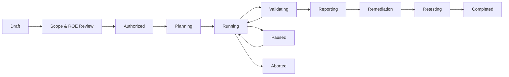
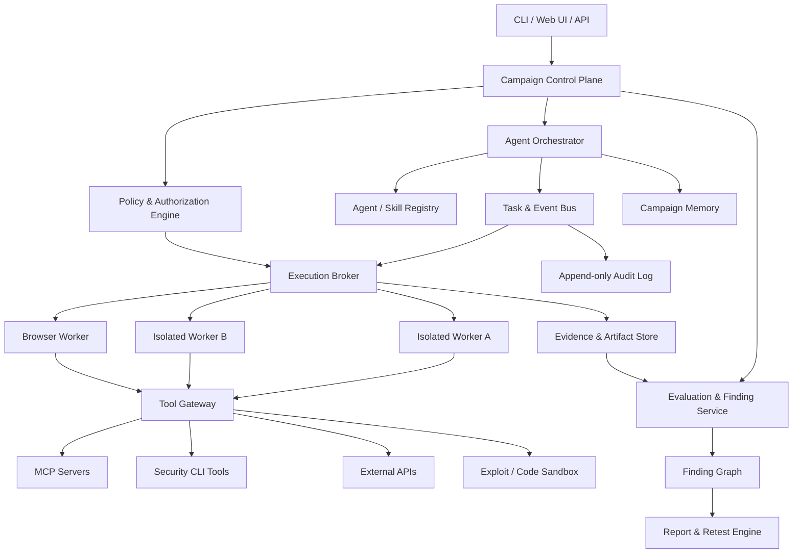
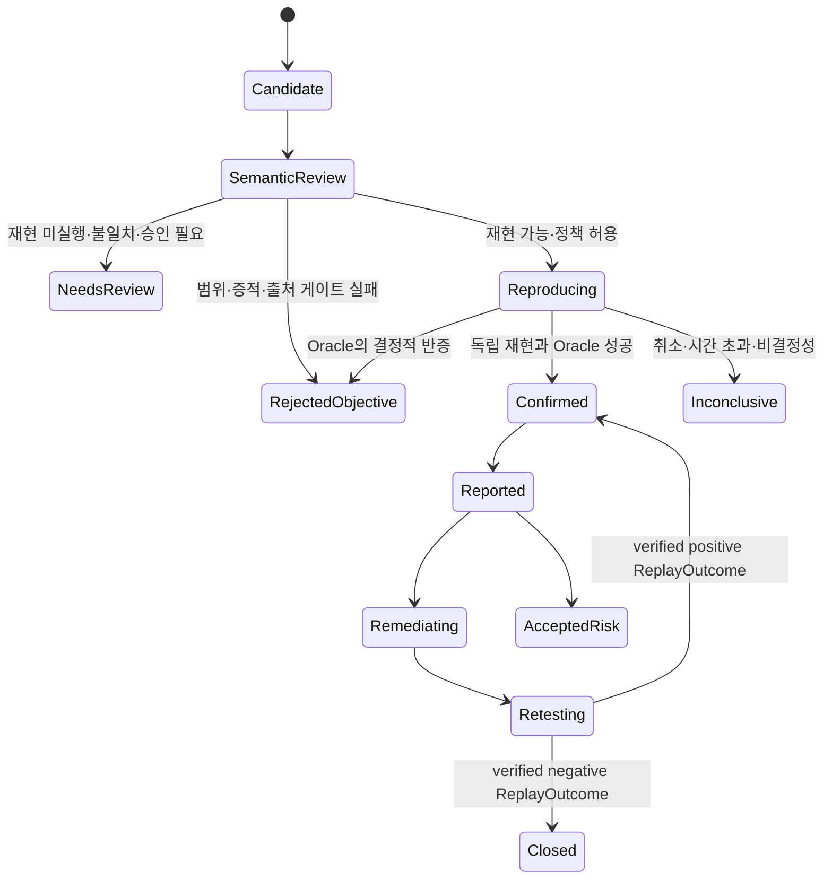

# PAJIN 제품 기획서

> 자율형 멀티 에이전트 AI 레드팀·보안 검증 오케스트레이션 플랫폼

| 항목 | 내용 |
| --- | --- |
| 문서 상태 | Product Baseline v0.3 |
| 작성일 | 2026-07-12 |
| 최종 최신화 | 2026-07-19 |
| 문서 목적 | 제품 방향, 범위, 핵심 요구사항, 안전 원칙, MVP 및 로드맵의 기준선 정의 |
| 주요 참고 | KISA 「AI 보안 레드티밍 가이드」(2026.07), STRIX, HEXSTRIKE AI, XBOW |

---

## 0. 문서 권한과 변경 통제

이 문서는 PAJIN의 제품 목표, 범위, 용어와 불변 품질 기준을 정의하는 최상위 기준선이다.
문서 사이에 충돌이 있으면 다음 순서로 해석한다.

1. `docs/PAJIN_PRODUCT_PLAN.md` — 제품 불변 원칙과 수용 기준
2. 같은 범위의 이전 결정을 명시적으로 amend 또는 supersede한 가장 최근 Accepted ADR — 불변 원칙을 구현하기 위한 기술 결정
3. `docs/KISA_TRACEABILITY.md` — KISA 요구사항과 구현 증적의 연결 상태
4. `README.md` — 현재 코드의 실행 방법, 지원 범위와 알려진 구현 격차

ADR은 제품 기획서의 불변 원칙을 구체화할 수 있지만 암묵적으로 완화할 수 없다. 불변 원칙을
바꾸려면 이 기획서를 먼저 개정하고, 변경 사유와 이행 영향을 새 ADR에 기록한 뒤 구현해야
한다. 코드나 README의 현재 동작이 기준선과 다르면 이를 새로운 기획으로 간주하지 않고
명시적인 구현 격차로 관리한다.

### 0.1 고정된 Finding 검증 원칙

다음 원칙은 [`ADR-0027`](adr/0027-independent-reproduction-confirmation-boundary.md)이
구체화하며, 구현 편의를 이유로 낮출 수 없다.

- 기존 증거를 다시 읽고 의미를 판정하는 Semantic Validator는 증거 심사자이지 독립
  재현 실행자가 아니다.
- Candidate는 별도의 제한된 Reproducer가 새 요청과 새 증적 계보로 동일 주장을 재현하고,
  Mode 소유의 Oracle과 객관적 증적 게이트가 이를 지지하며, source/replay Worker trust domain
  밖의 authority가 의도한 target 실행을 독립적으로 attest해야만 `confirmed`가 될 수 있다.
- LLM은 공격 Tool, 임의 명령, URL 또는 Capability Grant를 직접 생성·실행하지 않는다.
  LLM이 제안한 비실행형 `ReplayIntent`는 신뢰 경계 안의 컴파일러와 정책 검사를 거쳐야 한다.
- 독립 재현이 아직 실행되지 않았거나 자동 재현 대상이 아니거나 독립 execution attestation이
  없으면 최대 `needs-review`, 실행 장애·취소·시간 초과로 결론을 내리지 못하면
  `inconclusive`다. 별도 Run·request·process·backend instance와 로컬 hash·seal은 일관성
  증거이지 독립 trust domain의 attestation이 아니다.
- 기존에 봉인된 Run은 다시 쓰지 않는다. 과거의 재현 없는 `confirmed`는 legacy 판정으로
  식별하며 이 기준선의 `confirmed`로 재해석하지 않는다.
- 수정 완료(`fixed`)는 봉인된 `validation/v1alpha1`의 independently attested Confirmed Finding,
  정확히 결박된 Restricted Replay, 외부에서 검증 가능한 remediation attestation이 모두 있을
  때만 주장한다. negative Worker transcript, 공개 deterministic-lab response tuple, 단순 신호
  부재와 Worker 판정은 proof가 아니며 현재 구현에서는 `inconclusive`다.
- 정상 기능 회귀는 취약점의 `fixed` 상태와 분리해 기록한다. 개별 Finding이 수정됐더라도
  포괄적인 release-level 재검증 성공은 별도의 fresh discovery에서 신규 Finding이 없고 정상
  기능 회귀가 통과해야 한다.

---

## 1. Executive Summary

PAJIN은 AI가 보안 테스트 전 과정을 계획하고, 필요한 전문 에이전트를 동적으로 구성하며, MCP·Skills·CLI·브라우저·보안 도구를 안전하게 위임해 실제 취약점을 탐색·검증·보고하는 자율형 멀티 에이전트 시스템이다.

PAJIN은 다음 세 가지 실행 모드를 하나의 공통 엔진 위에서 제공하는 것을 목표로 한다.

1. **AI Red Team Mode**: LLM, RAG, AI 에이전트, MCP, 가드레일과 AI 애플리케이션의 보안·안전·품질·성능 검증
2. **Bug Bounty Mode**: 프로그램 정책과 허용 범위를 준수하는 정찰, 취약점 탐색, PoC 검증 및 신고서 생성
3. **CTF Mode**: 격리된 대회 환경에서 웹, 포너블, 리버싱, 포렌식, 암호학 등 문제 해결 자동화

PAJIN의 경쟁력은 단순히 많은 공격 도구를 연결하는 데 있지 않다. 다음 항목을 제품의 중심 가치로 삼는다.

- 승인된 범위 안에서 끝까지 수행 가능한 실질적 자율성
- 에이전트와 도구별 최소 권한 및 감쇠형 권한 위임
- 실험 전체를 재현할 수 있는 이벤트·대화·도구 호출·환경 증적
- 자동 탐색과 독립 검증 에이전트, 필요 시 HITL을 결합한 낮은 오탐률
- KISA 가이드에 맞춘 계획, 교전 규칙, 실행 로그, 결과 보고, 재검증 산출물
- 동일한 코어 위에서 보안 도메인을 Mode Pack과 Skill Pack으로 확장하는 구조

### 1.1 현재 구현 기준선

2026-07-23 기준 PAJIN은 **CLI 기반 정책 통제 멀티 에이전트 보안 검증 백엔드 MVP를 구축 중**이다.
Phase 0-1은 완료되었고 Phase 2의 실행 코어, Replay 계약·Compiler·단일 사용 ticket·
Restricted Reproducer와 exact KISA M03·M06·A04 fresh-session materializer·live transcript
Oracle·runner coordinator, verified receipt 재로딩 공통 Gate와 append-only
`validation/v1alpha1` 투영, 기준 Candidate 결박형 negative KISA retest Gate는 구현되었다.
M6-06의 stable SQLite 원장과 재시작 후 read-only verifier는 로컬 KISA positive/negative
replay ticket을 영속화한다. M6-07A는 일반 Local 실행에 명시적으로 opt-in하는 exact KISA
Candidate→SQLite replay→공통 Gate 경로를 추가했다. 기본 Local 실행은 자동 replay를 하지
않는다. Control Plane replay-ticket orchestration은 M6-07B로 분리한다. ADR 0029는
2026-07-17에 Accepted되었다. 첫 authority-state 조각은 versioned Replay aggregate schema,
strict startup validation을 포함한 repository-managed v1→v2 migration, internal-only payload,
원자적 batch·burn-on-claim·heartbeat·lease 만료·취소 전이를 구현했다. M6-07B-2A는 소유자가
통제하는 managed filesystem repository, immutable `cp_artifacts` metadata, schema v3와 exact
opaque locator를 통한 완료·봉인 source의 내부 server-owned admission을 추가했다. 2026-07-18
구현된 M6-07B-2B는 batch input을 locator와 idempotency key로 한정하고 server-owned source
재로딩, exact M03·M06·A04 confirmation Candidate/contract 파생, trusted compilation, canonical
`ReplayCompilation` 및 `ReplayCapabilityGrant`를 append-only planned/pending, non-dispatchable
PostgreSQL derivation record이자 proof로 영속화했다. 저장된 5분 Grant는 pending 중 만료될 수 있으므로
이후 실행 권한으로 절대 재사용하면 안 된다. schema v4의 각 append-only row는 고유한
`compilation_id`, Replay Run identity, compilation digest와 Grant digest를 소유한다. `item_id`는
고유하지 않고 Candidate/contract plan identity FK에 결박되므로 item 하나에 여러 attempt/version row를
둘 수 있다. 2026-07-18 구현된 M6-07B-2C durable issuance는 schema v5에 durable budget account와
reservation, 보수적인 sealed-rate account와 reservation, exact ticket FK를 추가했다. 내부 멱등
`ControlPlaneService.issue_replay_batch(batch_id, actor=...)`는 managed source를 다시 resolve·재검증하고
첫 시도 전체의 Tool-call/request-unit을 예약한 뒤 각 pending item을 fresh Replay Run identity와 5분
Grant로 다시 compile한다. 새 canonical compilation row, active budget/rate reservation, 내부 Job과
`issued` ticket을 한 transaction에서 만들고 payload/ticket을 exact `compilation_id`,
`budget_reservation_id`, `rate_reservation_id`, attempt, Replay Run과 digest에 결박한다. 최초 planned
record는 non-dispatchable proof로 남고 재사용하지 않는다. 응답 유실(response-loss) 재시도는 현재
active exact authority graph가 발급 직후 ticket/Job `issued`/`queued`이거나 claim 뒤
`claimed`/`running`일 때만 같은 issuance를 재구성하며, terminal이거나 그 밖에 변경된 graph는 fail
closed한다. 2026-07-18 구현된 M6-07B-2D는 schema v6 append-only `cp_replay_tool_permits` 원장과
내부 서비스 전용 호출별 permit 발급을 추가했다. strict request는 executor profile, lease token, ticket ID,
fencing value와 1-based call ordinal만 받으며, 서비스는 exact active authority graph, reservation counter와
rolling request-rate state를 다시 검증한다. canonical permit은 source/original request, Tool/version/target/method,
ordinal, Tool-call unit 하나와 trusted request unit에 결박된다. 고유 ticket/ordinal 및 저장된 permit
digest/request ID 덕분에 exact response-loss duplicate는 같은 row를 돌려주고 최초 발급만 reserved
budget/rate를 consumed로 옮기며 event를 append한다. 실행이 불확실해도 발급분은 consumed로 남는다.
M6-07B-2E는 strict JSON `PAJIN_CP_REPLAY_EXECUTOR_PROFILES` subject→profile-array allowlist와
Replay claim·heartbeat·Tool-permit 발급 전용 WORKER-role endpoint, 대응 async client를 추가했다.
설정이 없으면 allowlist는 비어 fail closed하며, 예시는
`{"replay-worker-service":["kisa-exact-v1"]}`이며 별도로 인증된 Replay Worker subject에만 해당
profile을 허용한다. claim/heartbeat envelope는 서버가 검증한 canonical
`ReplayCompilation`을 포함하고 exact compilation·Candidate·contract·Grant·Run binding을 다시
검사한다. permit은 발급 시 이미 unit을 소비한 non-bearer proof이며 별도 redeem mutation은 없다.
M6-07B-2F는 schema v7 append-only `cp_replay_execution_contexts` 권위를 추가한다. 발급 시 fresh
compilation마다 정확한 typed Campaign, exact KISA Scenario, canonical `AIChatProbeTool.spec`, 각
component digest와 전체 context digest를 가진 canonical context를 하나씩 기록한다. executor profile은
`kisa-exact-v1`로 고정하고 Secret Lease는 빈 ID 집합과 함께 금지하며 opaque output-staging slot만
할당한다. Job payload, claim/heartbeat envelope, required profile과 모든 permit 발급은 같은 context를
전이적으로 다시 검증한다. v6→v7 migration은 non-dispatchable v6 권위에만 빈 append-only context
table을 만들고, dispatchable ticket·permit·Job·reservation 또는 진행된 batch/item 상태를 정직하게
backfill할 수 없으면 fail closed한다. 2026-07-19 schema-v9 slice는 별도 credential의 전용
`kisa-exact-v1` daemon, dispatch 직전 server-authorized permit, opaque staging slot의 이중 봉인 output,
server-owned Artifact import·검증, append-only typed finalization과 one-item 공통 Gate를 구현한다.
Permit/finalize의 정확한 retry는 응답 유실만 다루고 Tool을 재dispatch하지 않으며, permit 뒤 failure는
그 ticket에 terminal이다. Compose는 managed repository를 API에만 mount한 채 일반 Worker와 전용 Replay
daemon을 함께 활성화한다. 2026-07-19 schema-v10 hardening은 canonical public-submission
authority digest와 immutable Job dispatch tuple digest, 정확한 v9→v10 forward migration과
fail-closed legacy fencing, 늦은 구 writer·row replacement·identity drift·허용되지 않은 state
transition·terminal history 변경을 막는 database guard를 추가했다. mutation request에는 4 MiB wire ceiling,
operation별 canonical JSON byte/depth/node/key/string 한도, 모든 depth의 duplicate-key 거부와
소유권이 분리된 input/result/checkpoint snapshot을 적용한다. 일반 및 Replay lease는 최대 24시간이고
Replay specification/Grant expiry가 더 짧게 줄일 수 있는 절대 deadline을 영속화한다. heartbeat는 그
안에서만 갱신하며 audit heartbeat event는 60초당 하나로 coalesce하고 reclaim은 rolling/absolute
expiry를 모두 검사한다. 2026-07-21에는 Operator-only opaque source/batch admission,
Operator·Approver·Auditor용 batch/item/ticket/finalization read API와 `retry-pending` 자동 fresh-identity
retry 발행을 추가했다. Retry는 immutable source 재파생, item plan 불변, permit 0개, capacity 완전 반환,
존재하며 비어 있는 이전 staging capability와 남은 시도 횟수를 요구한다. Terminal authority graph는
보존하고 fresh Run, compilation, context, reservation, Job, ticket, staging capability, attempt와 fence를
append한다. Schema v11 multi-item projection publication은 전체 receipt를 다시 열고 CAS-fenced
projection을 발행한다. Schema v12는 confirmed baseline과 부모 Retest Artifact를 1:1 결박하고 부모의
budget/rate capacity, 음성 replay receipt와 정상 기능 회귀를 서버가 재검증한 `kisa-retest.json`
projection을 발행한다. 독립 remediation attestation이 없으므로 방어 응답은 `fixed`가 아니라
`inconclusive`다. Portable/off-host 서명 proof, 다른 Mode의 materializer·Oracle과 구조화 협업 메모리는
후속 과제다. 2026-07-23 Agentic Discovery A1 계약 조각은 versioned
`SurfaceObservation`, `AttackSurface`, `AttackSurfaceSet`, canonical HTTP operation과
schema-bound Tool interface locator, 도메인 분리 identity와 exact evidence lineage 검증을 추가했다.
A2는 integrity-verified Campaign·Gateway evidence 전용 Trusted Surface Producer, exact
request/result/evidence/root 결박, Scope·Authorization·method·Tool risk 재검증, 원본 Run을
보존하는 별도 append-only projection을 추가했다. A3는 명시적 feature flag에서만 단일 호출
MCP Recon Planner·Specialist wave를 Campaign 공용 budget·rate limit로 실행하고 봉인된 source
Run → A2 admission → 별도 Surface projection을 연결한다. 기존 one-time Planner에는 Surface를
전달하지 않으므로 A3만으로 자동 후속 공격은 발생하지 않는다. A4는 별도 명시적 flag에서 봉인된
Surface projection을 다시 검증하고 코드 등록 규칙으로 `AttackHypothesis`·`AttackHypothesisSet`과
단일 Dynamic Specialist Wave를 결정론적으로 컴파일한다. 가설별 fresh 감쇠 Capability와 한 번의
Tool 호출만 허용하고 결과를 canonical Hypothesis 순서로 봉인한다. A5는 별도 명시적 flag에서 봉인된
A4 결과를 다시 검증하고 exact 등록 필드를 `ObservationGraphSnapshot`과 typed 관계로 승격한다.
결정론적 `ReplanDecision`은 신규성 임계값, 최대 2 wave·1 replan, 동일 Plan 반복, Campaign 공유
Agent·Tool call·비용·시간·rate limit을 강제한다. 코드 등록 transition이 새 Compiler·rule을 선택한
경우에만 두 번째 fresh-Capability Wave를 한 번 실행하며 모든 Graph·Decision을 별도 Control Run에
append-only artifact와 audit event로 봉인한다. 기존 one-time Planner 입력은 계속 바꾸지 않는다.
Phase 3 Mode Pack은 제한된 실행 시나리오를 갖춘 동작 가능한 수준이며, Phase 4는 일반 Control
Plane 수직 조각과 전용 exact-KISA one-item Replay slice를 함께 포함한다.

| 영역 | 구현 상태 | 현재 경계 |
| --- | --- | --- |
| 공통 엔진 | 진행 중 | Supervisor, Planner, 동적 Specialist, Semantic Validator, Reporter와 작업 그래프 실행; Replay 계약·Compiler·단일 사용 ticket·Restricted Reproducer, 로컬 KISA SQLite ticket 원장, Multi-Agent와 명시적 Local exact KISA orchestration 및 receipt 재로딩 공통 Gate 구현; KISA 이외 replay orchestration은 후속 |
| 정책·권한 | 완료 | Scope, Capability 감쇠, 계보별 호출 예산, 위험 등급, 승인, Kill Switch |
| 실행 격리 | MVP 완료 | Docker Worker, 기본 egress 차단, allowlist proxy, 등록 MCP와 고정 Tool |
| AI Red Team | 진행 중 | KISA 19개 위협·52개 체크리스트를 카탈로그화하고 A01·A02·A04·M03·M06 실행; reproduction-backed baseline의 hardened retest와 정상 기능 회귀 연결 |
| Bug Bounty | 진행 중 | 정책·Scope·중복·로컬 신고서와 고정 Boolean SQLi 로컬 랩 실행 |
| CTF | 진행 중 | 로컬 Web 백업 노출, 오프라인 Single-byte XOR, Web + Crypto Suite 실행 |
| Control Plane | 초기 구현 | FastAPI, PostgreSQL Job queue, 승인 체크포인트, fence형 취소, schema-v10 exact submission identity·bounded JSON ingress·absolute lease deadline·heartbeat coalescing, 일반 Worker daemon, opaque Operator Replay source/batch admission·역할 기반 상태 조회와 durable reservation·일회성 pre-dispatch permit·schema-v7 execution context·sealed opaque staging·schema-v9 server-owned Artifact import/finalization·자동 fresh-identity retry·schema-v11 multi-item projection·schema-v12 dual-source negative retest projection·schema-v13 opt-in exact Claim별 공개 projection의 전용 exact-KISA Replay 경로를 구현했고 Compose는 distinct credential로 두 daemon을 모두 활성화함 |
| 제품 UI·생태계 | 초기 구현 | 동일 오리진 Web Console의 제출·조회·승인·재개·취소; Agent Graph, Pack registry와 외부 연동은 후속 |

현재 기본 인터페이스는 CLI + YAML이며, 외부 대상에 대한 범용 공격 자동화나 제출 자동화는
제공하지 않는다. 상세 안전 경계와 재현 명령은 저장소 `README.md`, KISA 커버리지는
`docs/KISA_TRACEABILITY.md`, 확정된 기술 결정은 `docs/adr/`를 기준으로 한다.

---

## 2. 배경과 문제 정의

### 2.1 현재 보안 자동화의 한계

기존 보안 스캐너와 LLM 기반 공격 자동화 도구는 다음 한계를 가진다.

- 개별 도구 실행은 자동화하지만 전체 공격 전략의 적응적 전개가 어렵다.
- 발견 결과가 실제 취약점인지 검증하지 않아 오탐이 누적된다.
- 여러 에이전트가 협업하더라도 권한, 범위, 예산, 중단 조건이 일관되게 적용되지 않는다.
- 도구 호출 결과와 대화 맥락이 분리되어 공격 체인의 재현이 어렵다.
- 강력한 MCP와 셸 권한이 에이전트에 과도하게 노출될 수 있다.
- AI 레드티밍, 버그바운티, CTF가 서로 다른 도구와 워크플로로 파편화되어 있다.
- 기술적 결과를 경영진, 개발팀, 규제 대응 담당자가 사용할 수 있는 산출물로 전환하기 어렵다.

### 2.2 PAJIN이 해결할 문제

PAJIN은 아래 질문에 일관된 방식으로 답해야 한다.

- 무엇을, 왜, 어디까지 테스트할 수 있는가?
- 어떤 에이전트가 어떤 근거로 생성되었는가?
- 각 에이전트는 어떤 도구와 자원에 접근할 수 있는가?
- 도구 실행이 교전 규칙, 법적 범위, 비용 한도를 충족하는가?
- 발견한 결과가 실제로 재현 가능하고 영향이 있는가?
- 누가, 언제, 어떤 입력과 환경에서 무엇을 실행했는가?
- 수정 이후 취약점이 제거되었고 정상 기능이 유지되는가?

---

## 3. 제품 비전

### 3.1 Vision

> 보안 전문가가 목표와 교전 규칙을 정의하면, PAJIN이 적절한 에이전트 팀을 구성하고 허용된 환경에서 탐색·공격·검증·보고·재검증까지 수행하는 신뢰 가능한 자율형 AI 레드팀 플랫폼을 만든다.

### 3.2 Mission

- 반복적인 보안 테스트를 자동화하면서 전문가 수준의 공격 체인 탐색을 지원한다.
- 강력한 공격 기능을 사용할수록 더 강한 통제와 증적이 적용되도록 한다.
- AI 보안과 전통적 애플리케이션 보안을 하나의 캠페인에서 연결한다.
- 자동화 결과를 감사와 개선에 사용할 수 있는 구조화된 데이터 자산으로 남긴다.

### 3.3 제품 원칙

1. **Scope First**: 모든 실행은 명시된 대상, 허용 범위, 제외 범위에서 시작한다.
2. **Least Privilege**: 에이전트는 작업에 필요한 최소 권한만 임시로 가진다.
3. **Authority Attenuation**: 하위 에이전트는 부모보다 넓은 권한을 받을 수 없다.
4. **Evidence or It Did Not Happen**: 증적 없는 성공 주장은 검증된 Finding이 아니다.
5. **Validate Before Report**: 탐색 에이전트의 결과를 독립된 검증 절차가 확인한다.
6. **Reproducibility by Default**: 모델, 프롬프트, 도구, 입력, 출력, 환경을 버전화한다.
7. **Safe Autonomy**: 자율성은 통제 부재가 아니라 사전 승인된 정책 안에서의 무인 수행이다.
8. **Human Escalation on Uncertainty**: 고위험·모호·정책 충돌 상황은 사람에게 에스컬레이션한다.
9. **Mode-Aware Behavior**: CTF, 버그바운티, AI 레드팀은 서로 다른 기본 정책을 가진다.
10. **Extensible but Governed**: 새 MCP·Skill·Tool은 등록, 검증, 권한 분류 후 사용한다.

---

## 4. 자율성 정의

PAJIN에서 **완전자동**은 에이전트가 제한 없이 행동한다는 의미가 아니다.

> 사용자가 사전에 승인한 목표, 범위, 자원, 시간, 비용, 도구 등급, 데이터 처리 규칙과 중단 조건 안에서 추가 입력 없이 캠페인을 완료할 수 있는 상태를 의미한다.

### 4.1 자율성 수준

| 수준 | 명칭 | 설명 | 권장 용도 |
| --- | --- | --- | --- |
| L0 | Manual | 모든 도구 실행을 사용자가 직접 요청 | 디버깅, 민감한 운영 환경 |
| L1 | Assisted | AI가 계획과 명령을 제안하고 사용자가 실행 | 초기 도입, 교육 |
| L2 | Supervised | 저위험 도구는 자동 실행하고 고위험 도구는 건별 승인 | 일반적인 운영 점검 |
| L3 | Policy-Autonomous | 사전 승인된 정책과 예산 안에서 자동 실행 | 스테이징, 버그바운티, 정기 점검 |
| L4 | Lab-Autonomous | 격리된 실험실에서 공격적 도구까지 자동 실행 | CTF, 소유한 테스트랩 |

초기 제품의 기본값은 **L2**이며, 신뢰 가능한 격리와 정책 엔진이 검증된 후 **L3**를 주력으로 제공한다. **L4**는 명시적으로 격리된 CTF·랩 환경에서만 허용한다.

---

## 5. 목표와 비목표

### 5.1 제품 목표

- 캠페인 단위로 목표, 범위, 접근 수준, 교전 규칙과 성공 기준을 관리한다.
- 작업에 따라 전문 에이전트를 동적으로 생성하고 종료한다.
- MCP, Skills, CLI, API, 브라우저, 코드 실행기를 통합 도구 모델로 제공한다.
- 에이전트마다 서로 다른 도구·네트워크·파일·비밀정보 권한을 부여한다.
- 정찰 결과를 공유하고 공격 체인을 연결할 수 있는 협업 메모리를 제공한다.
- 후보 Finding을 재현·독립 검증·중복 제거한 뒤 보고한다.
- KISA 가이드의 계획, 이행, 기록, 결과 보고, 후속 조치 흐름을 지원한다.
- Markdown, JSON, SARIF 및 향후 PDF 형식의 결과물을 생성한다.
- 로컬 단일 머신에서 시작해 분산 워커로 확장할 수 있다.

### 5.2 초기 비목표

- 무단 또는 불명확한 대상에 대한 공격 자동화
- 운영 환경에서 파괴적 DoS, 데이터 삭제, 랜섬웨어성 행위 자동 수행
- 실제 데이터 탈취나 외부 반출을 통한 영향 증명
- 모든 보안 도구를 PAJIN 코어에 직접 내장
- 모든 Finding의 자동 수정과 무검토 배포
- 범용 SIEM, SOAR, EDR 전체 기능 대체
- 자체 기반 모델 학습 및 대규모 모델 호스팅

---

## 6. 대상 사용자와 페르소나

| 사용자 | 주요 목표 | 핵심 요구 |
| --- | --- | --- |
| Red Team Lead / PM | 캠페인 계획, 범위·리스크·일정 관리 | 교전 규칙, 진행 가시성, 중단·승인, 보고서 |
| AI Red Team Specialist | 탈옥, 인젝션, RAG·에이전트 취약점 검증 | 공격 데이터셋, 멀티턴 공격, Judge, 재현성 |
| Penetration Tester | 웹·API·인프라 취약점 탐색 및 PoC | 브라우저, 프록시, 셸, 스캐너, 증적 수집 |
| Bug Bounty Hunter | 프로그램 범위 내 효율적 탐색과 신고 | 범위 준수, 중복 방지, PoC, 보고서 템플릿 |
| CTF Player / Team | 빠른 문제 분류와 병렬 풀이 | 카테고리별 에이전트, 격리 실행, 플래그 검증 |
| AI / Application Engineer | 원인 분석과 수정, 회귀 테스트 | 재현 스크립트, 로그, 수정 권고, 재검증 |
| Security Manager / Auditor | 위험과 통제 상태 파악 | 위험 요약, 감사 로그, 표준 매핑, 잔여 위험 |
| Platform Administrator | 모델·도구·워커·비밀정보 운영 | 접근 제어, 비용, 격리, 관측성, 정책 관리 |

---

## 7. 핵심 사용 시나리오

### 7.1 AI Red Team Mode

#### 대상

- 기반 모델 및 파인튜닝 모델
- 시스템 프롬프트와 가드레일
- RAG, 벡터 데이터베이스, 문서 저장소
- AI 에이전트, MCP 서버, Skills, Function Calling
- 사용자 인터페이스, API, 파일 업로드
- 데이터 파이프라인, 모델 서빙, CI/CD, 접근 제어

#### 주요 위협

- 프롬프트 인젝션과 간접 프롬프트 인젝션
- 탈옥과 정책 우회
- 시스템 프롬프트, 학습 데이터, RAG 데이터 유출
- 부적절한 출력 처리
- 에이전트 하이재킹과 도구 오남용
- 에이전트 메모리 오염
- 비용·토큰·호출 증폭과 에이전트 DoS
- 모델·데이터·확장요소 공급망 위험
- 환각, 편향, 과잉 거절, 성능 저하

#### 대표 흐름

1. 대상 커넥터와 모델·프롬프트 버전을 등록한다.
2. 지원 언어, 도메인, 위험 분류, 평가 기준을 선택한다.
3. 공격 표면 분석 에이전트가 테스트 계획을 구성한다.
4. Attacker 에이전트가 시드와 변형 전략을 생성한다.
5. Target Runner가 단일턴·멀티턴·간접 인젝션 시나리오를 실행한다.
6. 규칙·분류기·LLM Judge가 결과를 평가한다.
7. 불일치·고위험 결과를 Validator 또는 HITL로 전달한다.
8. 확정 Finding을 KISA 위협 분류 및 영향 기준에 매핑한다.
9. 수정 후 공격 회귀와 정상 질의 회귀를 함께 수행한다.

### 7.2 Bug Bounty Mode

#### 필수 입력

- 프로그램명과 정책 원문
- In-scope 및 Out-of-scope 자산
- 허용·금지 테스트 기법
- 속도 제한과 테스트 시간대
- 계정, 역할, 테스트 데이터 조건
- 데이터 접근·보관·삭제 규칙
- 신고 포맷과 심각도 기준

#### 대표 흐름

1. Scope Parser가 프로그램 정책을 구조화한다.
2. 사용자가 해석 결과를 확인하고 캠페인을 승인한다.
3. Recon 에이전트가 수동·능동 정찰 범위를 분리해 실행한다.
4. 전문 에이전트가 웹, API, 인증, 비즈니스 로직 등을 병렬 분석한다.
5. 후보 취약점은 별도 Validator가 최소 영향 방식으로 검증한다.
6. 기존 Finding, 공개 이슈, 동일 원인 후보를 중복 제거한다.
7. Reporter가 재현 절차, 영향, 증적, 권고를 포함한 신고서를 생성한다.

#### 기본 금지

- 범위 외 자산 접근
- 다른 사용자 데이터의 불필요한 열람·저장
- 대량 트래픽, 서비스 중단, 사회공학
- 지속성 확보, 백도어 설치
- 취약점 증명에 필요하지 않은 데이터 변경 또는 반출

### 7.3 CTF Mode

#### 지원 카테고리

아래 목록은 목표 지원 범위다. 2026-07-17 현재 구현되어 실행 가능한 CTF 범위는 Web과 Cryptography에
한정되며, Pwn / Binary Exploitation, Reverse Engineering, Digital Forensics, OSINT,
Miscellaneous는 계획 범위로 남아 있다.

- Web
- Pwn / Binary Exploitation
- Reverse Engineering
- Digital Forensics
- Cryptography
- OSINT
- Miscellaneous

#### 대표 흐름

1. 문제 설명과 제공 파일을 수집한다.
2. Triage 에이전트가 카테고리와 풀이 가설을 분류한다.
3. 카테고리별 전문 에이전트를 병렬 생성한다.
4. 각 에이전트는 격리된 워크스페이스와 도구 권한을 받는다.
5. 공유 Artifact Store를 통해 중간 결과를 교환한다.
6. Verifier가 플래그 포맷 또는 채점 서버로 결과를 검증한다.
7. 풀이 과정과 최종 Write-up을 생성한다.

CTF Mode는 공격적 도구 사용 범위가 가장 넓지만, 네트워크와 파일 접근은 대회 대상 및 격리 환경으로 강하게 제한한다.

---

## 8. 공통 캠페인 수명주기

아래 다이어그램과 상태 표는 현재 영속화된 런타임 상태 머신이 아니라 제품이 목표로 하는 전체
Campaign 수명주기를 정의한다. 2026-07-17 현재 로컬 실행은 `RunStatus`의 `running`, `completed`,
`failed`, `cancelled`만 구현하고, Control Plane 실행은 `RunState`의 `queued`, `running`,
`awaiting-approval`, `completed`, `failed`, `cancelled`만 구현한다. 나머지 수명주기 단계는 제품
워크플로상의 개념이며, 아직 모두 독립적인 영속 런타임 상태로 구현된 것은 아니다.



### 8.1 상태 정의

| 상태 | 의미 | 진입 조건 |
| --- | --- | --- |
| Draft | 캠페인 초안 | 대상과 목적 생성 |
| Scope & ROE Review | 범위 및 교전 규칙 검토 | 필수 항목 입력 완료 |
| Authorized | 실행 권한 확보 | 승인 주체와 증빙 등록 |
| Planning | 에이전트가 공격 계획 구성 | 정책 검증 통과 |
| Running | 도구와 시나리오 실행 중 | 예산·워커 확보 |
| Validating | 후보 Finding 검증 | 후보 결과 존재 |
| Reporting | 결과와 잔여 위험 정리 | 검증 단계 완료 |
| Remediation | 개선 작업 추적 | 보고서 승인 |
| Retesting | 동일·변형 공격 및 회귀 테스트 | 수정 배포 완료 |
| Completed | 캠페인 종료 | 종료 기준 만족 |
| Paused | 사용자·정책·시스템에 의한 일시 중단 | 재개 가능 |
| Aborted | 비상 중단 또는 승인 철회 | 실행 권한 폐기 |

---

## 9. KISA 가이드 반영 모델

PAJIN은 KISA 가이드의 `준비 → 이행 → 결과 보고 → 후속 조치`를 제품 워크플로와 데이터 모델에 반영한다.

### 9.1 위협 분류

| 그룹 | 코드 | PAJIN 적용 영역 |
| --- | --- | --- |
| 데이터 위협 | D01-D03 | 데이터셋, 파이프라인, 비식별화 평가 |
| 모델 위협 | M01-M08 | 모델·프롬프트·가드레일·출력·가용성 평가 |
| 에이전트 위협 | A01-A04 | Tool Gateway, 메모리, MCP, 실행 루프 평가 |
| 공급망 위협 | S01-S04 | 모델·데이터·도구·플러그인 출처와 버전 검증 |

### 9.2 가이드 요구사항과 제품 기능 매핑

| KISA 활동 | PAJIN 기능 |
| --- | --- |
| 사전 협의 및 교전 규칙 | Campaign Manifest, ROE Policy, 승인 워크플로 |
| 목표·범위·제외 범위 설정 | Target Registry, Scope Rules, Deny Rules |
| 블랙·그레이·화이트박스 접근 | Access Profile과 Credential Grant |
| 공격 표면 식별 | Attack Surface Graph |
| 페르소나 정의 | Agent Persona 및 Threat Actor Profile |
| 공격 시나리오 구성 | Scenario Template과 Planner |
| 최소 권한 자산 제공 | Capability Grant와 임시 Secret Lease |
| 비상 보고와 중단 | Kill Switch, Policy Tripwire, Escalation Queue |
| 자동 공격과 전문가 심층 점검 | Attacker Agents, Validator, HITL Review |
| 영향·근본 원인 분석 | Finding Graph, Impact Model, Root Cause Field |
| 로그와 증적 관리 | Append-only Event Log, Evidence Store, Hash Manifest |
| 결과 보고 | Executive·Technical·Compliance Report Generator |
| 재검증과 회귀 테스트 | Retest Campaign, Security/Utility Regression Suite |
| 지속 점검 | Schedule, CI/CD Trigger, Baseline Drift Detection |
| CVD/VDP 연계 | Disclosure Package와 상태 추적 |

### 9.3 필수 산출물

- 테스트 계획서
- 교전 규칙 및 승인 기록
- 대상·범위·제외 범위 목록
- 위협 모델과 공격 표면 그래프
- 시나리오와 성공·중단 기준
- 테스트 실행 로그
- 공격 체인 스냅샷
- 재현 스크립트와 시각적 증거
- 취약점 상세 및 위험 요약
- 테스트 완료 보고서
- 개선 계획과 재검증 결과

---

## 10. 제품 아키텍처

### 10.1 논리 아키텍처



### 10.2 Control Plane

Control Plane은 실행을 직접 하지 않고 다음을 결정한다.

- 캠페인 상태와 승인 상태
- 대상과 범위
- 에이전트 생성·중단·재시도
- 작업 그래프와 우선순위
- 권한 및 정책 판정
- 비용·시간·호출·토큰 예산
- 후보 Finding의 검증 상태
- 보고와 재검증 흐름

### 10.3 Execution Plane

Execution Plane은 실제 도구를 격리된 환경에서 실행한다.

초기 Docker 격리와 Tool Gateway의 확정 결정은
[`ADR-0002`](adr/0002-tool-gateway-and-worker-isolation.md)를 따른다.

- 캠페인 또는 작업 단위의 임시 워커
- 읽기 전용 기본 파일시스템과 제한된 작업 디렉터리
- 대상 기반 네트워크 egress allowlist
- CPU, 메모리, 프로세스, 시간, 디스크, 요청률 제한
- 임시 자격 증명 주입과 자동 회수
- stdout, stderr, 파일, 네트워크, 스크린샷 증적 수집
- 워커 종료 시 정리 및 Artifact 보존

### 10.4 내부 표준화 계층

외부 MCP 프로토콜을 PAJIN의 내부 권한 모델로 직접 사용하지 않는다. 모든 외부 도구는 내부 `ToolSpec`으로 정규화한다.

`ToolSpec`의 최소 필드:

- 도구 ID, 이름, 버전, 공급자
- 입력·출력 JSON Schema
- 위험 등급과 예상 부작용
- 네트워크, 파일, 프로세스, 비밀정보 요구 권한
- 지원 실행 환경
- 기본 시간·비용·호출 제한
- 멱등성 여부
- 증적 수집 방법
- 공급망 검증 정보와 라이선스

이를 통해 MCP, Skills, 로컬 CLI, HTTP API가 동일한 Policy Engine을 통과하도록 한다.

---

## 11. 멀티 에이전트 모델

### 11.1 기본 에이전트 역할

| 역할 | 책임 | 기본 도구 권한 |
| --- | --- | --- |
| Campaign Manager | 목표 분해, 일정·예산·종료 기준 관리 | 메타데이터 읽기, 작업 생성 |
| Planner | 공격 표면과 시나리오 설계 | 대상 정보·지식베이스 읽기 |
| Recon Agent | 자산과 엔드포인트 탐색 | 수동·제한적 능동 정찰 |
| Web / API Agent | 웹·API 취약점 탐색 | 브라우저, 프록시, HTTP 도구 |
| Code Agent | 소스·구성·의존성 분석 | 저장소 읽기, 제한된 빌드·테스트 |
| AI Security Agent | 모델·RAG·에이전트 공격 | Target Connector, 공격 데이터셋 |
| CTF Specialist | 카테고리별 문제 풀이 | 격리된 분석·공격 도구 |
| Semantic Validator | 후보 주장·증거 분석과 비실행형 ReplayIntent 제안 | Provider 호출만 허용, 공격 도구 없음 |
| Restricted Reproducer | 후보 취약점 독립 재현 | 원 요청에 결박된 replay 전용 최소 권한 도구 |
| Judge | 정량·정성 평가와 불일치 탐지 | 규칙, 분류기, 평가 모델 |
| Reporter | 기술·비즈니스·규제 보고 | 확정 Finding 및 증적 읽기 |
| Retest Agent | 수정 후 재공격과 정상 기능 확인 | 저장된 재현 자산과 대상 접근 |

### 11.2 동적 생성 규칙

에이전트 생성 요청은 다음 정보를 포함해야 한다.

- 생성 사유와 해결할 작업
- 기대 산출물
- 부모 에이전트와 책임 관계
- 요청 Capability 목록
- 시간, 토큰, 비용, 도구 호출 예산
- 종료 조건
- 최대 재시도 횟수
- 생성 깊이와 동시 에이전트 한도

### 11.3 권한 위임 불변식

```text
child.scope       ⊆ parent.scope
child.capability  ⊆ parent.delegable_capability
child.budget      ≤ parent.remaining_budget
child.expiry      ≤ parent.expiry
child.risk_tier   ≤ campaign.max_risk_tier
```

하위 에이전트가 더 높은 권한을 요구하면 부모가 직접 부여할 수 없으며 Policy Engine의 재평가와 필요한 승인 절차를 거쳐야 한다.

### 11.4 협업 메모리

메모리는 네 가지로 분리한다.

1. **Immutable Evidence**: 원본 요청·응답·도구 결과·파일 해시
2. **Campaign Facts**: 검증된 자산, 계정 역할, 기술 스택, 제약 조건
3. **Hypotheses**: 아직 검증되지 않은 공격 가설과 신뢰도
4. **Agent Working Memory**: 개별 에이전트의 임시 사고와 작업 상태

외부 문서, 웹 페이지, RAG 결과는 신뢰되지 않은 데이터로 표시하고 명령으로 취급하지 않는다. 메모리로 승격되는 사실은 출처와 검증 상태를 가져야 한다.

---

## 12. 권한과 안전 모델

### 12.1 Capability Grant

도구 사용 권한은 역할명이 아니라 구체적인 Capability로 발급한다.

예시:

```yaml
capability_grant:
  subject: agent:web-validator-02
  campaign: campaign-2026-001
  tools:
    - http.request
    - browser.navigate
    - browser.screenshot
  targets:
    allow:
      - https://staging.example.com/**
    deny:
      - https://staging.example.com/admin/delete/**
  network:
    methods: [GET, HEAD, POST]
    requests_per_minute: 30
  filesystem:
    read: [/workspace/evidence/input]
    write: [/workspace/evidence/output]
  secrets:
    leases: [test-user-session]
  limits:
    expires_in: 20m
    max_calls: 200
    max_cost_usd: 3.00
  delegable: false
```

### 12.2 도구 위험 등급

| 등급 | 설명 | 예시 | 기본 정책 |
| --- | --- | --- | --- |
| T0 | 로컬·메타데이터 읽기 | 파일 목록, 로그 조회, 정적 분석 | 자동 허용 |
| T1 | 수동적 외부 관찰 | DNS 조회, 공개 정보 검색 | 범위 검증 후 허용 |
| T2 | 비파괴 능동 테스트 | 제한된 HTTP 요청, 안전 스캔 | 예산·속도 제한 후 허용 |
| T3 | 상태 변화 또는 실제 악용 가능 | 인증 우회 검증, 코드 실행 PoC | 사전 승인 또는 건별 승인 |
| T4 | 파괴·지속성·대규모 영향 가능 | DoS, 삭제, 지속성, 외부 반출 | 기본 금지, 격리 랩만 예외 |

### 12.3 정책 판정 순서

1. 캠페인 승인 유효성
2. 대상이 Allow Scope에 포함되는지 확인
3. Deny Scope와 금지 행위 우선 적용
4. 에이전트 Capability 보유 여부
5. 모드별 최대 위험 등급
6. 시간·비용·요청률·동시성 예산
7. 데이터 처리 및 비밀정보 정책
8. 승인 또는 HITL 요구 여부
9. 실행 후 증적 수집 가능 여부

`deny`는 항상 `allow`보다 우선한다.

### 12.4 Kill Switch와 Tripwire

즉시 중단 조건:

- 범위 외 대상 접근 시도
- 실제 개인정보·인증정보·기밀정보의 예상치 못한 노출
- 서비스 오류율, 지연, 자원 사용량 임계치 초과
- 비용 또는 도구 호출량의 급격한 증가
- 에이전트 무한 루프 또는 반복 실패
- 권한 상승·정책 우회 시도 감지
- 감사 로그나 증적 수집 실패
- 승인 철회 또는 대상 소유권 불명확

중단 시 신규 Tool Invocation을 차단하고, 실행 중 프로세스를 종료하며, Secret Lease를 회수하고, 상태 스냅샷을 보존한다.

---

## 13. 핵심 기능 요구사항

우선순위는 `P0 = MVP 필수`, `P1 = 첫 공개 버전`, `P2 = 확장`으로 정의한다.
이 표는 목표 요구사항 백로그이며 현재 구현 완료표가 아니다. 실제 구현 상태와 제한은
1.1절과 21절을 기준으로 한다.

### 13.1 Campaign & Scope

| ID | 요구사항 | 우선순위 |
| --- | --- | --- |
| CAM-001 | 캠페인 생성, 복제, 일시중지, 재개, 중단 | P0 |
| CAM-002 | 목적, 성공 기준, 시작·종료 기준 관리 | P0 |
| CAM-003 | 대상, 허용 범위, 제외 범위, 접근 수준 관리 | P0 |
| CAM-004 | 교전 규칙과 승인 증빙 등록 | P0 |
| CAM-005 | 모델·프롬프트·애플리케이션 버전 스냅샷 | P1 |
| CAM-006 | 예약 및 CI/CD 이벤트 기반 실행 | P1 |

### 13.2 Agent Orchestration

| ID | 요구사항 | 우선순위 |
| --- | --- | --- |
| AGT-001 | 사전 정의 에이전트 실행 | P0 |
| AGT-002 | 작업 그래프 생성과 의존성 관리 | P0 |
| AGT-003 | 동적 하위 에이전트 생성과 종료 | P1 |
| AGT-004 | 에이전트별 예산·권한·시간 제한 | P0 |
| AGT-005 | 에이전트 간 사실·Artifact 공유 | P0 |
| AGT-006 | 실패 재시도, 대체 전략, 체크포인트 복구 | P1 |
| AGT-007 | 생성 깊이·개수·동시성 제한 | P0 |

### 13.3 Tool & Execution

| ID | 요구사항 | 우선순위 |
| --- | --- | --- |
| TOL-001 | MCP, CLI, HTTP, 브라우저 Tool Adapter | P0 |
| TOL-002 | ToolSpec 등록과 위험 등급 관리 | P0 |
| TOL-003 | 모든 도구 호출 전 정책 검사 | P0 |
| TOL-004 | 컨테이너 기반 격리 실행 | P0 |
| TOL-005 | 네트워크 egress와 파일 접근 제한 | P0 |
| TOL-006 | 임시 Secret Lease 발급·마스킹·회수 | P1 |
| TOL-007 | 도구 상태, 버전, 공급망 정보 점검 | P1 |
| TOL-008 | 원격·분산 워커 스케줄링 | P2 |

### 13.4 Evidence & Findings

| ID | 요구사항 | 우선순위 |
| --- | --- | --- |
| EVD-001 | 입력, 출력, 도구 인자, 지연, 오류 기록 | P0 |
| EVD-002 | 멀티턴 대화와 도구 호출을 단일 Trace로 연결 | P0 |
| EVD-003 | 파일, 스크린샷, HTTP 트랜스크립트 저장 | P0 |
| EVD-004 | Artifact 해시 및 변경 탐지 | P1 |
| FND-001 | 후보와 확정 Finding 분리 | P0 |
| FND-002 | 독립 재현 및 최소 1개 검증 근거 요구 | P0 |
| FND-003 | 중복·동일 근본 원인 군집화 | P1 |
| FND-004 | KISA, OWASP, CWE, CVSS 등 분류 매핑 | P1 |
| FND-005 | 영향·악용 가능성·재현성·탐지 가능성 평가 | P0 |

### 13.5 Evaluation & Reporting

| ID | 요구사항 | 우선순위 |
| --- | --- | --- |
| EVL-001 | 규칙·분류기·LLM Judge 조합 | P0 |
| EVL-002 | Judge 불일치와 신뢰도 기록 | P0 |
| EVL-003 | 고위험·모호 결과 HITL 큐 | P1 |
| RPT-001 | Markdown 및 JSON 결과 보고 | P0 |
| RPT-002 | 경영진 요약과 기술 상세 분리 | P1 |
| RPT-003 | KISA 체크리스트와 완료 보고서 생성 | P1 |
| RPT-004 | SARIF, PDF, 이슈 트래커 내보내기 | P2 |
| RPT-005 | 수정 권고와 재검증 캠페인 생성 | P1 |

---

## 14. 데이터 모델

### 14.1 주요 엔터티

| 엔터티 | 역할 |
| --- | --- |
| Project | 장기 대상과 팀 단위 컨테이너 |
| Campaign | 한 번의 레드티밍·버그바운티·CTF 수행 단위 |
| Target | 도메인, API, 저장소, 모델, 파일, 채점 서버 등 대상 |
| ScopeRule | 허용·금지 대상, 경로, 메서드, 시간대 |
| RuleOfEngagement | 허용 기법, 금지 행위, 중단 조건, 연락 체계 |
| Authorization | 소유권·승인 주체·유효 기간 증빙 |
| Scenario | 공격 목표, 사전 조건, 실행 절차, 판정 기준 |
| AgentDefinition | 역할, 프롬프트, 도구 요구사항, 기본 정책 |
| AgentInstance | 캠페인에서 실행 중인 에이전트 인스턴스 |
| CapabilityGrant | 에이전트에 부여된 임시 권한 |
| Task | 실행할 작업과 의존성, 상태, 예산 |
| ToolInvocation | 정책 판정부터 실행 결과까지의 도구 호출 |
| Trace | 에이전트 대화, 작업, 도구 호출을 연결한 실행 추적 |
| Artifact | 파일, 스크린샷, 로그, 패킷, 재현 스크립트 |
| CandidateFinding | 탐색 단계에서 발견된 후보 |
| Finding | 독립 재현으로 확정된 취약점과 영향·근본 원인 |
| Evaluation | Judge와 사람의 판정 및 기준 |
| Remediation | 담당자, 조치 내용, 기한, 상태 |
| Retest | immutable baseline 결박형 공격 ReplayOutcome과 별도 정상 기능 회귀 결과 |
| Report | 특정 시점의 결과 산출물 |
| AuditEvent | 변경 불가능한 보안·운영 이벤트 |

### 14.2 Finding 상태



`Duplicate`는 검증 disposition이 아니라 별도의 triage 관계다. 중복 판정은 Candidate와
Validation Decision을 삭제하거나 바꾸지 않는다.

`Closed`는 과거의 Confirmed Decision을 삭제하거나 `rejected-objective`로 바꾸는 상태가 아니다.
봉인된 baseline의 이력은 그대로 유지하고, 정확히 결박된 retest 관계가 trusted negative
Oracle의 `contradicts` 결과와 canonical receipt를 가질 때 별도의 lifecycle 상태로 추가한다.
기존 positive Oracle에서 support가 관찰되지 않은 결과는 계속 `inconclusive`이며 `Closed`의
근거로 사용할 수 없다.

### 14.3 Finding 필수 필드

- 고유 ID와 제목
- 최초 발견 및 최종 검증 시간
- 대상과 영향받는 구성 요소
- 위협 분류와 보안 분류 체계 매핑
- 사전 조건과 공격 경로
- 재현 가능한 입력·절차·스크립트
- 관찰된 결과와 기대 결과
- 기밀성·무결성·가용성·안전성·품질 영향
- 악용 가능성, 재현성, 탐지 가능성
- 기술 심각도와 비즈니스 우선순위
- 근본 원인 가설과 신뢰도
- 증적 Artifact 목록과 해시
- 완화 권고와 재검증 기준

---

## 15. 평가 전략

### 15.1 다중 판정

단일 LLM Judge의 판정을 최종 결과로 사용하지 않는다.

1. **Deterministic Checks**: 정규식, 스키마, 응답 코드, 도구 호출, 데이터 유출 토큰 등
2. **Specialized Classifier**: 유해성, 인젝션, 비밀정보, 정책 분류 모델
3. **LLM Judge**: 맥락, 실행 가능성, 도메인 영향 평가
4. **Semantic Validator**: 다른 프롬프트·모델로 주장, 맥락, 영향과 재현 조건 심사
5. **Restricted Reproducer + Oracle**: 별도 실행 환경의 새 요청·증적으로 독립 재현
6. **Human Review**: Critical, 판단 불일치, 신규 공격, 법적·윤리적 모호성

Candidate 보존, 다중 검증 상태와 결정론적 증적 게이트는
[`ADR-0025`](adr/0025-candidate-validation-ledger-and-replay-boundary.md)를 따른다. Stage 1은
legacy Validator가 반환한 Finding을 Candidate로 보존하고 Candidate별 Decision snapshot을
구현했다. [`ADR-0026`](adr/0026-trusted-kisa-candidate-admission.md)은 KISA
`ai.chat-probe`의 카탈로그, typed 요청, 실행 identity와 실제 transcript를 재검산하는 trusted
Candidate Producer를 추가했다.

[`ADR-0030`](adr/0030-candidate-aware-atomic-claim-validation.md)은 일반 Provider Validator가
Finding 전체를 다시 생성하던 경로를 정확한 Candidate ID·digest 판정으로 교체했다. 신뢰 코드가
Candidate를 `validity`·`impact`·`severity` Atomic Claim으로 결정론적으로 분해하고, Provider는
각 Claim ID·digest에 대해 `supports`·`contradicts`·`insufficient`와 Candidate 소유 evidence만
반환한다. validity 결과만 기존 Candidate semantic Gate로 투영되고 impact·severity 판정은
`validator-output.json`에 별도로 봉인되며 원 Candidate와 severity를 변경하지 않는다.

[`ADR-0031`](adr/0031-blind-evidence-review-boundary.md)의 B2.1은 Candidate-aware 판정과 별도로
metadata-minimized Blind Evidence Review를 실행한다. 신뢰 코드는 validity와 선택적 impact
Claim에서 Candidate identity·disposition·severity·기존 Decision을 제거한 opaque Packet을 만들고,
별도 Blind Reviewer는 허용 목록 evidence만 사용해 판정한다. 결정론적 Reconciler는 두 판정을
`corroborated`·`contested`·`inconclusive`로 봉인하지만 Candidate 상태나 confirmation eligibility를
변경하지 않는다. Blind 실패는 `insufficient`·`inconclusive`로 닫힌다. severity 문장 자체가 제안된
severity를 누설하므로 severity Blind Review는 제외한다.

[`ADR-0032`](adr/0032-fresh-capability-validation-controls.md)와
[`ADR-0033`](adr/0033-registered-validation-control-materializers.md)의 B2.2 확장은 KISA
M03·M06·A04 validity Claim에 대해 별도 Control Executor를 제공한다. 명시적
`--validation-controls` 실행은 코드 등록 materializer의 ID·version·scenario digest를 Plan
v1alpha2에 봉인하고, Baseline·Negative Control·Counterfactual마다 fresh non-delegable
`max_calls=1` Capability와 고유 request·session·evidence·receipt를 만든다. M03·M06은 benign
`READY` Counterfactual을 사용하고, A04는 두 번째 memory query를 유지한 채 첫 poison write만
바꿔 인과관계를 대조한다. 결정론적 Reconciler는 `contrast-observed`·
`contrast-not-observed`·`inconclusive`만 기록한다. 결과는 항상 information-only이며 Candidate
disposition·severity·confirmation eligibility를 변경하지 않는다.

[`ADR-0034`](adr/0034-diverse-independent-severity-review.md)의 B2.3 첫 수직 조각은
`provider-agent-run`에 별도 review Provider 등록을 선택적으로 추가한다. Review Provider는
Primary와 Provider ID·endpoint·model이 모두 달라야 하며, 별도 Reviewer Agent·Tool allowlist·
Capability 호출 예산·Secret Lease를 사용한다. Severity Deriver는 제안 severity와 Candidate
identity·disposition·기존 Decision을 받지 않고, opaque severity Claim ID와 최소화된
validity·선택적 impact Packet만으로 등급을 새로 도출한다. 결정론적 reconciliation은 원 등급과
독립 도출을 `corroborated`·`contested`·`inconclusive`로 비교하지만 항상 information-only이며
Candidate·Finding·confirmation을 변경하지 않는다. 이 Provider/model 차이는 설정 계약일 뿐
별도 조직·인프라를 암호학적으로 attest하지 않으며, calibration·다수 Reviewer/Human 합의와
portable attestation은 후속 범위다.

[`ADR-0035`](adr/0035-claim-replay-public-state-projection.md)의 B2.4 첫 수직 조각은 기존
Candidate 단위 Restricted Replay를 정확한 validity Atomic Claim에 결박한 별도
`claim-replays.json`으로 투영한다. 이 artifact는 Claim·Candidate digest와 Replay
Run·Outcome·Oracle·request·evidence·receipt 계보를 함께 봉인한다. 내부
`FindingDisposition`과 `confirmed` Gate는 변경하지 않고, 소비자용 상태를 별도 map으로
제공한다. validity Claim이 재현됐지만 전체 confirmation invariant를 만족하지 못하면
`partially-confirmed`, 성공한 typed Oracle이 명시적으로 반박하면 `not-reproduced`다.
실행 실패·취소·시간초과·target unavailable·Oracle 판단 불가는 계속 `inconclusive`이며,
두 공개 상태 모두 canonical confirmed Finding에는 들어가지 않는다.

[`ADR-0036`](adr/0036-claim-bound-replay-execution-authority.md)의 B2.5 첫 수직 조각은
Candidate의 `validity`·`impact`·`severity`를 각각 별도 compiled 실행 권위에 결박한다.
Packet·Intent·Contract·Binding·Grant·Spec·Oracle·Outcome은 Candidate Claim digest와
Claim ID·digest·type·statement를 반복하며 치환을 fail closed한다. exact KISA
M03·M06·A04는 Claim마다 별도 Replay Run·5분 이하 비위임 Grant·single-use ticket·fresh
session·evidence·receipt를 사용한다. Mode 소유 impact statement와 `high` severity만
Oracle 대상이며, 내부 confirmation은 계속 validity만 구동한다. impact·severity assessment는
정보 전용 공개 projection이고 Candidate·Finding·severity를 변경할 수 없다.

[`ADR-0037`](adr/0037-control-plane-claim-specific-public-projection.md)의 B2.6 첫 수직 조각은
이 Claim별 실행 권위를 PostgreSQL Control Plane 끝까지 보존한다. 명시적
`claim_projection` opt-in은 exact KISA Candidate마다 세 item을 파생하고, schema-v13
append-only `cp_replay_claim_bindings`가 각 item을 원 Candidate와 exact Claim에 결박한다.
projection input authority v3는 Candidate·Claim digest와 ticket·compilation·Replay
Run·finalization·output·receipt 계보를 함께 봉인하며, 세 Atomic Claim의 완전한 집합이 아니면
fail closed한다. 서버는 모든 Claim output을 재검증해 `claim-replays.json`과 공개 상태를
발행하지만 validity만 confirmation을 구동하고 impact·severity는 계속 정보 전용이다. 기존 v1
confirmation과 v2 negative Retest projection은 그대로 읽을 수 있다.

이 단계들 자체는 Candidate admission과 원 증거 심사만 강화한다.
[`ADR-0027`](adr/0027-independent-reproduction-confirmation-boundary.md)에 따라 Semantic
Validator의 동의와 objective gate만 통과한 Candidate는 최대 `needs-review`이며, 별도
Restricted Reproducer의 새 요청·증적과 Mode Oracle 성공 없이는 `confirmed`로 승격할 수 없다.
현재 공통 게이트는 semantic support와 objective gate만 통과한 Candidate를
`independent-reproduction-missing` 사유의 `needs-review`로 보존하고 `findings.json`에서
제외한다. 버전형 `ValidationPacket`, `ReplayIntent`, `ModeReplayContract`,
`CompiledReplaySpec`, `ReplayAttempt`, `ReplayOracleResult`, `ReplayOutcome` 계약과 공통
`AIChatProbeOutput`은 구현됐다. 계약은 Candidate·Run·원 요청·새 요청·Mode·Scenario·Tool·
Target·Threat를 결박하고 실행 가능한 모델 출력과 식별자 치환을 거부한다. 결정론적 Replay
Compiler는 원 Plan·실제 ToolRequest·Specialist Grant·증적 digest를 대조하고 Scope·취소·승인·
예산을 재검사한 뒤 5분 이하·비위임·단일 Tool·단일 Target의 전용 Grant와 opaque 단일 사용
ticket을 발급한다. Restricted Reproducer는 ticket을 원자적으로 claim하고 `stateless` 작업 또는
등록된 신뢰 materializer의 제한된 fresh-session 작업을 기존 Tool Gateway·Worker로 실행한다.
캠페인 공용 예산·rate limit과 부모 취소를 async Mode Oracle까지 적용하고 Tool Adapter의 신규
Secret Lease 요청을 금지한다. 새 request·정확히 대응하는 evidence JSON·typed Oracle 결과를
검증한 다음 별도 replay Run을 두 번 seal한다. 전용 loader는 Artifact digest, 두 Seal의 직접
계보와 ticket 최종화를 다시 대조한다. 등록되지 않은 session-bearing 계약은 계속
`unsupported`로 닫혀 있다.

`kisa-run`의 Multi-Agent 경로는 봉인된 원 Run을 검증한 뒤 eligible trusted Candidate를 별도
replay Run에서 실행한다. M03·M06·A04 fresh-session materializer는 compiler-bound 인자 중
`session_id`만 반복별로 교체하며, live Oracle은 Worker의 `vulnerable`·`matched` 값을 무시하고
원문 transcript와 카탈로그 check를 재계산한다. `kisa-replay-index.json`은 원 Candidate·Decision·
request와 replay Run·Outcome·receipt seal root를 연결한다. 공통 Gate는 메모리 객체를 신뢰하지
않고 각 replay Run의 이중 seal과 ticket finalization을 다시 검증한 뒤 공통 reason matrix를
적용한다. 원 flat Candidate·Decision·`findings.json`은 변경하지 않고 새 seal의
`validation/v1alpha1` Decision·Finding·Markdown 투영만 추가한다. verified receipt가 있을 때
index의 `confirmationMutationApplied`는 `true`이며, 없으면 fail-closed `false`다. Validator-only
우회 차단, Candidate 보존, 취소·실패 시 `inconclusive` 봉인은 그대로 유지한다.

[`ADR-0028`](adr/0028-durable-local-replay-ticket-ledger.md)에 따라 로컬 KISA positive와
baseline-bound negative replay coordinator는 개별 sealed replay Run 밖의 stable SQLite
원장을 주입받는다. 원장은 canonical compilation, source root, replay Run과 issuance context
digest를 보존하고 `issued → claimed → finalized` 상태 전이와 event journal을 한 transaction에
기록한다. 실행 프로세스가 종료된 뒤에는 SQLite URI `mode=ro`로 여는 새 verifier가 receipt의
ticket, compilation, source/replay 계보, artifact digest와 최종 seal root를 다시 대조한다.
기존 인메모리 authority는 단위 테스트와 API 호환용으로 남는다. 이 구현의 신뢰 anchor는
로컬 DB와 OS 계정/ACL이며, PostgreSQL Control Plane replay authority나 외부 검증 가능한
portable signature를 뜻하지 않는다.

### 15.2 신뢰도 계산 요소

- 동일 조건 반복 성공률
- 변형 입력에서의 성공률
- Restricted Reproducer의 독립 재현 성공 여부
- 직접 관찰된 시스템 상태 변화
- 증적 완전성
- Judge 간 일치도
- 환경 의존성과 비결정성

### 15.3 AI Red Team 지표

- Attack Success Rate
- Block / Refusal Rate
- Over-refusal Rate
- Reproducibility Rate
- Sensitive Data Exposure Count
- Unauthorized Tool Invocation Count
- Mean Turns to Compromise
- Token / Cost Amplification
- Latency and Resource Degradation
- Judge Agreement Rate

---

## 16. 사용자 경험

### 16.1 초기 인터페이스

MVP는 CLI와 YAML Campaign·Mode Pack Manifest를 우선한다. 현재 구현된 명령 표면은 다음과
같으며, 각 명령의 옵션은 `pajin <command> --help`를 기준으로 한다.

| 영역 | 현재 명령 |
| --- | --- |
| 공통 실행 | `pajin validate`, `pajin run`, `pajin multi-run`, `pajin multi-cancel-check` |
| Provider·Agent Loop | `pajin provider-check`, `pajin provider-agent-run`, `pajin tool-loop-run`, `pajin tool-loop-approval-check` |
| KISA AI Red Team | `pajin kisa-run`, `pajin kisa-plan-remediation`, `pajin kisa-retest` |
| Bug Bounty | `pajin bug-bounty-review`, `pajin bug-bounty-compile`, `pajin bug-bounty-report`, `pajin bug-bounty-run` |
| CTF | `pajin ctf-run`, `pajin ctf-web-run`, `pajin ctf-suite-run` |
| 증적·인프라 점검 | `pajin evidence-verify`, `pajin replay-verify`, `pajin worker-check`, `pajin egress-check`, `pajin mcp-check` |
| 서버 프로세스 | `pajin-control-plane`, `pajin-worker-daemon`, `pajin-replay-worker-daemon` |

초기 기획에 있던 범용 `authorize`, `status`, `findings`, `report`, `stop` CLI는 아직 별도
명령으로 구현하지 않았다. 지속 실행의 제출·조회·승인·재개·취소는 현재 선택적 Control
Plane API가 담당하며, 동일 오리진 Web Console이 선택 Run의 동일 흐름을 제공한다.

### 16.2 현재 Web Console과 향후 Web UI

현재 `/ui` Web Console은 외부 프런트엔드 의존성 없이 다음 최소 운영 흐름을 제공한다.

- 메모리 전용 Bearer 인증과 역할 확인
- Operator의 멱등 Run 제출
- 상태 필터·제한된 offset pagination 기반 Run 목록
- 선택 Run의 승인된 입력과 제한된 최신/이전 append-only 이벤트 페이지 조회
- 현재 체크포인트에 연결된 최소화된 승인 intent 조회
- Approver의 승인·거절과 Operator의 1회성 재개
- Operator의 사유 기반 멱등 취소와 active lease 폐기
- 수동 또는 5초 polling 기반 상태 갱신

공개 shell에는 데이터가 없고 모든 `/v1` 요청은 기존 역할 인증을 다시 통과한다. Console은
로컬 단일 테넌트 preview이며 보고서 다운로드, fleet 단위 승인 큐, 사용자 계정과 조직
격리는 아직 제공하지 않는다. 취소는 추가 dispatch와 결과 commit을 fence하지만 이미 발생한
외부 부작용을 되돌리거나 임의 executor의 즉시 정지를 보장하지 않는다. Worker는 취소된 Run,
lease 상실, heartbeat 불능, daemon 종료를 타입화된 first-wins 컨텍스트로 trusted executor에
전달하고, 제한된 협력 정리 시간 뒤 강제 task 취소로 전환한다. Local Campaign·Tool Loop는
`cancellation.json` 정리 영수증을, trusted executor는 `quiescence.json` 로컬 실행 스택 종료
영수증을 추가 seal로 보존한다. 이는 Control Plane의 정리 승인이나 외부 시스템의 물리적 정지
증명이 아니며, `cancelling` 상태와 fenced cleanup acknowledgement는 후속 범위다.

향후 제품 Web UI의 주요 화면:

- 프로젝트 및 캠페인 대시보드
- 범위·교전 규칙 편집기
- 실시간 에이전트 그래프
- 작업, 예산, 도구 호출 현황
- 정책 거부 및 승인 요청 큐
- 공격 체인 Trace Viewer
- 후보·확정 Finding 검토 화면
- 증적과 재현 실행 화면
- 위험 요약과 KISA 체크리스트
- 수정 및 재검증 추적

### 16.3 캠페인 Manifest 예시

```yaml
apiVersion: pajin.dev/v1alpha1
kind: Campaign
metadata:
  name: kisa-ai-chat-lab-assessment
  description: KISA-aligned Docker assessment of a provider-neutral AI chat target.
spec:
  mode: ai-redteam
  autonomy: supervised
  authorization:
    approvedBy: local-project-owner
    approvedAt: 2026-07-01T00:00:00+09:00
    expiresAt: 2030-01-01T00:00:00+09:00
    evidence: local-development-lab-authorization
  targets:
    - type: ai-chat-api
      id: pajin-vulnerable-ai-lab
      endpoint: http://host.docker.internal:8765/v1/chat
  scope:
    allow:
      - http://host.docker.internal:8765/v1/chat
    deny:
      - http://host.docker.internal:8765/admin/**
  accessProfile: greybox
  objectives:
    - detect system prompt disclosure
    - validate jailbreak policy enforcement
    - detect persistence of untrusted input in agent memory
  threatClasses: [M03, M06, A04]
  rulesOfEngagement:
    maxToolRiskTier: T2
    allowedMethods: [POST]
    prohibit:
      - denial-of-service
      - real-user-data-access
      - out-of-scope-access
    stopOn:
      - sensitive-data-exposure
      - out-of-scope-attempt
    allowPrivateNetworks: true
  budgets:
    durationSeconds: 120
    maxCostUsd: 1
    maxAgents: 12
    maxSpawnDepth: 1
    maxToolCalls: 8
  outputs:
    - markdown-report
    - json-findings
    - kisa-checklist
    - kisa-completion-report
```

---

## 17. 비기능 요구사항

### 17.1 보안

- 모든 API와 작업에 프로젝트·캠페인·역할 기반 접근 제어 적용
- Secret은 저장 시 암호화하고 실행 시 임시 Lease로만 제공
- 로그와 보고서에서 토큰, 쿠키, 개인정보 자동 마스킹
- 관리자·정책 변경·승인·도구 실행에 감사 이벤트 생성
- 워커는 기본적으로 외부 네트워크 차단
- Tool과 컨테이너 이미지의 버전 고정 및 출처 검증
- 에이전트 입력의 신뢰 경계와 prompt injection 방어 적용

### 17.2 신뢰성과 복구

- 작업 단위 체크포인트와 재시도
- 중복 실행 방지를 위한 Invocation ID와 멱등성 키
- 워커 장애 시 Artifact와 상태 복구
- 모델·외부 API 장애 시 대체 Provider 또는 안전한 중단
- 감사 로그 실패 시 공격 실행 차단

### 17.3 성능과 확장성

- 로컬 MVP에서 동시 에이전트 5개 이상
- Tool Invocation의 정책 판정 지연 목표 100ms 이하
- 캠페인별 동시성·요청률·비용 제한
- 실행 워커의 수평 확장 가능 구조
- 대규모 로그와 Artifact를 운영 DB에서 분리 저장

### 17.4 관측성

- OpenTelemetry 호환 Trace, Metric, Log
- 캠페인, 에이전트, 작업, 도구 호출 단위 상관관계 ID
- 모델 토큰, 비용, 지연, 오류율
- 정책 허용·거부·승인 대기 통계
- 워커 CPU, 메모리, 디스크, 네트워크 사용량

---

## 18. PAJIN 자체 위협 모델

PAJIN은 공격 도구를 다루기 때문에 일반 SaaS보다 강한 내부 위협 모델이 필요하다.

| 위협 | 예시 | 핵심 통제 |
| --- | --- | --- |
| Prompt Injection | 웹 페이지가 에이전트에게 범위 외 명령 지시 | 외부 콘텐츠 비신뢰 표시, 정책 분리, Tool Gateway |
| Agent Hijacking | 하위 에이전트가 권한 확대 요청 | 감쇠형 위임, Policy Engine 재평가 |
| Memory Poisoning | 거짓 사실이 공유 메모리에 영구 저장 | 출처·검증 상태, immutable evidence 분리 |
| Tool Supply Chain | 악성 MCP·Skill·컨테이너 등록 | 서명, 버전 고정, 격리, 등록 심사 |
| Secret Leakage | 프롬프트·로그·보고서에 API 키 노출 | Secret Lease, 마스킹, DLP 검사 |
| Scope Escape | 리디렉션·DNS·링크로 범위 외 접근 | 요청 시점 대상 재검증, egress allowlist |
| Confused Deputy | 허용된 도구가 다른 시스템을 대신 조작 | 대상·행위 단위 Capability |
| Cost Exhaustion | 무한 에이전트 생성과 API 호출 | 예산, 깊이·동시성 제한, circuit breaker |
| Evidence Tampering | 공격 결과 수정 또는 삭제 | append-only log, 해시, 객체 버전 관리 |
| Cross-Campaign Leakage | 다른 고객·캠페인의 메모리 공유 | 저장소·워커·키의 캠페인 격리 |

---

## 19. 기술 방향 초안

아래는 구현 착수 시점의 기술 방향이다. Agent Runtime과 Orchestration 경계는
[`ADR-0001`](adr/0001-agent-runtime-and-orchestration.md)에서 확정하였다.

| 영역 | 선택 | 이유 |
| --- | --- | --- |
| 주 언어 | Python 3.12+ | AI·보안 도구 생태계, 비동기 작업, 빠른 확장 |
| API | FastAPI + Pydantic | 선택적 Control Plane의 타입 기반 계약과 비동기 API로 구현 |
| CLI | Typer | 초기 운영과 자동화용 기본 인터페이스로 구현 |
| 영속 저장 | 로컬 Run Store + SQLite replay-ticket 원장 + PostgreSQL | CLI Artifact, 로컬 replay ticket과 Control Plane Job·승인·감사 상태를 분리해 영속화 |
| Artifact | 로컬 파일 → S3 호환 객체 저장소 | MVP 단순성 및 확장성 |
| 작업 큐 | 인프로세스 실행 + PostgreSQL Job queue | 다중 Worker 원자적 claim·lease·heartbeat·crash requeue 구현, 운영 Worker pool은 후속 과제 |
| 격리 | Docker → 강화 런타임/gVisor/Kubernetes | 개발 편의와 운영 격리의 단계적 강화 |
| 정책 | 내부 Policy 인터페이스 → OPA/Cedar 검토 | MVP 속도와 장기 정책 표현력 균형 |
| 모델 연동 | Provider Gateway | 모델 교체, 비용, 로깅, 재현성 |
| 관측성 | Audit Event·Evidence Seal → OpenTelemetry | 현재 로컬 재현성과 무결성 우선, 운영 텔레메트리는 후속 확장 |
| 외부 도구 | MCP Adapter + Canonical ToolSpec | 프로토콜 종속성 최소화 |

핵심 원칙은 `ProviderAgentRuntime`이 PAJIN의 governed Provider 경계를 통해 network-backed
계획·검증을 담당하고, Campaign 상태·Capability·정책 판정·도구 실행·증적은 PAJIN Core가
소유하는 것이다. `PydanticAIAgentRuntime`은 결정론적 test를 위한 정확한 로컬 `TestModel`로
제한한다. 초기 Workflow Backend는 로컬 구현을 사용하며 장기 실행과 분산 워커가 필요한
단계에서 Temporal Adapter를 추가한다.

### 19.1 현재 저장소 구조

```text
PAJIN/
├─ src/pajin/
│  ├─ agents/
│  ├─ control_plane/
│  ├─ domain/
│  ├─ modes/
│  │  ├─ ai_redteam/
│  │  ├─ bug_bounty/
│  │  └─ ctf/
│  ├─ policy/
│  ├─ providers/
│  ├─ reporting/
│  ├─ runtime/
│  ├─ tools/
│  └─ workflow/
├─ containers/
├─ examples/
├─ scripts/
├─ tests/
└─ docs/adr/
```

---

## 20. MVP 정의

### 20.1 MVP 목표

> 로컬 환경에서 하나의 캠페인을 정의하고, 두 개 이상의 전문 에이전트가 제한된 도구를 사용해 테스트를 수행하며, 검증된 Finding과 재현 가능한 Markdown 보고서를 생성한다.

### 20.2 MVP 범위

#### 포함

- YAML Campaign 및 Mode Pack Manifest
- AI Red Team, 제한된 로컬 Bug Bounty, Web·Crypto CTF 수직 시나리오
- Campaign과 Run 상태 모델
- Supervisor, Planner, 동적 Specialist, Semantic Validator, Restricted Reproducer, Reporter 역할
- 등록형 Mock, HTTP, MCP 및 Mode Pack Tool Adapter
- Docker 기반 격리 워커
- Capability와 Scope Policy
- 호출 전 정책 검사와 Kill Switch
- 이벤트·Trace·Artifact 저장
- 후보/확정 Finding 분리, KISA trusted Candidate admission과 버전된 Confirmed 호환 출력
- Markdown 및 JSON 보고서
- 동일 입력 기반 재검증
- 선택적 FastAPI·PostgreSQL Control Plane, 일반 Worker daemon과 전용 exact-KISA Replay Worker daemon

#### 제외

- 멀티테넌트 Web UI
- 대규모 분산 워커
- 완전한 동적 에이전트 마켓플레이스
- 운영 환경 T3/T4 자동 실행
- 자동 패치와 Pull Request 생성
- 모든 KISA 산출물의 완전 자동화

현재 구현의 기능 범위는 최초 최소 MVP를 넘어 세 Mode Pack, Replay 계약·Compiler·Grant,
stateless Restricted Reproducer, exact KISA fresh-session 실행·live transcript Oracle·runner
coordinator, receipt 재로딩 공통 Gate와 지속성 Control Plane exact-KISA one-item positive-confirmation
slice까지 포함한다. 지원 KISA 수직 경로는 독립 ReplayOutcome 없이는 Confirmed가 될 수 없는 Finding
확정 기준을 충족한다. 일반 Local 경로는 명시적 `--kisa-replay`일 때만 exact KISA 계약에 연결되고,
내부 Control Plane issuance는 전용 daemon으로 같은 exact-KISA allowlist를 실행할 수 있다. Public
Control Plane admission과 다른 Mode 경로는 자동 replay 없이 계속 fail closed다. 지원 시나리오의 폭과
운영 배포 수준은 Phase 3-4의 후속 범위다.

### 20.3 MVP 완료 기준

- 범위 외 URL 요청이 Tool Gateway에서 차단된다.
- 부모보다 넓은 권한의 하위 에이전트를 생성할 수 없다.
- 예산 또는 시간 초과 시 실행이 자동 중단된다.
- 모든 Tool Invocation이 Trace와 Audit Event를 남긴다.
- Finding은 Restricted Reproducer의 독립 재현 성공 결과 없이는 Confirmed가 될 수 없다.
- reproduction-backed Confirmed baseline은 Candidate-bound verified negative ReplayOutcome 없이는
  `fixed` 또는 `Closed`가 될 수 없다.
- 보고서에서 입력, 출력, 모델·도구 버전, 재현 절차를 확인할 수 있다.
- 캠페인 중단 시 워커와 Secret Lease가 회수된다.
- 동일 캠페인을 재실행했을 때 비교 가능한 결과가 생성된다.

2026-07-19 현재 Candidate admission, Semantic Validator, objective gate, Replay 계약·Compiler·
단일 사용 ticket·Restricted Reproducer와 exact KISA fresh-session materializer·live Oracle·
runner coordinator, 공통 Gate의 verified receipt 재로딩과 append-only disposition 투영이
구현됐다. M6-05는 같은 receipt 경계를 KISA hardened retest에 연결해 baseline-bound negative
증명과 정상 기능 회귀를 분리했다. KISA 외 실행 경로는 ReplayOutcome을 생성하지 않으므로
Confirmed를 내지 않는다. M6-06은 로컬 KISA positive/negative 경로의 SQLite durable ticket과
재시작 후 read-only 검증을 구현했다. M6-07A는 `pajin run ... --kisa-replay --repetitions 2`로
명시적으로 선택한 Local AI Red Team Campaign을 Candidate→SQLite replay→공통 Gate에
연결했다. M6-07B-2A는 아래의 내부 managed Artifact와 sealed-source admission 기반을 추가했고,
M6-07B-2B는 exact KISA confirmation compilation을 planned/pending non-dispatchable derivation
proof로 파생·저장한다. M6-07B-2C는 managed source를 재검증하고 schema-v5 durable budget/sealed-rate
reservation, fresh Replay Run/Grant compilation append, exact reservation-bound 내부 첫 시도 Job/ticket
발행을 batch 단위 한 transaction에서 멱등 처리한다. M6-07B-2D는 schema-v6 append-only per-call permit
ledger와 내부 서비스 발급을 멱등 처리하고, 발급 unit을 reserved에서 consumed로 원자적으로 옮긴다.
M6-07B-2E는 fail-closed subject→profile 설정, WORKER-only claim/heartbeat/permit endpoint, async client와
canonical `ReplayCompilation` claim envelope를 연결한다. M6-07B-2F는 schema-v7 append-only exact
execution context, 발급 시 Campaign/KISA Scenario/canonical ToolSpec component digest, 고정
`kisa-exact-v1`, secret 금지, opaque output-staging slot과 payload/claim/profile/permit 전이 결박을
추가한다. Schema-v9 slice는 전용 `kisa-exact-v1` daemon, permit-before-dispatch 집행, opaque staging
slot execute/seal, server-owned import·typed finalization과 one-item 공통 Gate를 제공하며 Compose는 일반
Worker와 다른 credential로 이 daemon을 활성화한다. Opaque public source/batch admission, 역할 기반
상태 조회 API와 permit 0개 fresh-identity retry 발행도 구현됐다. Multi-item versioned projection
publication, negative Control Plane retest와 portable/off-host proof는 별도 완료 기준으로 남아 있다.

### 20.4 M6-05 hardened KISA retest Exit Gate

M6-05는 다음 조건을 모두 만족해야 완료된 것으로 본다.

- baseline loader는 봉인된 `validation/v1alpha1`의 independently attested Confirmed Finding만
  허용하고 legacy flat·semantic-only·미확정 baseline은 거부한다.
- 각 retest 증명은 Candidate, source Decision, versioned Finding, remediation action,
  baseline/retest Run과 seal root, original/replay request, scenario, threat, Tool, target을
  정확히 결박한다. ID·digest·receipt·seal 불일치는 `inconclusive`로 축소하지 않고 hard fail한다.
- normal parent retest는 정상 기능 probe와 regression만 담당하며, 취약점 상태는 별도의
  baseline-bound Restricted Replay 공격 결과로 판정한다.
- 외부 remediation attestation이 없으면 negative Worker replay는 공개 deterministic-lab 응답과
  모든 반복이 일치해도 `inconclusive`다. `ReplayOracleVerdict.SUPPORTS`는 이미 신뢰된 baseline을
  `still-vulnerable`로 남긴다.
- positive confirmation Oracle의 zero-support 판정은 계속 `inconclusive`다. Worker가 제공한
  `vulnerable=false`나 공격 신호 부재만으로 negative 증명을 만들 수 없다.
- M03·M06·A04의 등록 방어 응답은 공개 lab fixture이며 remediation authority가 아니다. 문자열,
  marker, `toolCalls`, `memoryWrites`, `safety.blocked` 메타데이터가 모두 기대값과 일치해도 외부
  attestation 없이는 `inconclusive`다.
- remediation plan은 versioned baseline projection과 기존 seal entry를 덮어쓰지 않고 append한
  뒤 새 current root를 만든다. retest receipt는 그 root를 결박하며 이후 baseline 변경은 hard
  fail한다. ReplayOutcome·request·evidence·Oracle·receipt는 각각 별도 replay Run에 봉인하고,
  parent Run에는 검증된 replay lineage와 receipt root를 가리키는 assessment·index·report를 새
  seal로 추가한다.
- 정상 기능 regression은 Finding 상태와 독립적으로 기록한다. `kisa-retest` CLI의 범위 한정
  Gate는 모든 baseline Finding이 `fixed`, `still-vulnerable`·`inconclusive`가 0, 실행 중 관찰된
  새 Confirmed Finding이 0, regression이 `pass`일 때만 성공한다. 이 Gate는 baseline 폐루프만
  검증하며 신규 위협 유형은 `not assessed`다. 포괄적인 신규 취약점 Gate는 별도의 fresh
  `pajin kisa-run`으로 수행하되 현재 실행 가능한 시나리오에 한정한다. 미구현 KISA 위협은 계속
  `not assessed`다.

### 20.5 M6-06 로컬 durable replay ticket Exit Gate

M6-06은 다음 로컬 KISA 수직 범위가 충족된 상태다.

- positive `kisa-run`은 `<output>/replay/replay-tickets.sqlite3`, baseline-bound negative
  `kisa-retest`는 `<output>/retest-replay/replay-tickets.sqlite3`의 stable 원장을 사용한다.
  원장은 개별 sealed replay Run 밖에 있으므로 Run finalization과 별개의 lifecycle을 갖는다.
- ticket 발급은 canonical compilation과 source root, replay Run, Campaign·Tool·Scenario를
  결박한 issuance context digest를 보존한다. `issued → claimed → finalized` 비교 후 변경과
  append-only event journal은 같은 SQLite transaction에서 처리된다.
- 프로세스 재시작 뒤 새 read-only verifier가 finalized ticket과 compilation, source/replay
  계보, artifact digest, 최종 receipt seal root를 대조한다. 운영자는
  `pajin replay-verify <replay-run> --ledger <ledger>`로 같은 검증 경계를 실행할 수 있다.
- 파일 누락, 미완료 ticket, schema·canonical compilation·context·Run·digest·seal 불일치는
  상태를 보정하거나 새 DB를 만들지 않고 fail closed로 종료한다.
- 기존 process-local 인메모리 authority와 facade는 단위 테스트 및 API 호환을 위해 유지한다.
- SQLite DB와 OS account/ACL이 로컬 trust anchor다. 공개키 서명 기반 portable/off-host proof와
  PostgreSQL Control Plane replay-ticket lifecycle은 M6-06의 완료 주장에 포함하지 않는다.

### 20.6 M6-07 Local·Control Plane replay orchestration Exit Gate

M6-07은 실행 권한과 내구성 경계가 다른 두 범위로 분리한다.

**M6-07A Local KISA orchestration**은 다음 단일 프로세스 수직 범위가 충족된 상태다.

- `pajin run <campaign> --kisa-replay --repetitions 2`처럼 명시적으로 opt-in한 AI Red Team
  Campaign만 Candidate→Replay→Gate 흐름을 시작한다. flag가 없는 기본 `pajin run`은 replay
  authority나 ticket 원장을 만들지 않고 기존 Local 실행 의미를 유지한다.
- Local 원 Run은 replay 전에 `run.json`, `capabilities.json`, `budget.json`, `rate-limits.json`과
  Validation snapshot을 완결하고 봉인한다. 원 실행과 replay는 같은 live Campaign 예산,
  request-rate ledger와 취소 문맥을 사용한다.
- 자동 replay 대상은 trusted KISA Producer가 admit한 exact M03·M06·A04
  `ai.chat-probe` 계약의 명시적 allowlist뿐이다. Tool metadata나 구조가 비슷하다는 이유로 다른
  Scenario·Mode를 자동 실행하는 generic predicate는 두지 않는다.
- replay ticket은 `<output>/local-replay/replay-tickets.sqlite3`의 stable SQLite authority에
  기록하고, 각 Candidate는 별도 replay Run과 canonical receipt를 가진다. Gate 진입 전에 batch가
  eligible Candidate 전부를 exact receipt로 덮는지 다시 검증한다.
- verified replay 결과가 있을 때만 공통 Gate를 적용한다. Candidate가 없거나 계약·semantic
  support가 빠진 경우에는 자동 확인을 만들지 않으며, 원 flat `findings.json`은 계속 immutable
  pre-replay snapshot이다. reproduction-backed Confirmed 결과는 append-only
  `validation/v1alpha1` 투영에만 추가한다.
- 이 경로는 한 호스트의 한 프로세스·한 writer를 전제로 한다. cross-process Gate lock, lease
  recovery, distributed Worker 또는 portable attestation을 제공한다고 주장하지 않는다.

**M6-07B Control Plane replay orchestration**은 미완료다. 기존 Campaign Job의 임의 result와
로컬 절대 경로를 replay authority로 재해석하지 않는다. ADR 0029는 2026-07-17에 Accepted되었고
구현은 schema v9의 첫 complete one-item positive-confirmation slice까지 도달했다. 그 기반은
versioned Replay aggregate, repository-managed v1→v2
migration, strict internal payload, lease fencing과 burn-on-claim lifecycle을 도입했다.
M6-07B-2A는 소유자가 통제하는 managed filesystem repository, immutable `cp_artifacts` metadata,
schema v3와 완료·봉인된 source의 신뢰된 내부 admission을 추가한다. admission은 producer Control
Plane Run ID와 sealed Run ID를 따로 기록한다. consumer는 opaque한 정확한
`(artifact_id, repository_version)` locator만 제출하고 서버가 저장된 content와 seal을 다시
검증한다. forward migration은 v1→v2→v3를 지원하지만 legacy Replay row가 있는 v2→v3는 가짜
Artifact binding을 만들지 않고 fail closed한다. 2026-07-18 구현된 M6-07B-2B는 exact locator와
idempotency key만 받고 managed sealed AI Red Team source를 다시 읽어 eligible exact M03·M06·A04
confirmation Candidate와 contract를 파생한다. trusted Replay Compiler로 canonical
`ReplayCompilation`과 Grant를 만들고 batch `planned`, item `pending` 상태의 append-only,
non-dispatchable PostgreSQL derivation record로 저장한다. caller가 작성한 Candidate, contract, policy,
digest, target, arguments는
authority input이 아니다. schema v4는 forward 경로를 v1→v2→v3→v4로 확장한다. 이어서
M6-07B-2C는 schema v5와 forward v1→v2→v3→v4→v5 경로에 durable budget/sealed-rate account 및
reservation과 exact ticket FK를 추가했다. 내부 `issue_replay_batch`는 managed source를 다시
검증하고, 전체 batch 첫 시도의 call/unit을 보수적으로 reserve하고, 각 item에 fresh Replay Run/Grant
compilation을 append한 뒤 exact `compilation_id`, `budget_reservation_id`, `rate_reservation_id`에
결박된 내부 Job/ticket을 원자적으로 발행한다. 호출은 멱등이며 최초 planned Grant는 재사용하지 않는다.
M6-07B-2D는 schema v6와 forward v1→v2→v3→v4→v5→v6 경로에 append-only
`cp_replay_tool_permits`를 추가했다. strict `ReplayToolPermitRequest`는 executor profile, lease token,
ticket ID, fencing value와 1-based call ordinal만 받는다. 내부 멱등
`ControlPlaneService.issue_replay_tool_permit(job_id, request, actor=...)` 서비스는 인증 principal과 등록
profile, exact Job/ticket lease token·fence, active Run/batch/item/ticket, canonical compilation/Grant, exact
reservation counter와 rolling request-rate admission을 다시 검증한다. cap이 있으면 현재 sealed baseline,
발급 후 아직 유효한 reservation의 미소비 unit, 각 60초 window에서 active인 permit unit과 새 trusted
request 비용을 합산하고, cap이 없으면 rate 거부만 생략한 채 exact counter를 소비한다. permit은 exact
ticket/compilation/reservation graph,
source/original request, Tool/version/target/method, 1-based ordinal, Tool-call unit 하나와 trusted request
unit에 결박된다. TTL은 최대 30초이며 Job/ticket lease와 compiled spec/Grant deadline에만 제한되고 rate
reservation expiry에는 제한되지 않는다. 고유 `(ticket, ordinal)`과 저장된 permit digest/request ID로
정확한 response-loss duplicate는 counter/event 중복 없이 같은 row를 반환한다. 최초 발급은 reserved budget/rate unit을
consumed로 원자적으로 옮기고 event를 append한다. 실행이 불확실해도 발급된 permit은 consumed로 남고
cancel/abandon은 확실히 미발급된 잔여분만 release한다. stale/wrong/cancelled/expired/finalized,
ordinal-gap과 over-limit 요청은 fail closed한다. M6-07B-2D 구현은 내부 서비스 원장/발급에 한정된다.
M6-07B-2E는 strict JSON subject→profile allowlist, WORKER-only Replay claim/heartbeat/Tool-permit
endpoint와 async client를 추가하고 claim/heartbeat에 서버 검증 canonical `ReplayCompilation`을 싣는다.
permit 발급이 곧 durable consumption이므로 non-bearer permit에 별도 redeem mutation은 추가하지 않는다.
M6-07B-2F는 forward 경로를 v1→v2→v3→v4→v5→v6→v7로 확장하고 append-only
`cp_replay_execution_contexts`를 추가한다. 각 fresh issuance context는 compilation과 one-to-one이며
exact Campaign, exact KISA Scenario, canonical `AIChatProbeTool.spec`, 독립 component digest,
source/policy/Replay identity, 고정 `kisa-exact-v1`, 빈 lease-ID 집합을 가진 secret 금지 정책과 opaque
output-staging slot을 canonical하게 포함한다. payload와 claim은 context identity/digest를 반복하고,
claim profile은 context와 일치해야 하며, permit 발급은 exact authority graph를 통해 context를 다시
검증한다. v6 migration은 context byte가 없는 dispatchable authority를 가짜로 backfill하지 않고 fail
closed한다. Schema v9는 별도 Replay Worker principal로 claim하고 fenced lease를 heartbeat하며 각 Tool
dispatch 직전에 durable permit을 발급받고 opaque staging slot에 output을 seal한 뒤 발행된 authority
identity만으로 finalize하는 전용 exact-KISA daemon을 구현한다. Control Plane이 Artifact, 두 seal과
permit lineage를 import·재검증하고 typed finalization과 one-item 공통 Gate를 원자적으로 기록한다.
동일 permit/finalize의 bounded response-loss retry는 Tool을 재dispatch하지 않으며 permit 뒤 failure는
해당 ticket에 terminal이다. Compose는 이 daemon을 활성화한다. Opaque public source/batch admission,
역할 기반 상태 조회 API와 permit 0개 fresh-identity retry 발행도 구현됐다. Multi-item versioned
projection publication과 negative Control Plane retest는 남아 있으므로 전체 완료를 주장할 수 없다.
Accepted ADR은 최소한 다음을 결정한다.

- sealed source/replay Artifact의 저장소 간 handoff와 검증 가능한 identity;
- Worker lease·retry와 충돌하지 않는 fencing, claim/finalize 및 crash 정책;
- PostgreSQL replay batch·item·ticket·event 상태와 단일 사용 불변식;
- source-root CAS와 공통 Gate finalization의 정확한 한 번 적용 경계; 그리고
- 프로세스 재시작과 여러 Worker에서도 유지되는 durable budget/request-rate 상태.

---

## 21. 단계별 로드맵

| 단계 | 상태 | 2026-07-23 기준 판단 |
| --- | --- | --- |
| Phase 0 | 완료 | 기획·스키마·위협 모델·ADR·합성 타깃 기준선 확보 |
| Phase 1 | 완료 | CLI, Campaign, Tool Gateway, Docker Worker, 보고·증적 수직 실행 확보 |
| Phase 2 | 진행 중 | 역할 분리, 동적 Specialist, Agentic Discovery A1 versioned Surface 계약·canonicalization, A2 Trusted Surface admission·append-only projection, A3 opt-in 단일 MCP Recon Wave, A4 deterministic Hypothesis Compiler·fresh-Capability Dynamic Specialist Wave와 A5 append-only Observation Graph·최대 2-wave bounded replanning 수직 조각, Candidate admission, Candidate-aware Provider Validator와 validity·impact·severity Atomic Claim/Decision, metadata-minimized Blind Evidence Review·결정론적 reconciliation, 선택형 별도 Provider/model Blind Review·독립 severity 도출, M03·M06·A04 등록형 fresh-capability Baseline·Negative Control·Counterfactual, Claim별 Replay 실행 권위·공개 부분 검증 상태, Replay 계약·Compiler·전용 Grant·Restricted Reproducer, 공통 Gate, exact KISA fresh-session Oracle/coordinator와 baseline-bound negative retest, 로컬 KISA durable SQLite ticket, 명시적 Local orchestration, 권한 감쇠·예산·취소·승인, opaque public admission/read API와 Control Plane exact-KISA claim→permit→execute/seal→server import/finalize→schema-v13 Claim별 confirmation·negative-retest projection 및 fresh-identity retry slice를 구현; 등록된 KISA 세 시나리오 밖의 Validation Control과 Claim별 Replay, 검증 가능한 운영 Provider 다양성·severity calibration·다수 Reviewer/Human 합의, trusted new-Surface admission, ranking·정보가치, 병렬·3-wave 이상 replanning, portable/off-host attestation과 구조화 협업 메모리는 후속 |
| Phase 3 | 진행 중 | 세 Mode Pack이 실행 가능하고 Linux repository quality CI가 구현됐으나 시나리오 범위와 Campaign·live infrastructure CI 연동은 제한적 |
| Phase 4 | 초기 구현 | PostgreSQL Control Plane, 일반 Worker와 전용 exact-KISA Replay Worker daemon, 승인·재개·취소 Web Console 수직 흐름 구현 |

### Phase 0 — Foundation & Governance (완료)

- 제품 기획서와 핵심 용어 확정
- Campaign, Scope, ROE, Capability 스키마 정의
- 자체 위협 모델 작성
- 아키텍처 ADR 작성
- 안전한 개발·테스트용 샘플 타깃 선정

### Phase 1 — Single-Agent Vertical Slice (완료)

- CLI와 Campaign Manifest
- 단일 에이전트 실행 루프
- Tool Registry와 Tool Gateway
- Docker 워커와 기본 egress 통제
- Event Log, Artifact, Markdown 보고서

### Phase 2 — Validated Multi-Agent MVP (진행 중)

- Planner, Specialist, Validator, Reporter 분리
- 작업 그래프와 동일 Run 증적·Artifact 공유
- Capability Grant와 감쇠형 위임
- 후보 Finding 검증 및 중복 처리
- Candidate-aware Atomic Claim Validator, metadata-minimized Blind Evidence Reviewer와 결정론적
  `corroborated`·`contested`·`inconclusive` reconciliation
- B2.2 등록형 확장: M03·M06·A04 validity Claim에 대해 materializer ID·version·scenario
  digest를 Plan v1alpha2에 봉인하고, fresh single-call Capability와 별도
  request·session·evidence·receipt를 사용하는 opt-in Baseline·Negative
  Control·Counterfactual Control Executor. 정보 전용 reconciliation이며 confirmation 불가
- B2.3 첫 수직 조각: Primary와 Provider ID·endpoint·model이 모두 다른 선택형 Reviewer
  Agent·Capability·Secret Lease에서 Blind Review와 제안 등급을 숨긴 독립 severity 도출 실행.
  결과는 정보 전용이며 Candidate·Finding·confirmation 변경 불가
- B2.4 첫 수직 조각: exact validity Claim ID·digest와 verified Replay 계보를 봉인하는
  `claim-replays.json`, 내부 disposition과 분리된 공개 `partially-confirmed`·
  `not-reproduced` 상태. typed Oracle 반박만 `not-reproduced`이며 terminal 실패는
  `inconclusive`; canonical confirmed Finding은 변경하지 않음
- B2.5 첫 수직 조각: validity·impact·severity 각각의 exact Claim identity를
  Packet→Intent→Contract→Binding→Grant→Spec→Oracle→Outcome에 보존하고, exact KISA
  M03·M06·A04에서 Claim별 별도 실행 권위·Replay Run·fresh session·receipt를 발급.
  validity만 confirmation을 구동하고 impact·severity는 정보 전용
- B2.6 첫 수직 조각: 명시적 Control Plane `claim_projection` opt-in, schema-v13 append-only
  Claim binding 원장과 v3 projection authority로 exact KISA M03·M06·A04의 세 Claim을
  claim→permit→finalize→`claim-replays.json` 공개 projection까지 보존. 기존 v1/v2 경로와
  validity-only confirmation invariant 유지
- Kill Switch, 예산, 재시도, 체크포인트
- 버전형 Validation Packet·Replay Intent·Mode Contract·Compiled Spec·Attempt·Oracle·Outcome 계약
- 결정론적 Replay Compiler와 5분 이하·비위임·단일 Tool·Target Replay Capability Grant
- opaque 단일 사용 ticket, stateless Restricted Reproducer, 공용 예산·rate limit·취소,
  Secret Lease 요청 차단, 새 evidence 검증과 이중 seal verified loader
- exact KISA M03·M06·A04 fresh-session materializer, raw transcript Oracle, Multi-Agent runner
  coordinator와 source/replay 분리 index
- verified receipt를 내부에서 재로딩하는 공통 replay-evidence Gate, reason matrix, 원 seal을
  보존하는 `verified-replay-evidence` Decision·Markdown 투영. 독립 실행 attestation이 없으면
  disposition은 `needs-review`로 제한
- reproduction-backed baseline의 exact Candidate·Decision·Finding·remediation·Run/root 계보에
  결박된 KISA negative ReplayOutcome, hardened retest Gate와 별도 정상 기능 regression
- 로컬 KISA positive/negative replay의 stable SQLite ticket 원장, 원자적 상태 전이·event journal,
  프로세스 재시작 뒤 read-only finalization verifier와 `pajin replay-verify`
- 명시적 `pajin run --kisa-replay` Local KISA Candidate→SQLite replay→공통 Gate orchestration;
  기본 Local 실행은 자동 replay를 하지 않으며 단일 프로세스·단일 writer 범위
- Accepted ADR 0029의 첫 authority-state 조각: versioned PostgreSQL Control Plane Replay
  batch/item/ticket/event schema, repository-managed v1→v2 migration, strict internal payload,
  lease fencing과 burn-on-claim
- M6-07B-2A managed-Artifact 기반: 소유자 통제 staging/filesystem repository, immutable
  `cp_artifacts`, forward v1→v2→v3와 legacy Replay data fail-closed를 적용한 schema v3,
  server-owned 완료·봉인 source admission, 분리된 producer/sealed Run identity, content/seal을 다시
  검증하는 exact opaque locator resolution; live PostgreSQL acceptance는 migration/locking,
  `cp_artifacts` append-only 강제와 exact composite Artifact foreign key를 검증
- M6-07B-2B trusted derivation: locator와 idempotency만 받는 input, managed sealed AI Red Team source
  재로딩, exact M03·M06·A04 confirmation Candidate/contract 파생, trusted canonical
  `ReplayCompilation`과 Grant, Job/ticket 발행 없는 append-only PostgreSQL batch `planned`/item `pending`
  non-dispatchable derivation record; 각 row는 `compilation_id`, Replay Run identity,
  compilation/Grant digest와 non-unique plan-bound `item_id`를 소유하며, 만료 가능한 Grant는 proof일
  뿐이므로 issuance에서 재사용하지 않음
- M6-07B-2C durable issuance: schema v5 durable budget/sealed-rate account·reservation, managed source
  재검증, batch 첫 시도 전체 예약, fresh Replay Run/Grant compilation append, exact
  `compilation_id`·`budget_reservation_id`·`rate_reservation_id` 결박 내부 Job/ticket의 원자적 발행,
  현재 active exact authority graph가 ticket/Job `issued`/`queued` 또는 `claimed`/`running`인 경우에만
  가능한 response-loss 재시도의 동일 issuance 재구성; terminal 또는 변경된 graph는 fail closed
- M6-07B-2D 내부 호출별 permit 원장/발급: schema v6 append-only `cp_replay_tool_permits`, 최소 strict
  request, exact active authority/counter 검증과 rolling-window rate 재수용, canonical Tool/target/method/unit 결박, 고유
  ticket/ordinal과 permit digest/request ID를 통한 response-loss 멱등성, reserved→consumed 원자 전이와
  event append, 불확실한 실행에도 발급분 burn, stale/mismatch/cancel/expire/finalize/gap/limit fail-closed
- M6-07B-2E 내부 Worker HTTP transport: strict JSON `PAJIN_CP_REPLAY_EXECUTOR_PROFILES`
  subject→profile-array allowlist(unset은 empty/fail-closed), WORKER-only 전용 claim·heartbeat·Tool-permit
  endpoint, 대응 async client, 서버 검증 canonical `ReplayCompilation`을 포함하고 exact digest/identity를
  다시 확인하는 claim/heartbeat envelope
- M6-07B-2F exact execution context: schema v7 append-only `cp_replay_execution_contexts`, fresh
  compilation별 exact Campaign/KISA Scenario/canonical ToolSpec byte와 component digest, 고정
  `kisa-exact-v1`, secret 금지, opaque output-staging slot, payload/claim/profile/permit 전이 결박,
  dispatchable authority를 정직하게 context로 backfill할 수 없는 v6 migration의 fail-closed 처리
- Schema-v9 exact-KISA 실행/finalization: 전용 Replay Worker principal·daemon, dispatch 직전 동일 permit
  response-loss의 bounded retry, opaque staging 이중 봉인, server-owned Artifact import·lineage 검증,
  append-only typed finalization과 one-item 공통 Gate; Compose daemon 활성화와 permit 뒤 같은 ticket의
  terminal failure
- Schema-v11/v12 aggregate projection: append-only `cp_replay_projections`와
  `cp_replay_retest_sources`, confirmation의 single-source 및 negative retest의 baseline/부모 Retest
  dual-source CAS, DB lock 밖의 전체 receipt·seal 재검증, 부모 정상 기능 회귀와 `kisa-retest.json`
  materialization, 원자적 item/batch `gated`/`completed` 전이
- 자동 fresh-identity retry 발행: Worker claim polling은 최대 시도 미만인 `retry-pending` item에 한해
  immutable source 재파생, Candidate/contract 불변, permit 0개, budget/rate reservation 완전 반환과 빈
  이전 staging 제거를 검증하고 terminal 이력을 보존한 채 fresh Run/compilation/context/reservation/
  Job/ticket/staging identity 및 증가한 attempt/fence를 append하며, 동시 PostgreSQL·SQLite issuer는 하나의
  authority graph로 수렴
- Agentic Discovery A1 계약: `pajin.dev/discovery/v1alpha1`의 bounded·strict
  `SurfaceObservation`, `AttackSurface`, `AttackSurfaceSet`, canonical HTTP operation과
  schema-bound Tool interface locator, 도메인 분리 stable Surface identity, exact
  request/result/evidence/root 계보 및 set ordering·uniqueness·lineage 검증
- Agentic Discovery A2 Trusted Surface admission: 봉인된 source Run의 Campaign·Gateway evidence만
  코드 등록 adapter로 해석하고 Scope·Authorization·method·Tool risk를 재검증하며, 원본 Run을
  변경하지 않는 별도 create-only Surface Set projection을 발행
- Agentic Discovery A3 단일 Recon Wave: 명시적 `enable_recon`에서만 코드 등록 MCP interface를
  대상으로 결정론적 단일 Recon Plan과 제한된 Specialist를 실행. source Run의 plan·Gateway evidence·
  budget·stop condition을 봉인하고 A2 admission과 별도 Surface projection을 발행하되, 기존 Planner에는
  Surface를 전달하지 않아 자동 후속 공격과 replanning 권위는 아직 없음
- Agentic Discovery A4 Hypothesis와 Dynamic Specialist Wave: 명시적 `enable_hypothesis_wave`에서만
  A3 source·projection Run과 publication event·artifact digest를 다시 검증하고, 코드 등록 rule로
  versioned `AttackHypothesis`·`AttackHypothesisSet`과 단일 `HypothesisWavePlan`을 컴파일. Surface·가설별
  fresh Specialist와 1-call 감쇠 Capability를 발급하고 Campaign 공유 budget·rate limit·Tool Gateway로
  한 wave만 실행해 결과를 canonical Hypothesis 순서로 봉인하며 기존 Planner에는 입력하지 않음
- Agentic Discovery A5 bounded replanning: 명시적 `enable_replanning`에서만 봉인된 첫 Hypothesis
  Wave의 Campaign·set·plan·result·terminal state·audit event를 다시 검증하고, 코드 등록 exact-field
  판정으로 `HypothesisObservation`과 append-only `ObservationGraphSnapshot`을 생성. `supports`·
  `contradicts`·`enables`·`depends-on`·`new-surface` 관계 계약과 canonical `ReplanDecision`을
  봉인하고, 신규성 임계값을 넘는 exact 등록 transition에 한해 서로 다른 Compiler·rule의 두 번째
  fresh-Capability Wave를 한 번 실행. 최대 2 wave·1 replan, 동일 상태 반복 차단과 Campaign 공유
  Agent·Tool call·cost·time·rate limit을 runtime이 강제하며 기존 Planner에는 입력하지 않음
- 남은 ADR 0029 범위: portable/off-host 서명 proof, KISA 외
  Local·Control Plane 경로의 session-bearing driver·Oracle 연결, Campaign
  Facts·Agent Working Memory의 구조화된 영속 계층, trusted new-Surface admission, ranking·정보가치,
  병렬-safe grouping과 3개 이상 wave replanning

### Phase 3 — Mode Packs (진행 중)

- AI Red Team: KISA 전체 카탈로그와 A01·A02·A04·M03·M06 실행 시나리오
- Bug Bounty: Scope Parser, 보수적 중복 판정, 신고서 초안, 고정 로컬 SQLi 랩
- CTF: Web·Crypto Specialist와 제한된 병렬 Suite
- KISA 체크리스트, 완료 보고서, 완화 계획, baseline-bound hardened 재검증·정상 기능 회귀
- 남은 범위: KISA 14개 위협 실행 시나리오, 추가 Bug Bounty·CTF 시나리오, CI/CD-triggered Campaign 실행과 live infrastructure workflow

### Phase 4 — Platform & Ecosystem (초기 구현)

- FastAPI·PostgreSQL 기반 Job queue, lease-aware 일반 Worker와 전용 exact-KISA Replay Worker daemon은 초기 구현 완료
- 동일 오리진 Web Console의 Run 제출·조회·승인·재개·취소는 초기 구현 완료
- typed 취소 전파, bounded cooperative grace·forced fallback, 로컬 정리·quiescence seal은 초기 구현 완료
- 남은 취소 범위: `cancelling` 전이, Worker별 신뢰 ID, fenced cleanup acknowledgement와 중앙 영수증 검증
- fleet 단위 승인 큐, 보고서 검토 UI와 실시간 Agent Graph
- 분산 Worker Pool
- 조직·프로젝트·역할 기반 접근 제어
- MCP·Skill·Tool Pack 등록과 검증
- 이슈 트래커, VDP, SIEM/SOAR 연동
- 정책·도메인·공격 데이터셋 마켓플레이스

---

## 22. 성공 지표

### 22.1 제품 품질

- Confirmed Finding Precision
- 후보 대비 확정 Finding 비율
- 독립 재현 성공률
- 중복 Finding 감소율
- 보고서 재현 절차 성공률
- 정책 우회 및 범위 이탈 0건

### 22.2 자동화 효율

- 캠페인 계획부터 첫 후보 발견까지의 시간
- 전문가가 직접 수행한 도구 호출 대비 자동화 비율
- Finding당 평균 모델·도구 비용
- 캠페인당 사람 승인·개입 횟수
- 실패 후 자동 복구율

### 22.3 보안 개선

- 재검증 통과율
- 수정 후 변형 공격 차단율
- 정상 질의 회귀 통과율
- Critical/High 조치 소요 시간
- 반복 캠페인 간 미해결 위험 감소율

---

## 23. 주요 리스크와 대응

| 리스크 | 영향 | 대응 방향 |
| --- | --- | --- |
| 강력한 도구의 오남용 | 법적·운영 피해 | 승인 증빙, Scope Policy, 격리, T3/T4 통제 |
| LLM 비결정성과 환각 | 허위 Finding, 불안정 실행 | Validator, 증적 요구, 다중 판정 |
| MCP·Skill 공급망 | PAJIN 호스트 침해 | 등록 심사, 버전 고정, 워커 격리, 최소 권한 |
| 비용 폭주 | 예산 고갈 | 계층별 예산, circuit breaker, 캐시, 중복 제거 |
| 지나친 초기 범위 | 개발 지연 | 공통 코어와 하나의 수직 시나리오 우선 |
| 도구 설치 복잡성 | 사용자 진입 장벽 | Tool Pack 이미지, 상태 점검, 점진적 다운로드 |
| 규제·정책 차이 | 모드별 사용 제한 | Policy Profile과 조직별 ROE 템플릿 |
| 공격 데이터 민감성 | 유출·노출 위험 | 암호화, 접근 통제, 보존 기간, 마스킹 |

---

## 24. 오픈 의사결정

초기 질문 중 실행 경계와 기술 구조는 Accepted 상태인 ADR-0001부터 ADR-0037까지에서 확정했다.
ADR-0029의 첫 M6-07B authority-state 조각, M6-07B-2A managed Artifact admission, M6-07B-2B 서버
파생 exact KISA planned proof, M6-07B-2C schema-v5 durable reservation 및 fresh authority-bound 내부
첫 시도 Job/ticket 발행, M6-07B-2D schema-v6 append-only 일회성 호출별 permit 원장과 내부 서비스 발급은
구현됐고 M6-07B-2E fail-closed 내부 Worker HTTP transport와 canonical compilation claim envelope도
구현됐으며 M6-07B-2F schema-v7 exact execution-context 권위도 구현됐다. Schema-v9 전용 exact-KISA
daemon, pre-dispatch permit, opaque staging 이중 봉인, server-owned import·typed finalization과 one-item
공통 Gate도 구현됐고 Compose는 별도 Replay Worker credential로 daemon을 활성화한다. Opaque public
source/batch admission, 역할 기반 상태 조회 API와 자동 fresh-identity retry 발행도 구현됐다. Schema-v11
multi-item projection, schema-v12 dual-source negative Control Plane retest와 schema-v13
opt-in exact Claim별 공개 projection도 구현됐으며
portable/off-host proof가 남아 있어 M6-07B 전체는 미완료다.
다음 항목은 Phase 3-4 진행 전에 추가 결정이 필요하다.

1. 운영 Worker fleet의 배치·확장·backpressure와 at-least-once 외부 부작용의 멱등성 정책
2. Web UI의 인증, 세션, 조직·프로젝트 격리와 멀티테넌시 경계
3. Campaign Memory의 영속 범위, 재사용, 보존·파기 및 학습 사용 정책
4. MCP·Skill·Tool Pack의 서명, 심사, 라이선스, 버전 고정과 업데이트 정책
5. KISA 외 OWASP, NIST, MITRE ATLAS 매핑 우선순위
6. 오픈소스 코어와 향후 상용 기능의 경계
7. 로컬 Evidence Seal을 외부 서명·객체 저장소에 앵커링하는 운영 방식

### 24.1 확정된 초기 결정

- **첫 수직 시나리오**: 에이전트형 AI 애플리케이션의 간접 프롬프트 인젝션 및 무단 도구 호출 검증
- **배포 형태**: 로컬 단일 사용자 우선, 선택적 FastAPI·PostgreSQL Control Plane 병행
- **기본 자율성**: L2 Supervised
- **Tool Loop 실행 등급**: T0-T2 자동, T3-T4는 정확한 호출 단위 승인 필수; Mode Policy는 더 엄격하게 제한 가능
- **첫 인터페이스**: CLI + YAML
- **첫 보고 형식**: Markdown + JSON
- **첫 격리 방식**: 캠페인별 Docker Worker
- **Finding 확정 경계**: 별도 제한 재현의 성공 증적과 objective gate 없이는 Confirmed 금지
- **에이전트 런타임**: PAJIN Core가 상태·정책·실행을 소유하고 `ProviderAgentRuntime`은 governed 운영 경로로 사용하며 PydanticAI는 결정론적 test를 위한 정확한 로컬 `TestModel`로 제한
- **첫 Provider 계약**: 등록된 OpenAI-compatible endpoint와 일회용 Secret Lease

첫 `mock-agent` 시나리오는 PAJIN의 멀티 에이전트, MCP/도구 권한, KISA A01·A02,
증적과 분리된 증거 심사를 확인한다. 이후 `ai-chat-api` 시나리오가 A04·M03·M06과 완화 후
재검증·정상 기능 회귀 범위를 확장했다.

---

## 25. 경쟁 제품으로부터의 학습

### STRIX에서 학습할 요소

- 정찰, 악용, 검증을 연결하는 멀티 에이전트 구조
- 실제 PoC와 재현 가능한 결과 중심의 Finding
- 코드, 브라우저, 프록시, 셸을 결합한 실행 환경
- 세션과 런타임, 도구, Skill을 분리한 모듈 구조
- 개발자 친화적인 CLI와 CI/CD 흐름

### HEXSTRIKE AI에서 학습할 요소

- MCP를 통한 광범위한 보안 도구 접근
- Bug Bounty, CTF, CVE 등 전문 에이전트 분류
- 도구 선택, 파라미터 조정, 공격 체인 구성 자동화
- 브라우저, 네트워크, 바이너리, 클라우드, 포렌식 Tool Pack

### XBOW에서 학습할 요소

XBOW의 공식 공개 저장소에서는 핵심 플랫폼 구현을 제공하지 않고 현재 공개 지원 범위는 웹
애플리케이션과 API이므로, PAJIN은 공식 제품·문서에서 확인되는 동작을 Bug Bounty/Web
침투테스트 요구의 참고로만 사용한다.

- 문서·자격증명·API 명세를 결합한 공격 표면 매핑과 컨텍스트 기반 우선순위화
- Coordinator, 단기 집중형 공격 에이전트, CWE별 검증 로직을 분리한 자율 침투테스트 흐름
- 검증된 Finding에는 실제 익스플로잇·재현 절차·증거를 포함하고, Informational Finding과
  분리하며 수정 후 재검증하는 흐름
- Scope, 보호 URL, 영향 증명 수준, 감사 로그, API·Webhook을 통한 운영 통제
- 공개 104개 Validation Benchmarks는 2026년 기준 포화되고 기반 취약점이 모델 학습
  데이터에 포함되었으므로, 현재 성능 비교가 아닌 격리·회귀 테스트 참고 자료로만 사용

### PAJIN의 차별화 방향

- MCP 자체보다 상위에 위치하는 일관된 정책·권한 계층
- 에이전트 생성 시 권한 감쇠를 보장하는 Capability 모델
- KISA 절차와 위협 분류를 제품 기본 스키마로 내장
- 자동 탐색과 독립 검증을 분리한 Finding 신뢰 체계
- 공격 체인 전체의 재현성과 부인 방지 가능한 증적
- AI 보안, 버그바운티, CTF를 Mode Pack으로 통합
- 한국어 공격·정상 데이터셋과 국내 조직용 보고 체계

---

## 26. 참고 자료

- KISA, 「AI 보안 레드티밍 가이드」, 2026.07
- [usestrix/strix](https://github.com/usestrix/strix)
- [0x4m4/hexstrike-ai](https://github.com/0x4m4/hexstrike-ai)
- [XBOW Platform](https://xbow.com/platform)
- [XBOW Documentation](https://docs.xbow.com/)
- [XBOW API Reference](https://docs.xbow.com/api/)
- [XBOW Validation Benchmarks](https://github.com/xbow-engineering/validation-benchmarks) — 공개 세트는 2026년 기준 포화·학습 데이터 포함 상태로 역사적·회귀 참고용
- ISO/IEC AWI TS 42119-7, Artificial intelligence — Testing of AI — Part 7: Red teaming
- NIST AI 100-2, Adversarial Machine Learning Taxonomy and Terminology
- OWASP Generative AI Red Teaming Guide
- OWASP Top 10 for LLM Applications
- MITRE ATLAS

---

## 27. 현재 문서와 문서 백로그

현재 기준 문서는 다음과 같다. 문서 권한 순서는 이 문서의 0장을 따른다.

1. `README.md` — 설치, 실행, 안전 경계, Mode Pack과 Control Plane 운영 계약
2. `docs/PAJIN_PRODUCT_PLAN.md` — 제품 방향, 요구사항, 현재 기준선과 로드맵
3. `docs/KISA_TRACEABILITY.md` — KISA 요구사항, 코드, 증적, 실행 커버리지 연결
4. `docs/adr/0001-0036` — 런타임·정책·Mode Pack·Control Plane, Candidate-aware Atomic Claim Validator, Blind Evidence 독립 검토, 등록형 Validation Control, 다양한 Provider/model 기반 독립 severity, Replay orchestration과 Claim별 실행 권위 설계에 관한 Accepted 의사결정

다음 문서는 Phase 4 제품화 전에 별도 기준선으로 분리한다.

1. `PAJIN_ARCHITECTURE.md` — 컴포넌트, 신뢰 경계, 이벤트 흐름, 배포 구조
2. `PAJIN_THREAT_MODEL.md` — 자산, 공격자, 위협, 통제, 잔여 위험
3. `PAJIN_DOMAIN_MODEL.md` — 엔터티, 상태 머신, 공개 스키마
4. `PAJIN_OPERATIONS.md` — 배포, Secret, 보존·파기, 복구, 증적 앵커링
5. 공개 Campaign·Mode Pack JSON Schema와 기본 Policy Profile
