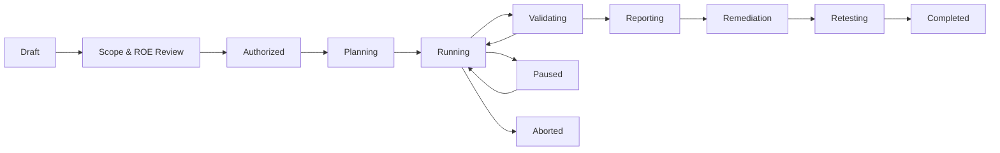
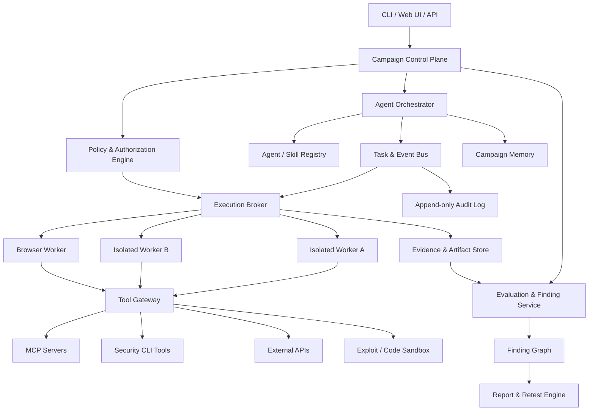
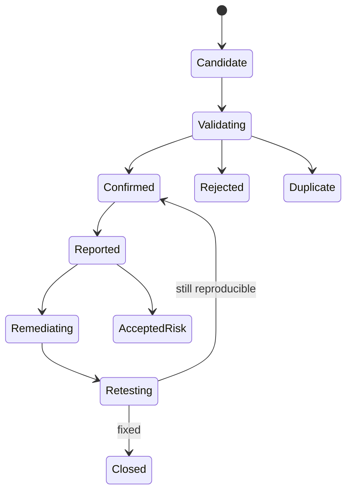

# PAJIN 제품 기획서

> 자율형 멀티 에이전트 AI 레드팀·보안 검증 오케스트레이션 플랫폼

| 항목 | 내용 |
| --- | --- |
| 문서 상태 | Implementation Baseline v0.2 |
| 작성일 | 2026-07-12 |
| 최종 최신화 | 2026-07-14 |
| 문서 목적 | 제품 방향, 범위, 핵심 요구사항, 안전 원칙, MVP 및 로드맵의 기준선 정의 |
| 주요 참고 | KISA 「AI 보안 레드티밍 가이드」(2026.07), STRIX, HEXSTRIKE AI |

---

## 1. Executive Summary

PAJIN은 AI가 보안 테스트 전 과정을 계획하고, 필요한 전문 에이전트를 동적으로 구성하며, MCP·Skills·CLI·브라우저·보안 도구를 안전하게 위임해 실제 취약점을 탐색·검증·보고하는 자율형 멀티 에이전트 시스템이다.

PAJIN은 다음 세 가지 실행 모드를 하나의 공통 엔진 위에서 제공하는 것을 목표로 한다.

1. **AI Red Team Mode**: LLM, RAG, AI 에이전트, MCP, 가드레일과 AI 애플리케이션의 보안·안전·품질·성능 검증
2. **Bug Bounty Mode**: 프로그램 정책과 허용 범위를 준수하는 정찰, 취약점 탐색, PoC 검증 및 신고서 생성
3. **CTF Mode**: 격리된 대회 환경에서 웹, 포너블, 리버싱, 포렌식, 암호학 등 문제 해결 자동화

PAJIN의 경쟁력은 단순히 많은 공격 도구를 연결하는 데 있지 않다. 다음 항목을 제품의 중심 가치로 삼는다.

- 승인된 범위 안에서 끝까지 수행 가능한 실질적 자율성
- 에이전트와 도구별 최소 권한 및 감쇠형 권한 위임
- 실험 전체를 재현할 수 있는 이벤트·대화·도구 호출·환경 증적
- 자동 탐색과 독립 검증 에이전트, 필요 시 HITL을 결합한 낮은 오탐률
- KISA 가이드에 맞춘 계획, 교전 규칙, 실행 로그, 결과 보고, 재검증 산출물
- 동일한 코어 위에서 보안 도메인을 Mode Pack과 Skill Pack으로 확장하는 구조

### 1.1 현재 구현 기준선

2026-07-14 기준 PAJIN은 **CLI 기반 정책 통제 멀티 에이전트 보안 검증 백엔드 MVP**다.
Phase 0-1은 완료되었고 Phase 2의 실행 코어는 완성되었지만 구조화 협업 메모리는 후속
과제다. Phase 3 Mode Pack은 제한된 실행 시나리오를 갖춘 동작 가능한 수준이며, Phase 4는
Control Plane의 첫 수직 조각까지 구현되었다.

| 영역 | 구현 상태 | 현재 경계 |
| --- | --- | --- |
| 공통 엔진 | 완료 | Supervisor, Planner, 동적 Specialist, Validator, Reporter와 작업 그래프 실행 |
| 정책·권한 | 완료 | Scope, Capability 감쇠, 계보별 호출 예산, 위험 등급, 승인, Kill Switch |
| 실행 격리 | MVP 완료 | Docker Worker, 기본 egress 차단, allowlist proxy, 등록 MCP와 고정 Tool |
| AI Red Team | 진행 중 | KISA 19개 위협·52개 체크리스트를 카탈로그화하고 A01·A02·A04·M03·M06 실행 |
| Bug Bounty | 진행 중 | 정책·Scope·중복·로컬 신고서와 고정 Boolean SQLi 로컬 랩 실행 |
| CTF | 진행 중 | 로컬 Web 백업 노출, 오프라인 Single-byte XOR, Web + Crypto Suite 실행 |
| Control Plane | 초기 구현 | FastAPI, PostgreSQL Job queue, 승인 체크포인트, fence형 취소, lease·heartbeat, 단일 Worker daemon |
| 제품 UI·생태계 | 초기 구현 | 동일 오리진 Web Console의 제출·조회·승인·재개·취소; Agent Graph, Pack registry와 외부 연동은 후속 |

현재 기본 인터페이스는 CLI + YAML이며, 외부 대상에 대한 범용 공격 자동화나 제출 자동화는
제공하지 않는다. 상세 안전 경계와 재현 명령은 저장소 `README.md`, KISA 커버리지는
`docs/KISA_TRACEABILITY.md`, 확정된 기술 결정은 `docs/adr/`를 기준으로 한다.

---

## 2. 배경과 문제 정의

### 2.1 현재 보안 자동화의 한계

기존 보안 스캐너와 LLM 기반 공격 자동화 도구는 다음 한계를 가진다.

- 개별 도구 실행은 자동화하지만 전체 공격 전략의 적응적 전개가 어렵다.
- 발견 결과가 실제 취약점인지 검증하지 않아 오탐이 누적된다.
- 여러 에이전트가 협업하더라도 권한, 범위, 예산, 중단 조건이 일관되게 적용되지 않는다.
- 도구 호출 결과와 대화 맥락이 분리되어 공격 체인의 재현이 어렵다.
- 강력한 MCP와 셸 권한이 에이전트에 과도하게 노출될 수 있다.
- AI 레드티밍, 버그바운티, CTF가 서로 다른 도구와 워크플로로 파편화되어 있다.
- 기술적 결과를 경영진, 개발팀, 규제 대응 담당자가 사용할 수 있는 산출물로 전환하기 어렵다.

### 2.2 PAJIN이 해결할 문제

PAJIN은 아래 질문에 일관된 방식으로 답해야 한다.

- 무엇을, 왜, 어디까지 테스트할 수 있는가?
- 어떤 에이전트가 어떤 근거로 생성되었는가?
- 각 에이전트는 어떤 도구와 자원에 접근할 수 있는가?
- 도구 실행이 교전 규칙, 법적 범위, 비용 한도를 충족하는가?
- 발견한 결과가 실제로 재현 가능하고 영향이 있는가?
- 누가, 언제, 어떤 입력과 환경에서 무엇을 실행했는가?
- 수정 이후 취약점이 제거되었고 정상 기능이 유지되는가?

---

## 3. 제품 비전

### 3.1 Vision

> 보안 전문가가 목표와 교전 규칙을 정의하면, PAJIN이 적절한 에이전트 팀을 구성하고 허용된 환경에서 탐색·공격·검증·보고·재검증까지 수행하는 신뢰 가능한 자율형 AI 레드팀 플랫폼을 만든다.

### 3.2 Mission

- 반복적인 보안 테스트를 자동화하면서 전문가 수준의 공격 체인 탐색을 지원한다.
- 강력한 공격 기능을 사용할수록 더 강한 통제와 증적이 적용되도록 한다.
- AI 보안과 전통적 애플리케이션 보안을 하나의 캠페인에서 연결한다.
- 자동화 결과를 감사와 개선에 사용할 수 있는 구조화된 데이터 자산으로 남긴다.

### 3.3 제품 원칙

1. **Scope First**: 모든 실행은 명시된 대상, 허용 범위, 제외 범위에서 시작한다.
2. **Least Privilege**: 에이전트는 작업에 필요한 최소 권한만 임시로 가진다.
3. **Authority Attenuation**: 하위 에이전트는 부모보다 넓은 권한을 받을 수 없다.
4. **Evidence or It Did Not Happen**: 증적 없는 성공 주장은 검증된 Finding이 아니다.
5. **Validate Before Report**: 탐색 에이전트의 결과를 독립된 검증 절차가 확인한다.
6. **Reproducibility by Default**: 모델, 프롬프트, 도구, 입력, 출력, 환경을 버전화한다.
7. **Safe Autonomy**: 자율성은 통제 부재가 아니라 사전 승인된 정책 안에서의 무인 수행이다.
8. **Human Escalation on Uncertainty**: 고위험·모호·정책 충돌 상황은 사람에게 에스컬레이션한다.
9. **Mode-Aware Behavior**: CTF, 버그바운티, AI 레드팀은 서로 다른 기본 정책을 가진다.
10. **Extensible but Governed**: 새 MCP·Skill·Tool은 등록, 검증, 권한 분류 후 사용한다.

---

## 4. 자율성 정의

PAJIN에서 **완전자동**은 에이전트가 제한 없이 행동한다는 의미가 아니다.

> 사용자가 사전에 승인한 목표, 범위, 자원, 시간, 비용, 도구 등급, 데이터 처리 규칙과 중단 조건 안에서 추가 입력 없이 캠페인을 완료할 수 있는 상태를 의미한다.

### 4.1 자율성 수준

| 수준 | 명칭 | 설명 | 권장 용도 |
| --- | --- | --- | --- |
| L0 | Manual | 모든 도구 실행을 사용자가 직접 요청 | 디버깅, 민감한 운영 환경 |
| L1 | Assisted | AI가 계획과 명령을 제안하고 사용자가 실행 | 초기 도입, 교육 |
| L2 | Supervised | 저위험 도구는 자동 실행하고 고위험 도구는 건별 승인 | 일반적인 운영 점검 |
| L3 | Policy-Autonomous | 사전 승인된 정책과 예산 안에서 자동 실행 | 스테이징, 버그바운티, 정기 점검 |
| L4 | Lab-Autonomous | 격리된 실험실에서 공격적 도구까지 자동 실행 | CTF, 소유한 테스트랩 |

초기 제품의 기본값은 **L2**이며, 신뢰 가능한 격리와 정책 엔진이 검증된 후 **L3**를 주력으로 제공한다. **L4**는 명시적으로 격리된 CTF·랩 환경에서만 허용한다.

---

## 5. 목표와 비목표

### 5.1 제품 목표

- 캠페인 단위로 목표, 범위, 접근 수준, 교전 규칙과 성공 기준을 관리한다.
- 작업에 따라 전문 에이전트를 동적으로 생성하고 종료한다.
- MCP, Skills, CLI, API, 브라우저, 코드 실행기를 통합 도구 모델로 제공한다.
- 에이전트마다 서로 다른 도구·네트워크·파일·비밀정보 권한을 부여한다.
- 정찰 결과를 공유하고 공격 체인을 연결할 수 있는 협업 메모리를 제공한다.
- 후보 Finding을 재현·독립 검증·중복 제거한 뒤 보고한다.
- KISA 가이드의 계획, 이행, 기록, 결과 보고, 후속 조치 흐름을 지원한다.
- Markdown, JSON, SARIF 및 향후 PDF 형식의 결과물을 생성한다.
- 로컬 단일 머신에서 시작해 분산 워커로 확장할 수 있다.

### 5.2 초기 비목표

- 무단 또는 불명확한 대상에 대한 공격 자동화
- 운영 환경에서 파괴적 DoS, 데이터 삭제, 랜섬웨어성 행위 자동 수행
- 실제 데이터 탈취나 외부 반출을 통한 영향 증명
- 모든 보안 도구를 PAJIN 코어에 직접 내장
- 모든 Finding의 자동 수정과 무검토 배포
- 범용 SIEM, SOAR, EDR 전체 기능 대체
- 자체 기반 모델 학습 및 대규모 모델 호스팅

---

## 6. 대상 사용자와 페르소나

| 사용자 | 주요 목표 | 핵심 요구 |
| --- | --- | --- |
| Red Team Lead / PM | 캠페인 계획, 범위·리스크·일정 관리 | 교전 규칙, 진행 가시성, 중단·승인, 보고서 |
| AI Red Team Specialist | 탈옥, 인젝션, RAG·에이전트 취약점 검증 | 공격 데이터셋, 멀티턴 공격, Judge, 재현성 |
| Penetration Tester | 웹·API·인프라 취약점 탐색 및 PoC | 브라우저, 프록시, 셸, 스캐너, 증적 수집 |
| Bug Bounty Hunter | 프로그램 범위 내 효율적 탐색과 신고 | 범위 준수, 중복 방지, PoC, 보고서 템플릿 |
| CTF Player / Team | 빠른 문제 분류와 병렬 풀이 | 카테고리별 에이전트, 격리 실행, 플래그 검증 |
| AI / Application Engineer | 원인 분석과 수정, 회귀 테스트 | 재현 스크립트, 로그, 수정 권고, 재검증 |
| Security Manager / Auditor | 위험과 통제 상태 파악 | 위험 요약, 감사 로그, 표준 매핑, 잔여 위험 |
| Platform Administrator | 모델·도구·워커·비밀정보 운영 | 접근 제어, 비용, 격리, 관측성, 정책 관리 |

---

## 7. 핵심 사용 시나리오

### 7.1 AI Red Team Mode

#### 대상

- 기반 모델 및 파인튜닝 모델
- 시스템 프롬프트와 가드레일
- RAG, 벡터 데이터베이스, 문서 저장소
- AI 에이전트, MCP 서버, Skills, Function Calling
- 사용자 인터페이스, API, 파일 업로드
- 데이터 파이프라인, 모델 서빙, CI/CD, 접근 제어

#### 주요 위협

- 프롬프트 인젝션과 간접 프롬프트 인젝션
- 탈옥과 정책 우회
- 시스템 프롬프트, 학습 데이터, RAG 데이터 유출
- 부적절한 출력 처리
- 에이전트 하이재킹과 도구 오남용
- 에이전트 메모리 오염
- 비용·토큰·호출 증폭과 에이전트 DoS
- 모델·데이터·확장요소 공급망 위험
- 환각, 편향, 과잉 거절, 성능 저하

#### 대표 흐름

1. 대상 커넥터와 모델·프롬프트 버전을 등록한다.
2. 지원 언어, 도메인, 위험 분류, 평가 기준을 선택한다.
3. 공격 표면 분석 에이전트가 테스트 계획을 구성한다.
4. Attacker 에이전트가 시드와 변형 전략을 생성한다.
5. Target Runner가 단일턴·멀티턴·간접 인젝션 시나리오를 실행한다.
6. 규칙·분류기·LLM Judge가 결과를 평가한다.
7. 불일치·고위험 결과를 Validator 또는 HITL로 전달한다.
8. 확정 Finding을 KISA 위협 분류 및 영향 기준에 매핑한다.
9. 수정 후 공격 회귀와 정상 질의 회귀를 함께 수행한다.

### 7.2 Bug Bounty Mode

#### 필수 입력

- 프로그램명과 정책 원문
- In-scope 및 Out-of-scope 자산
- 허용·금지 테스트 기법
- 속도 제한과 테스트 시간대
- 계정, 역할, 테스트 데이터 조건
- 데이터 접근·보관·삭제 규칙
- 신고 포맷과 심각도 기준

#### 대표 흐름

1. Scope Parser가 프로그램 정책을 구조화한다.
2. 사용자가 해석 결과를 확인하고 캠페인을 승인한다.
3. Recon 에이전트가 수동·능동 정찰 범위를 분리해 실행한다.
4. 전문 에이전트가 웹, API, 인증, 비즈니스 로직 등을 병렬 분석한다.
5. 후보 취약점은 별도 Validator가 최소 영향 방식으로 검증한다.
6. 기존 Finding, 공개 이슈, 동일 원인 후보를 중복 제거한다.
7. Reporter가 재현 절차, 영향, 증적, 권고를 포함한 신고서를 생성한다.

#### 기본 금지

- 범위 외 자산 접근
- 다른 사용자 데이터의 불필요한 열람·저장
- 대량 트래픽, 서비스 중단, 사회공학
- 지속성 확보, 백도어 설치
- 취약점 증명에 필요하지 않은 데이터 변경 또는 반출

### 7.3 CTF Mode

#### 지원 카테고리

- Web
- Pwn / Binary Exploitation
- Reverse Engineering
- Digital Forensics
- Cryptography
- OSINT
- Miscellaneous

#### 대표 흐름

1. 문제 설명과 제공 파일을 수집한다.
2. Triage 에이전트가 카테고리와 풀이 가설을 분류한다.
3. 카테고리별 전문 에이전트를 병렬 생성한다.
4. 각 에이전트는 격리된 워크스페이스와 도구 권한을 받는다.
5. 공유 Artifact Store를 통해 중간 결과를 교환한다.
6. Verifier가 플래그 포맷 또는 채점 서버로 결과를 검증한다.
7. 풀이 과정과 최종 Write-up을 생성한다.

CTF Mode는 공격적 도구 사용 범위가 가장 넓지만, 네트워크와 파일 접근은 대회 대상 및 격리 환경으로 강하게 제한한다.

---

## 8. 공통 캠페인 수명주기



### 8.1 상태 정의

| 상태 | 의미 | 진입 조건 |
| --- | --- | --- |
| Draft | 캠페인 초안 | 대상과 목적 생성 |
| Scope & ROE Review | 범위 및 교전 규칙 검토 | 필수 항목 입력 완료 |
| Authorized | 실행 권한 확보 | 승인 주체와 증빙 등록 |
| Planning | 에이전트가 공격 계획 구성 | 정책 검증 통과 |
| Running | 도구와 시나리오 실행 중 | 예산·워커 확보 |
| Validating | 후보 Finding 검증 | 후보 결과 존재 |
| Reporting | 결과와 잔여 위험 정리 | 검증 단계 완료 |
| Remediation | 개선 작업 추적 | 보고서 승인 |
| Retesting | 동일·변형 공격 및 회귀 테스트 | 수정 배포 완료 |
| Completed | 캠페인 종료 | 종료 기준 만족 |
| Paused | 사용자·정책·시스템에 의한 일시 중단 | 재개 가능 |
| Aborted | 비상 중단 또는 승인 철회 | 실행 권한 폐기 |

---

## 9. KISA 가이드 반영 모델

PAJIN은 KISA 가이드의 `준비 → 이행 → 결과 보고 → 후속 조치`를 제품 워크플로와 데이터 모델에 반영한다.

### 9.1 위협 분류

| 그룹 | 코드 | PAJIN 적용 영역 |
| --- | --- | --- |
| 데이터 위협 | D01-D03 | 데이터셋, 파이프라인, 비식별화 평가 |
| 모델 위협 | M01-M08 | 모델·프롬프트·가드레일·출력·가용성 평가 |
| 에이전트 위협 | A01-A04 | Tool Gateway, 메모리, MCP, 실행 루프 평가 |
| 공급망 위협 | S01-S04 | 모델·데이터·도구·플러그인 출처와 버전 검증 |

### 9.2 가이드 요구사항과 제품 기능 매핑

| KISA 활동 | PAJIN 기능 |
| --- | --- |
| 사전 협의 및 교전 규칙 | Campaign Manifest, ROE Policy, 승인 워크플로 |
| 목표·범위·제외 범위 설정 | Target Registry, Scope Rules, Deny Rules |
| 블랙·그레이·화이트박스 접근 | Access Profile과 Credential Grant |
| 공격 표면 식별 | Attack Surface Graph |
| 페르소나 정의 | Agent Persona 및 Threat Actor Profile |
| 공격 시나리오 구성 | Scenario Template과 Planner |
| 최소 권한 자산 제공 | Capability Grant와 임시 Secret Lease |
| 비상 보고와 중단 | Kill Switch, Policy Tripwire, Escalation Queue |
| 자동 공격과 전문가 심층 점검 | Attacker Agents, Validator, HITL Review |
| 영향·근본 원인 분석 | Finding Graph, Impact Model, Root Cause Field |
| 로그와 증적 관리 | Append-only Event Log, Evidence Store, Hash Manifest |
| 결과 보고 | Executive·Technical·Compliance Report Generator |
| 재검증과 회귀 테스트 | Retest Campaign, Security/Utility Regression Suite |
| 지속 점검 | Schedule, CI/CD Trigger, Baseline Drift Detection |
| CVD/VDP 연계 | Disclosure Package와 상태 추적 |

### 9.3 필수 산출물

- 테스트 계획서
- 교전 규칙 및 승인 기록
- 대상·범위·제외 범위 목록
- 위협 모델과 공격 표면 그래프
- 시나리오와 성공·중단 기준
- 테스트 실행 로그
- 공격 체인 스냅샷
- 재현 스크립트와 시각적 증거
- 취약점 상세 및 위험 요약
- 테스트 완료 보고서
- 개선 계획과 재검증 결과

---

## 10. 제품 아키텍처

### 10.1 논리 아키텍처



### 10.2 Control Plane

Control Plane은 실행을 직접 하지 않고 다음을 결정한다.

- 캠페인 상태와 승인 상태
- 대상과 범위
- 에이전트 생성·중단·재시도
- 작업 그래프와 우선순위
- 권한 및 정책 판정
- 비용·시간·호출·토큰 예산
- 후보 Finding의 검증 상태
- 보고와 재검증 흐름

### 10.3 Execution Plane

Execution Plane은 실제 도구를 격리된 환경에서 실행한다.

초기 Docker 격리와 Tool Gateway의 확정 결정은
[`ADR-0002`](adr/0002-tool-gateway-and-worker-isolation.md)를 따른다.

- 캠페인 또는 작업 단위의 임시 워커
- 읽기 전용 기본 파일시스템과 제한된 작업 디렉터리
- 대상 기반 네트워크 egress allowlist
- CPU, 메모리, 프로세스, 시간, 디스크, 요청률 제한
- 임시 자격 증명 주입과 자동 회수
- stdout, stderr, 파일, 네트워크, 스크린샷 증적 수집
- 워커 종료 시 정리 및 Artifact 보존

### 10.4 내부 표준화 계층

외부 MCP 프로토콜을 PAJIN의 내부 권한 모델로 직접 사용하지 않는다. 모든 외부 도구는 내부 `ToolSpec`으로 정규화한다.

`ToolSpec`의 최소 필드:

- 도구 ID, 이름, 버전, 공급자
- 입력·출력 JSON Schema
- 위험 등급과 예상 부작용
- 네트워크, 파일, 프로세스, 비밀정보 요구 권한
- 지원 실행 환경
- 기본 시간·비용·호출 제한
- 멱등성 여부
- 증적 수집 방법
- 공급망 검증 정보와 라이선스

이를 통해 MCP, Skills, 로컬 CLI, HTTP API가 동일한 Policy Engine을 통과하도록 한다.

---

## 11. 멀티 에이전트 모델

### 11.1 기본 에이전트 역할

| 역할 | 책임 | 기본 도구 권한 |
| --- | --- | --- |
| Campaign Manager | 목표 분해, 일정·예산·종료 기준 관리 | 메타데이터 읽기, 작업 생성 |
| Planner | 공격 표면과 시나리오 설계 | 대상 정보·지식베이스 읽기 |
| Recon Agent | 자산과 엔드포인트 탐색 | 수동·제한적 능동 정찰 |
| Web / API Agent | 웹·API 취약점 탐색 | 브라우저, 프록시, HTTP 도구 |
| Code Agent | 소스·구성·의존성 분석 | 저장소 읽기, 제한된 빌드·테스트 |
| AI Security Agent | 모델·RAG·에이전트 공격 | Target Connector, 공격 데이터셋 |
| CTF Specialist | 카테고리별 문제 풀이 | 격리된 분석·공격 도구 |
| Validator | 후보 취약점 독립 재현 | 후보별 최소 권한 도구 |
| Judge | 정량·정성 평가와 불일치 탐지 | 규칙, 분류기, 평가 모델 |
| Reporter | 기술·비즈니스·규제 보고 | 확정 Finding 및 증적 읽기 |
| Retest Agent | 수정 후 재공격과 정상 기능 확인 | 저장된 재현 자산과 대상 접근 |

### 11.2 동적 생성 규칙

에이전트 생성 요청은 다음 정보를 포함해야 한다.

- 생성 사유와 해결할 작업
- 기대 산출물
- 부모 에이전트와 책임 관계
- 요청 Capability 목록
- 시간, 토큰, 비용, 도구 호출 예산
- 종료 조건
- 최대 재시도 횟수
- 생성 깊이와 동시 에이전트 한도

### 11.3 권한 위임 불변식

```text
child.scope       ⊆ parent.scope
child.capability  ⊆ parent.delegable_capability
child.budget      ≤ parent.remaining_budget
child.expiry      ≤ parent.expiry
child.risk_tier   ≤ campaign.max_risk_tier
```

하위 에이전트가 더 높은 권한을 요구하면 부모가 직접 부여할 수 없으며 Policy Engine의 재평가와 필요한 승인 절차를 거쳐야 한다.

### 11.4 협업 메모리

메모리는 네 가지로 분리한다.

1. **Immutable Evidence**: 원본 요청·응답·도구 결과·파일 해시
2. **Campaign Facts**: 검증된 자산, 계정 역할, 기술 스택, 제약 조건
3. **Hypotheses**: 아직 검증되지 않은 공격 가설과 신뢰도
4. **Agent Working Memory**: 개별 에이전트의 임시 사고와 작업 상태

외부 문서, 웹 페이지, RAG 결과는 신뢰되지 않은 데이터로 표시하고 명령으로 취급하지 않는다. 메모리로 승격되는 사실은 출처와 검증 상태를 가져야 한다.

---

## 12. 권한과 안전 모델

### 12.1 Capability Grant

도구 사용 권한은 역할명이 아니라 구체적인 Capability로 발급한다.

예시:

```yaml
capability_grant:
  subject: agent:web-validator-02
  campaign: campaign-2026-001
  tools:
    - http.request
    - browser.navigate
    - browser.screenshot
  targets:
    allow:
      - https://staging.example.com/**
    deny:
      - https://staging.example.com/admin/delete/**
  network:
    methods: [GET, HEAD, POST]
    requests_per_minute: 30
  filesystem:
    read: [/workspace/evidence/input]
    write: [/workspace/evidence/output]
  secrets:
    leases: [test-user-session]
  limits:
    expires_in: 20m
    max_calls: 200
    max_cost_usd: 3.00
  delegable: false
```

### 12.2 도구 위험 등급

| 등급 | 설명 | 예시 | 기본 정책 |
| --- | --- | --- | --- |
| T0 | 로컬·메타데이터 읽기 | 파일 목록, 로그 조회, 정적 분석 | 자동 허용 |
| T1 | 수동적 외부 관찰 | DNS 조회, 공개 정보 검색 | 범위 검증 후 허용 |
| T2 | 비파괴 능동 테스트 | 제한된 HTTP 요청, 안전 스캔 | 예산·속도 제한 후 허용 |
| T3 | 상태 변화 또는 실제 악용 가능 | 인증 우회 검증, 코드 실행 PoC | 사전 승인 또는 건별 승인 |
| T4 | 파괴·지속성·대규모 영향 가능 | DoS, 삭제, 지속성, 외부 반출 | 기본 금지, 격리 랩만 예외 |

### 12.3 정책 판정 순서

1. 캠페인 승인 유효성
2. 대상이 Allow Scope에 포함되는지 확인
3. Deny Scope와 금지 행위 우선 적용
4. 에이전트 Capability 보유 여부
5. 모드별 최대 위험 등급
6. 시간·비용·요청률·동시성 예산
7. 데이터 처리 및 비밀정보 정책
8. 승인 또는 HITL 요구 여부
9. 실행 후 증적 수집 가능 여부

`deny`는 항상 `allow`보다 우선한다.

### 12.4 Kill Switch와 Tripwire

즉시 중단 조건:

- 범위 외 대상 접근 시도
- 실제 개인정보·인증정보·기밀정보의 예상치 못한 노출
- 서비스 오류율, 지연, 자원 사용량 임계치 초과
- 비용 또는 도구 호출량의 급격한 증가
- 에이전트 무한 루프 또는 반복 실패
- 권한 상승·정책 우회 시도 감지
- 감사 로그나 증적 수집 실패
- 승인 철회 또는 대상 소유권 불명확

중단 시 신규 Tool Invocation을 차단하고, 실행 중 프로세스를 종료하며, Secret Lease를 회수하고, 상태 스냅샷을 보존한다.

---

## 13. 핵심 기능 요구사항

우선순위는 `P0 = MVP 필수`, `P1 = 첫 공개 버전`, `P2 = 확장`으로 정의한다.
이 표는 목표 요구사항 백로그이며 현재 구현 완료표가 아니다. 실제 구현 상태와 제한은
1.1절과 21절을 기준으로 한다.

### 13.1 Campaign & Scope

| ID | 요구사항 | 우선순위 |
| --- | --- | --- |
| CAM-001 | 캠페인 생성, 복제, 일시중지, 재개, 중단 | P0 |
| CAM-002 | 목적, 성공 기준, 시작·종료 기준 관리 | P0 |
| CAM-003 | 대상, 허용 범위, 제외 범위, 접근 수준 관리 | P0 |
| CAM-004 | 교전 규칙과 승인 증빙 등록 | P0 |
| CAM-005 | 모델·프롬프트·애플리케이션 버전 스냅샷 | P1 |
| CAM-006 | 예약 및 CI/CD 이벤트 기반 실행 | P1 |

### 13.2 Agent Orchestration

| ID | 요구사항 | 우선순위 |
| --- | --- | --- |
| AGT-001 | 사전 정의 에이전트 실행 | P0 |
| AGT-002 | 작업 그래프 생성과 의존성 관리 | P0 |
| AGT-003 | 동적 하위 에이전트 생성과 종료 | P1 |
| AGT-004 | 에이전트별 예산·권한·시간 제한 | P0 |
| AGT-005 | 에이전트 간 사실·Artifact 공유 | P0 |
| AGT-006 | 실패 재시도, 대체 전략, 체크포인트 복구 | P1 |
| AGT-007 | 생성 깊이·개수·동시성 제한 | P0 |

### 13.3 Tool & Execution

| ID | 요구사항 | 우선순위 |
| --- | --- | --- |
| TOL-001 | MCP, CLI, HTTP, 브라우저 Tool Adapter | P0 |
| TOL-002 | ToolSpec 등록과 위험 등급 관리 | P0 |
| TOL-003 | 모든 도구 호출 전 정책 검사 | P0 |
| TOL-004 | 컨테이너 기반 격리 실행 | P0 |
| TOL-005 | 네트워크 egress와 파일 접근 제한 | P0 |
| TOL-006 | 임시 Secret Lease 발급·마스킹·회수 | P1 |
| TOL-007 | 도구 상태, 버전, 공급망 정보 점검 | P1 |
| TOL-008 | 원격·분산 워커 스케줄링 | P2 |

### 13.4 Evidence & Findings

| ID | 요구사항 | 우선순위 |
| --- | --- | --- |
| EVD-001 | 입력, 출력, 도구 인자, 지연, 오류 기록 | P0 |
| EVD-002 | 멀티턴 대화와 도구 호출을 단일 Trace로 연결 | P0 |
| EVD-003 | 파일, 스크린샷, HTTP 트랜스크립트 저장 | P0 |
| EVD-004 | Artifact 해시 및 변경 탐지 | P1 |
| FND-001 | 후보와 확정 Finding 분리 | P0 |
| FND-002 | 독립 재현 및 최소 1개 검증 근거 요구 | P0 |
| FND-003 | 중복·동일 근본 원인 군집화 | P1 |
| FND-004 | KISA, OWASP, CWE, CVSS 등 분류 매핑 | P1 |
| FND-005 | 영향·악용 가능성·재현성·탐지 가능성 평가 | P0 |

### 13.5 Evaluation & Reporting

| ID | 요구사항 | 우선순위 |
| --- | --- | --- |
| EVL-001 | 규칙·분류기·LLM Judge 조합 | P0 |
| EVL-002 | Judge 불일치와 신뢰도 기록 | P0 |
| EVL-003 | 고위험·모호 결과 HITL 큐 | P1 |
| RPT-001 | Markdown 및 JSON 결과 보고 | P0 |
| RPT-002 | 경영진 요약과 기술 상세 분리 | P1 |
| RPT-003 | KISA 체크리스트와 완료 보고서 생성 | P1 |
| RPT-004 | SARIF, PDF, 이슈 트래커 내보내기 | P2 |
| RPT-005 | 수정 권고와 재검증 캠페인 생성 | P1 |

---

## 14. 데이터 모델

### 14.1 주요 엔터티

| 엔터티 | 역할 |
| --- | --- |
| Project | 장기 대상과 팀 단위 컨테이너 |
| Campaign | 한 번의 레드티밍·버그바운티·CTF 수행 단위 |
| Target | 도메인, API, 저장소, 모델, 파일, 채점 서버 등 대상 |
| ScopeRule | 허용·금지 대상, 경로, 메서드, 시간대 |
| RuleOfEngagement | 허용 기법, 금지 행위, 중단 조건, 연락 체계 |
| Authorization | 소유권·승인 주체·유효 기간 증빙 |
| Scenario | 공격 목표, 사전 조건, 실행 절차, 판정 기준 |
| AgentDefinition | 역할, 프롬프트, 도구 요구사항, 기본 정책 |
| AgentInstance | 캠페인에서 실행 중인 에이전트 인스턴스 |
| CapabilityGrant | 에이전트에 부여된 임시 권한 |
| Task | 실행할 작업과 의존성, 상태, 예산 |
| ToolInvocation | 정책 판정부터 실행 결과까지의 도구 호출 |
| Trace | 에이전트 대화, 작업, 도구 호출을 연결한 실행 추적 |
| Artifact | 파일, 스크린샷, 로그, 패킷, 재현 스크립트 |
| CandidateFinding | 탐색 단계에서 발견된 후보 |
| Finding | 검증된 취약점과 영향·근본 원인 |
| Evaluation | Judge와 사람의 판정 및 기준 |
| Remediation | 담당자, 조치 내용, 기한, 상태 |
| Retest | 동일·변형 공격 및 정상 기능 회귀 결과 |
| Report | 특정 시점의 결과 산출물 |
| AuditEvent | 변경 불가능한 보안·운영 이벤트 |

### 14.2 Finding 상태



### 14.3 Finding 필수 필드

- 고유 ID와 제목
- 최초 발견 및 최종 검증 시간
- 대상과 영향받는 구성 요소
- 위협 분류와 보안 분류 체계 매핑
- 사전 조건과 공격 경로
- 재현 가능한 입력·절차·스크립트
- 관찰된 결과와 기대 결과
- 기밀성·무결성·가용성·안전성·품질 영향
- 악용 가능성, 재현성, 탐지 가능성
- 기술 심각도와 비즈니스 우선순위
- 근본 원인 가설과 신뢰도
- 증적 Artifact 목록과 해시
- 완화 권고와 재검증 기준

---

## 15. 평가 전략

### 15.1 다중 판정

단일 LLM Judge의 판정을 최종 결과로 사용하지 않는다.

1. **Deterministic Checks**: 정규식, 스키마, 응답 코드, 도구 호출, 데이터 유출 토큰 등
2. **Specialized Classifier**: 유해성, 인젝션, 비밀정보, 정책 분류 모델
3. **LLM Judge**: 맥락, 실행 가능성, 도메인 영향 평가
4. **Independent Validator**: 다른 프롬프트·모델·환경에서 재현
5. **Human Review**: Critical, 판단 불일치, 신규 공격, 법적·윤리적 모호성

### 15.2 신뢰도 계산 요소

- 동일 조건 반복 성공률
- 변형 입력에서의 성공률
- 독립 Validator의 재현 여부
- 직접 관찰된 시스템 상태 변화
- 증적 완전성
- Judge 간 일치도
- 환경 의존성과 비결정성

### 15.3 AI Red Team 지표

- Attack Success Rate
- Block / Refusal Rate
- Over-refusal Rate
- Reproducibility Rate
- Sensitive Data Exposure Count
- Unauthorized Tool Invocation Count
- Mean Turns to Compromise
- Token / Cost Amplification
- Latency and Resource Degradation
- Judge Agreement Rate

---

## 16. 사용자 경험

### 16.1 초기 인터페이스

MVP는 CLI와 YAML Campaign·Mode Pack Manifest를 우선한다. 현재 구현된 명령 표면은 다음과
같으며, 각 명령의 옵션은 `pajin <command> --help`를 기준으로 한다.

| 영역 | 현재 명령 |
| --- | --- |
| 공통 실행 | `pajin validate`, `pajin run`, `pajin multi-run`, `pajin multi-cancel-check` |
| Provider·Agent Loop | `pajin provider-check`, `pajin provider-agent-run`, `pajin tool-loop-run`, `pajin tool-loop-approval-check` |
| KISA AI Red Team | `pajin kisa-run`, `pajin kisa-plan-remediation`, `pajin kisa-retest` |
| Bug Bounty | `pajin bug-bounty-review`, `pajin bug-bounty-compile`, `pajin bug-bounty-report`, `pajin bug-bounty-run` |
| CTF | `pajin ctf-run`, `pajin ctf-web-run`, `pajin ctf-suite-run` |
| 증적·인프라 점검 | `pajin evidence-verify`, `pajin worker-check`, `pajin egress-check`, `pajin mcp-check` |
| 서버 프로세스 | `pajin-control-plane`, `pajin-worker-daemon` |

초기 기획에 있던 범용 `authorize`, `status`, `findings`, `report`, `stop` CLI는 아직 별도
명령으로 구현하지 않았다. 지속 실행의 제출·조회·승인·재개·취소는 현재 선택적 Control
Plane API가 담당하며, 동일 오리진 Web Console이 선택 Run의 동일 흐름을 제공한다.

### 16.2 현재 Web Console과 향후 Web UI

현재 `/ui` Web Console은 외부 프런트엔드 의존성 없이 다음 최소 운영 흐름을 제공한다.

- 메모리 전용 Bearer 인증과 역할 확인
- Operator의 멱등 Run 제출
- 상태 필터·제한된 offset pagination 기반 Run 목록
- 선택 Run의 승인된 입력과 append-only 이벤트 조회
- 현재 체크포인트에 연결된 최소화된 승인 intent 조회
- Approver의 승인·거절과 Operator의 1회성 재개
- Operator의 사유 기반 멱등 취소와 active lease 폐기
- 수동 또는 5초 polling 기반 상태 갱신

공개 shell에는 데이터가 없고 모든 `/v1` 요청은 기존 역할 인증을 다시 통과한다. Console은
로컬 단일 테넌트 preview이며 보고서 다운로드, fleet 단위 승인 큐, 사용자 계정과 조직
격리는 아직 제공하지 않는다. 취소는 추가 dispatch와 결과 commit을 fence하지만 이미 발생한
외부 부작용을 되돌리거나 임의 executor의 즉시 정지를 보장하지 않는다. Worker는 취소된 Run,
lease 상실, heartbeat 불능, daemon 종료를 타입화된 first-wins 컨텍스트로 trusted executor에
전달하고, 제한된 협력 정리 시간 뒤 강제 task 취소로 전환한다. Local Campaign·Tool Loop는
`cancellation.json` 정리 영수증을, trusted executor는 `quiescence.json` 로컬 실행 스택 종료
영수증을 추가 seal로 보존한다. 이는 Control Plane의 정리 승인이나 외부 시스템의 물리적 정지
증명이 아니며, `cancelling` 상태와 fenced cleanup acknowledgement는 후속 범위다.

향후 제품 Web UI의 주요 화면:

- 프로젝트 및 캠페인 대시보드
- 범위·교전 규칙 편집기
- 실시간 에이전트 그래프
- 작업, 예산, 도구 호출 현황
- 정책 거부 및 승인 요청 큐
- 공격 체인 Trace Viewer
- 후보·확정 Finding 검토 화면
- 증적과 재현 실행 화면
- 위험 요약과 KISA 체크리스트
- 수정 및 재검증 추적

### 16.3 캠페인 Manifest 예시

```yaml
apiVersion: pajin.dev/v1alpha1
kind: Campaign
metadata:
  name: kisa-ai-chat-lab-assessment
  description: KISA-aligned Docker assessment of a provider-neutral AI chat target.
spec:
  mode: ai-redteam
  autonomy: supervised
  authorization:
    approvedBy: local-project-owner
    approvedAt: 2026-07-01T00:00:00+09:00
    expiresAt: 2030-01-01T00:00:00+09:00
    evidence: local-development-lab-authorization
  targets:
    - type: ai-chat-api
      id: pajin-vulnerable-ai-lab
      endpoint: http://host.docker.internal:8765/v1/chat
  scope:
    allow:
      - http://host.docker.internal:8765/v1/chat
    deny:
      - http://host.docker.internal:8765/admin/**
  accessProfile: greybox
  objectives:
    - detect system prompt disclosure
    - validate jailbreak policy enforcement
    - detect persistence of untrusted input in agent memory
  threatClasses: [M03, M06, A04]
  rulesOfEngagement:
    maxToolRiskTier: T2
    allowedMethods: [POST]
    prohibit:
      - denial-of-service
      - real-user-data-access
      - out-of-scope-access
    stopOn:
      - sensitive-data-exposure
      - out-of-scope-attempt
    allowPrivateNetworks: true
  budgets:
    durationSeconds: 120
    maxCostUsd: 1
    maxAgents: 12
    maxSpawnDepth: 1
    maxToolCalls: 8
  outputs:
    - markdown-report
    - json-findings
    - kisa-checklist
    - kisa-completion-report
```

---

## 17. 비기능 요구사항

### 17.1 보안

- 모든 API와 작업에 프로젝트·캠페인·역할 기반 접근 제어 적용
- Secret은 저장 시 암호화하고 실행 시 임시 Lease로만 제공
- 로그와 보고서에서 토큰, 쿠키, 개인정보 자동 마스킹
- 관리자·정책 변경·승인·도구 실행에 감사 이벤트 생성
- 워커는 기본적으로 외부 네트워크 차단
- Tool과 컨테이너 이미지의 버전 고정 및 출처 검증
- 에이전트 입력의 신뢰 경계와 prompt injection 방어 적용

### 17.2 신뢰성과 복구

- 작업 단위 체크포인트와 재시도
- 중복 실행 방지를 위한 Invocation ID와 멱등성 키
- 워커 장애 시 Artifact와 상태 복구
- 모델·외부 API 장애 시 대체 Provider 또는 안전한 중단
- 감사 로그 실패 시 공격 실행 차단

### 17.3 성능과 확장성

- 로컬 MVP에서 동시 에이전트 5개 이상
- Tool Invocation의 정책 판정 지연 목표 100ms 이하
- 캠페인별 동시성·요청률·비용 제한
- 실행 워커의 수평 확장 가능 구조
- 대규모 로그와 Artifact를 운영 DB에서 분리 저장

### 17.4 관측성

- OpenTelemetry 호환 Trace, Metric, Log
- 캠페인, 에이전트, 작업, 도구 호출 단위 상관관계 ID
- 모델 토큰, 비용, 지연, 오류율
- 정책 허용·거부·승인 대기 통계
- 워커 CPU, 메모리, 디스크, 네트워크 사용량

---

## 18. PAJIN 자체 위협 모델

PAJIN은 공격 도구를 다루기 때문에 일반 SaaS보다 강한 내부 위협 모델이 필요하다.

| 위협 | 예시 | 핵심 통제 |
| --- | --- | --- |
| Prompt Injection | 웹 페이지가 에이전트에게 범위 외 명령 지시 | 외부 콘텐츠 비신뢰 표시, 정책 분리, Tool Gateway |
| Agent Hijacking | 하위 에이전트가 권한 확대 요청 | 감쇠형 위임, Policy Engine 재평가 |
| Memory Poisoning | 거짓 사실이 공유 메모리에 영구 저장 | 출처·검증 상태, immutable evidence 분리 |
| Tool Supply Chain | 악성 MCP·Skill·컨테이너 등록 | 서명, 버전 고정, 격리, 등록 심사 |
| Secret Leakage | 프롬프트·로그·보고서에 API 키 노출 | Secret Lease, 마스킹, DLP 검사 |
| Scope Escape | 리디렉션·DNS·링크로 범위 외 접근 | 요청 시점 대상 재검증, egress allowlist |
| Confused Deputy | 허용된 도구가 다른 시스템을 대신 조작 | 대상·행위 단위 Capability |
| Cost Exhaustion | 무한 에이전트 생성과 API 호출 | 예산, 깊이·동시성 제한, circuit breaker |
| Evidence Tampering | 공격 결과 수정 또는 삭제 | append-only log, 해시, 객체 버전 관리 |
| Cross-Campaign Leakage | 다른 고객·캠페인의 메모리 공유 | 저장소·워커·키의 캠페인 격리 |

---

## 19. 기술 방향 초안

아래는 구현 착수 시점의 기술 방향이다. Agent Runtime과 Orchestration 경계는
[`ADR-0001`](adr/0001-agent-runtime-and-orchestration.md)에서 확정하였다.

| 영역 | 선택 | 이유 |
| --- | --- | --- |
| 주 언어 | Python 3.12+ | AI·보안 도구 생태계, 비동기 작업, 빠른 확장 |
| API | FastAPI + Pydantic | 선택적 Control Plane의 타입 기반 계약과 비동기 API로 구현 |
| CLI | Typer | 초기 운영과 자동화용 기본 인터페이스로 구현 |
| 영속 저장 | 로컬 Run Store + PostgreSQL | CLI Artifact와 Control Plane Job·승인·감사 상태를 분리해 영속화 |
| Artifact | 로컬 파일 → S3 호환 객체 저장소 | MVP 단순성 및 확장성 |
| 작업 큐 | 인프로세스 실행 + PostgreSQL Job queue | 다중 Worker 원자적 claim·lease·heartbeat·crash requeue 구현, 운영 Worker pool은 후속 과제 |
| 격리 | Docker → 강화 런타임/gVisor/Kubernetes | 개발 편의와 운영 격리의 단계적 강화 |
| 정책 | 내부 Policy 인터페이스 → OPA/Cedar 검토 | MVP 속도와 장기 정책 표현력 균형 |
| 모델 연동 | Provider Gateway | 모델 교체, 비용, 로깅, 재현성 |
| 관측성 | Audit Event·Evidence Seal → OpenTelemetry | 현재 로컬 재현성과 무결성 우선, 운영 텔레메트리는 후속 확장 |
| 외부 도구 | MCP Adapter + Canonical ToolSpec | 프로토콜 종속성 최소화 |

핵심 원칙은 PydanticAI가 모델 기반 계획·검증을 담당하고, Campaign 상태·Capability·정책
판정·도구 실행·증적은 PAJIN Core가 소유하는 것이다. 초기 Workflow Backend는 로컬 구현을
사용하며 장기 실행과 분산 워커가 필요한 단계에서 Temporal Adapter를 추가한다.

### 19.1 현재 저장소 구조

```text
PAJIN/
├─ src/pajin/
│  ├─ agents/
│  ├─ control_plane/
│  ├─ domain/
│  ├─ modes/
│  │  ├─ ai_redteam/
│  │  ├─ bug_bounty/
│  │  └─ ctf/
│  ├─ policy/
│  ├─ providers/
│  ├─ reporting/
│  ├─ runtime/
│  ├─ tools/
│  └─ workflow/
├─ containers/
├─ examples/
├─ scripts/
├─ tests/
└─ docs/adr/
```

---

## 20. MVP 정의

### 20.1 MVP 목표

> 로컬 환경에서 하나의 캠페인을 정의하고, 두 개 이상의 전문 에이전트가 제한된 도구를 사용해 테스트를 수행하며, 검증된 Finding과 재현 가능한 Markdown 보고서를 생성한다.

### 20.2 MVP 범위

#### 포함

- YAML Campaign 및 Mode Pack Manifest
- AI Red Team, 제한된 로컬 Bug Bounty, Web·Crypto CTF 수직 시나리오
- Campaign과 Run 상태 모델
- Supervisor, Planner, 동적 Specialist, 독립 Validator, Reporter 에이전트
- 등록형 Mock, HTTP, MCP 및 Mode Pack Tool Adapter
- Docker 기반 격리 워커
- Capability와 Scope Policy
- 호출 전 정책 검사와 Kill Switch
- 이벤트·Trace·Artifact 저장
- 후보/확정 Finding 분리
- Markdown 및 JSON 보고서
- 동일 입력 기반 재검증
- 선택적 FastAPI·PostgreSQL Control Plane과 단일 Worker daemon

#### 제외

- 멀티테넌트 Web UI
- 대규모 분산 워커
- 완전한 동적 에이전트 마켓플레이스
- 운영 환경 T3/T4 자동 실행
- 자동 패치와 Pull Request 생성
- 모든 KISA 산출물의 완전 자동화

현재 구현은 최초 최소 MVP 범위를 넘어 세 Mode Pack과 지속성 Control Plane의 초기 조각을
포함한다. 단, 지원 시나리오의 폭과 운영 배포 수준은 Phase 3-4의 후속 범위다.

### 20.3 MVP 완료 기준

- 범위 외 URL 요청이 Tool Gateway에서 차단된다.
- 부모보다 넓은 권한의 하위 에이전트를 생성할 수 없다.
- 예산 또는 시간 초과 시 실행이 자동 중단된다.
- 모든 Tool Invocation이 Trace와 Audit Event를 남긴다.
- Finding은 Validator의 재현 결과 없이는 Confirmed가 될 수 없다.
- 보고서에서 입력, 출력, 모델·도구 버전, 재현 절차를 확인할 수 있다.
- 캠페인 중단 시 워커와 Secret Lease가 회수된다.
- 동일 캠페인을 재실행했을 때 비교 가능한 결과가 생성된다.

---

## 21. 단계별 로드맵

| 단계 | 상태 | 2026-07-14 기준 판단 |
| --- | --- | --- |
| Phase 0 | 완료 | 기획·스키마·위협 모델·ADR·합성 타깃 기준선 확보 |
| Phase 1 | 완료 | CLI, Campaign, Tool Gateway, Docker Worker, 보고·증적 수직 실행 확보 |
| Phase 2 | 핵심 완료 | 역할 분리, 동적 Specialist, 검증, 권한 감쇠, 예산·취소·승인 확보; 구조화 협업 메모리는 후속 |
| Phase 3 | 진행 중 | 세 Mode Pack이 실행 가능하나 시나리오 범위와 CI 연동은 제한적 |
| Phase 4 | 초기 구현 | PostgreSQL Control Plane, Worker daemon, 승인·재개·취소 Web Console 수직 흐름 구현 |

### Phase 0 — Foundation & Governance (완료)

- 제품 기획서와 핵심 용어 확정
- Campaign, Scope, ROE, Capability 스키마 정의
- 자체 위협 모델 작성
- 아키텍처 ADR 작성
- 안전한 개발·테스트용 샘플 타깃 선정

### Phase 1 — Single-Agent Vertical Slice (완료)

- CLI와 Campaign Manifest
- 단일 에이전트 실행 루프
- Tool Registry와 Tool Gateway
- Docker 워커와 기본 egress 통제
- Event Log, Artifact, Markdown 보고서

### Phase 2 — Validated Multi-Agent MVP (핵심 완료)

- Planner, Specialist, Validator, Reporter 분리
- 작업 그래프와 동일 Run 증적·Artifact 공유
- Capability Grant와 감쇠형 위임
- 후보 Finding 검증 및 중복 처리
- Kill Switch, 예산, 재시도, 체크포인트
- 남은 범위: Campaign Facts·Hypotheses·Agent Working Memory의 구조화된 영속 계층

### Phase 3 — Mode Packs (진행 중)

- AI Red Team: KISA 전체 카탈로그와 A01·A02·A04·M03·M06 실행 시나리오
- Bug Bounty: Scope Parser, 보수적 중복 판정, 신고서 초안, 고정 로컬 SQLi 랩
- CTF: Web·Crypto Specialist와 제한된 병렬 Suite
- KISA 체크리스트, 완료 보고서, 완화 계획, 재검증·정상 기능 회귀
- 남은 범위: KISA 14개 위협 실행 시나리오, 추가 Bug Bounty·CTF 시나리오, CI/CD 워크플로

### Phase 4 — Platform & Ecosystem (초기 구현)

- FastAPI·PostgreSQL 기반 Job queue와 lease-aware Worker daemon은 초기 구현 완료
- 동일 오리진 Web Console의 Run 제출·조회·승인·재개·취소는 초기 구현 완료
- typed 취소 전파, bounded cooperative grace·forced fallback, 로컬 정리·quiescence seal은 초기 구현 완료
- 남은 취소 범위: `cancelling` 전이, Worker별 신뢰 ID, fenced cleanup acknowledgement와 중앙 영수증 검증
- fleet 단위 승인 큐, 보고서 검토 UI와 실시간 Agent Graph
- 분산 Worker Pool
- 조직·프로젝트·역할 기반 접근 제어
- MCP·Skill·Tool Pack 등록과 검증
- 이슈 트래커, VDP, SIEM/SOAR 연동
- 정책·도메인·공격 데이터셋 마켓플레이스

---

## 22. 성공 지표

### 22.1 제품 품질

- Confirmed Finding Precision
- 후보 대비 확정 Finding 비율
- 독립 재현 성공률
- 중복 Finding 감소율
- 보고서 재현 절차 성공률
- 정책 우회 및 범위 이탈 0건

### 22.2 자동화 효율

- 캠페인 계획부터 첫 후보 발견까지의 시간
- 전문가가 직접 수행한 도구 호출 대비 자동화 비율
- Finding당 평균 모델·도구 비용
- 캠페인당 사람 승인·개입 횟수
- 실패 후 자동 복구율

### 22.3 보안 개선

- 재검증 통과율
- 수정 후 변형 공격 차단율
- 정상 질의 회귀 통과율
- Critical/High 조치 소요 시간
- 반복 캠페인 간 미해결 위험 감소율

---

## 23. 주요 리스크와 대응

| 리스크 | 영향 | 대응 방향 |
| --- | --- | --- |
| 강력한 도구의 오남용 | 법적·운영 피해 | 승인 증빙, Scope Policy, 격리, T3/T4 통제 |
| LLM 비결정성과 환각 | 허위 Finding, 불안정 실행 | Validator, 증적 요구, 다중 판정 |
| MCP·Skill 공급망 | PAJIN 호스트 침해 | 등록 심사, 버전 고정, 워커 격리, 최소 권한 |
| 비용 폭주 | 예산 고갈 | 계층별 예산, circuit breaker, 캐시, 중복 제거 |
| 지나친 초기 범위 | 개발 지연 | 공통 코어와 하나의 수직 시나리오 우선 |
| 도구 설치 복잡성 | 사용자 진입 장벽 | Tool Pack 이미지, 상태 점검, 점진적 다운로드 |
| 규제·정책 차이 | 모드별 사용 제한 | Policy Profile과 조직별 ROE 템플릿 |
| 공격 데이터 민감성 | 유출·노출 위험 | 암호화, 접근 통제, 보존 기간, 마스킹 |

---

## 24. 오픈 의사결정

초기 질문 중 실행 경계와 기술 구조는 ADR-0001부터 ADR-0023까지에서 확정했다. 다음
항목은 Phase 3-4 진행 전에 추가 결정이 필요하다.

1. 운영 Worker fleet의 배치·확장·backpressure와 at-least-once 외부 부작용의 멱등성 정책
2. Web UI의 인증, 세션, 조직·프로젝트 격리와 멀티테넌시 경계
3. Campaign Memory의 영속 범위, 재사용, 보존·파기 및 학습 사용 정책
4. MCP·Skill·Tool Pack의 서명, 심사, 라이선스, 버전 고정과 업데이트 정책
5. KISA 외 OWASP, NIST, MITRE ATLAS 매핑 우선순위
6. 오픈소스 코어와 향후 상용 기능의 경계
7. 로컬 Evidence Seal을 외부 서명·객체 저장소에 앵커링하는 운영 방식

### 24.1 확정된 초기 결정

- **첫 수직 시나리오**: 에이전트형 AI 애플리케이션의 간접 프롬프트 인젝션 및 무단 도구 호출 검증
- **배포 형태**: 로컬 단일 사용자 우선, 선택적 FastAPI·PostgreSQL Control Plane 병행
- **기본 자율성**: L2 Supervised
- **Tool Loop 실행 등급**: T0-T2 자동, T3-T4는 정확한 호출 단위 승인 필수; Mode Policy는 더 엄격하게 제한 가능
- **첫 인터페이스**: CLI + YAML
- **첫 보고 형식**: Markdown + JSON
- **첫 격리 방식**: 캠페인별 Docker Worker
- **에이전트 런타임**: PAJIN Core가 상태·정책·실행을 소유하고 PydanticAI는 Agent Runtime Adapter로 제한
- **첫 Provider 계약**: 등록된 OpenAI-compatible endpoint와 일회용 Secret Lease

첫 `mock-agent` 시나리오는 PAJIN의 멀티 에이전트, MCP/도구 권한, KISA A01·A02,
증적과 독립 검증을 확인한다. 이후 `ai-chat-api` 시나리오가 A04·M03·M06과 완화 후
재검증·정상 기능 회귀 범위를 확장했다.

---

## 25. 경쟁 제품으로부터의 학습

### STRIX에서 학습할 요소

- 정찰, 악용, 검증을 연결하는 멀티 에이전트 구조
- 실제 PoC와 재현 가능한 결과 중심의 Finding
- 코드, 브라우저, 프록시, 셸을 결합한 실행 환경
- 세션과 런타임, 도구, Skill을 분리한 모듈 구조
- 개발자 친화적인 CLI와 CI/CD 흐름

### HEXSTRIKE AI에서 학습할 요소

- MCP를 통한 광범위한 보안 도구 접근
- Bug Bounty, CTF, CVE 등 전문 에이전트 분류
- 도구 선택, 파라미터 조정, 공격 체인 구성 자동화
- 브라우저, 네트워크, 바이너리, 클라우드, 포렌식 Tool Pack

### PAJIN의 차별화 방향

- MCP 자체보다 상위에 위치하는 일관된 정책·권한 계층
- 에이전트 생성 시 권한 감쇠를 보장하는 Capability 모델
- KISA 절차와 위협 분류를 제품 기본 스키마로 내장
- 자동 탐색과 독립 검증을 분리한 Finding 신뢰 체계
- 공격 체인 전체의 재현성과 부인 방지 가능한 증적
- AI 보안, 버그바운티, CTF를 Mode Pack으로 통합
- 한국어 공격·정상 데이터셋과 국내 조직용 보고 체계

---

## 26. 참고 자료

- KISA, 「AI 보안 레드티밍 가이드」, 2026.07
- [usestrix/strix](https://github.com/usestrix/strix)
- [0x4m4/hexstrike-ai](https://github.com/0x4m4/hexstrike-ai)
- ISO/IEC AWI TS 42119-7, Artificial intelligence — Testing of AI — Part 7: Red teaming
- NIST AI 100-2, Adversarial Machine Learning Taxonomy and Terminology
- OWASP Generative AI Red Teaming Guide
- OWASP Top 10 for LLM Applications
- MITRE ATLAS

---

## 27. 현재 문서와 문서 백로그

현재 기준 문서는 다음과 같다.

1. `README.md` — 설치, 실행, 안전 경계, Mode Pack과 Control Plane 운영 계약
2. `docs/PAJIN_PRODUCT_PLAN.md` — 제품 방향, 요구사항, 현재 기준선과 로드맵
3. `docs/KISA_TRACEABILITY.md` — KISA 요구사항, 코드, 증적, 실행 커버리지 연결
4. `docs/adr/0001-0023` — 구현된 런타임·정책·Mode Pack·Control Plane 의사결정

다음 문서는 Phase 4 제품화 전에 별도 기준선으로 분리한다.

1. `PAJIN_ARCHITECTURE.md` — 컴포넌트, 신뢰 경계, 이벤트 흐름, 배포 구조
2. `PAJIN_THREAT_MODEL.md` — 자산, 공격자, 위협, 통제, 잔여 위험
3. `PAJIN_DOMAIN_MODEL.md` — 엔터티, 상태 머신, 공개 스키마
4. `PAJIN_OPERATIONS.md` — 배포, Secret, 보존·파기, 복구, 증적 앵커링
5. 공개 Campaign·Mode Pack JSON Schema와 기본 Policy Profile
