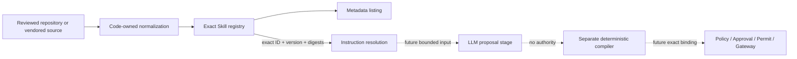

# SKILL-001: Versioned Analysis Skill Registry

- Status: Implemented as catalogued-only metadata
- Domains: Web initially; domain-neutral registry contract
- Decision:
  [ADR-0302](../adr/0302-separate-reusable-analysis-skills-from-execution-and-holdout-authority.md)
- Runtime consumers: none for registry `1.0.0`; SKILL-002 is the explicit successor consumer

## Objective

SKILL-001 defines a strict, content-addressed registry for reusable analysis knowledge. It gives
future LLM campaign stages exact Skill identities and bounded instructions without giving the
registry, a Skill, target-derived content, or a model response any execution or product-claim
authority.

This contract stops at catalog registration and exact resolution. It does not perform Skill
selection, prompt projection, Recipe binding, Tool dispatch, target access, validation, Finding
promotion, Graph admission, report delivery, or external transmission.

## Trust boundaries



The source and normalized Skill content are reviewed inputs. They are not trusted executable code.
Target-derived text and metadata are always untrusted evidence and cannot alter the registry or
choose a loader.

## Versioned wires

The implemented API versions are:

- `pajin.dev/analysis-skill-instruction-bundle/v1alpha1`;
- `pajin.dev/analysis-skill-definition/v1alpha1`; and
- `pajin.dev/analysis-skill-registry/v1alpha1`.

The installed registry identity is:

```text
registryId: pajin.analysis-skills
registryVersion: 1.0.0
registryDigest: 4ca94d3a34ae73f6e468656901151f20da2ec582e314e9f56afff25722412898
```

Canonical JSON is UTF-8, key-sorted, compact, finite, and limited to 1 MiB per normalized object.
Digests are SHA-256 with a PAJIN Skill domain separator, the digest-domain length and bytes, and the
canonical-content length and bytes. Schema, instruction, definition, and complete-registry digests
use distinct domains.

## Skill definition

One `SkillDefinition` contains:

- `skillId`, `skillVersion`, and `skillDigest`;
- exact `instructionDigest`, `inputSchemaDigest`, and `outputSchemaDigest`;
- `lifecycleStage`;
- sorted unique security-domain references, Agent roles, Surface types, Hypothesis types, and
  required Evidence types;
- pinned `sourceKind`, `sourceId`, `sourceRevision`, `licenseId`, and optional vendored
  `upstreamUri`;
- lifecycle evidence markers; and
- literal knowledge-only and authority-denial markers.

Repository-owned content cannot declare an upstream URI. Its revision must be an exact semantic
version or a full 40/64-character lowercase content ID. Vendored content must declare an upstream
URI and a full 40/64-character lowercase revision ID; moving names such as `main`, `HEAD`, and
`latest` are rejected. A URI is provenance metadata only: the runtime does not fetch it and does
not treat it as a trust root.

One `SkillInstructionBundle` contains only:

- title and target-neutral objective;
- bounded, unique workflow steps;
- bounded, unique evidence requirements;
- bounded, unique false-positive controls;
- bounded, unique safety constraints; and
- literal declarations that target content is untrusted and that ground truth, secrets, and action
  material are absent.

The bundle cannot carry a target, route, selector, credential, payload, command, Tool call, import
path, Recipe, Capability, Permit, expected answer, evaluator seed, or delivery destination. Strict
models reject those and all other unknown fields.

## Progressive disclosure

`SkillDefinitionRegistry.definitions()` returns immutable metadata only. It does not return
instruction text. `references()` returns exact content and schema identities. A caller obtains the
full `RegisteredSkill` only through `resolve()` with an exact `SkillDefinitionRef` containing all of
the following:

```text
skillId
skillVersion
skillDigest
instructionDigest
inputSchemaDigest
outputSchemaDigest
```

There is no `latest`, compatible fallback, partial match, or substitution. A mismatched digest,
unknown version, malformed object, empty registry, duplicate ID/version pair, or noncanonical
record fails closed.

## Lifecycle semantics

Lifecycle stages and their required evidence markers are:

| Stage | Selectable | Model projection | Recipe binding | Lab evidence | Independent evidence |
| --- | ---: | ---: | ---: | ---: | ---: |
| `catalogued` | false | false | false | false | false |
| `proposal-only` | true | true | false | false | false |
| `recipe-backed` | true | true | true | false | false |
| `lab-executable` | true | true | true | true | false |
| `independently-verified` | true | true | true | true | true |

The registry rejects a stage whose evidence markers do not match this table. These markers report
available evidence; they do not authorize any operation. Every stage keeps these fields literally
false:

- Scope expansion authority;
- target-selection authority;
- Tool-request authority;
- Capability authority;
- Permit authority;
- execution authority;
- Graph-admission authority;
- Finding authority; and
- report-delivery authority.

## Initial catalog

Version `1.0.0` contains five repository-owned Web Skills, all at `catalogued`:

| Skill ID | Purpose |
| --- | --- |
| `pajin.skill.web.assess-sqli` | Assess semantic SQL-injection evidence and controls |
| `pajin.skill.web.assess-object-access` | Assess cross-principal object-access evidence |
| `pajin.skill.web.assess-xss` | Assess non-transmitting browser marker execution |
| `pajin.skill.web.compose-attack-path` | Compose only separately supported causal hops |
| `pajin.skill.web.write-security-finding` | Draft narrative from an already validated Finding |

All five use the registered Web domain classification and target-neutral
`web.http-operation` Surface type. Their input and output schemas are bound by digest but do not
constitute runtime parsers or target actions.

## Non-authority invariants

The registry has no registration mutation after construction and exposes no `execute`, `dispatch`,
`compile`, or `issue_permit` operation. The package does not import an HTTP client, subprocess
runtime, Tool registry, Worker, or Graph writer.

Future consumers must preserve this sequence:

```text
exact Skill reference
-> bounded model projection
-> untrusted proposal
-> deterministic compiler
-> separate exact Skill-to-Recipe binding
-> current Campaign Scope intersection
-> policy and recorded approval
-> one-use ActionPermit
-> Gateway and isolated Worker
-> sealed Evidence
-> independent validation
-> Finding and Graph admission
```

Selection, projection, and Recipe binding require new versioned contracts and tests. None is
implied by registry membership or lifecycle state.

## Positive and adversarial validation

The focused test suite verifies:

- deterministic registry and Skill identities with a pinned complete-registry digest;
- exact resolution and rejection of `latest`, unknown or invalid semantic versions, and digest
  substitution;
- empty and duplicate registry rejection plus immutable record storage;
- instruction, definition, and schema drift rejection;
- strict rejection of executable, target, and private-ground-truth fields;
- exact Boolean authority markers and lifecycle marker mismatch rejection;
- immutable provenance revision rules for repository-owned and vendored sources;
- absence of execution methods and forbidden runtime imports;
- metadata-first disclosure; and
- absence of reserved challenge-answer, evaluator-seed, expected-Finding, matcher, and target-locator
  fields, plus reviewed Juice Shop and local-target canary strings.

This proves registry containment and deterministic identity. It does not prove that the Skills are
correct, complete, useful to a model, executable, or transferable across targets. Automated key and
canary checks also cannot prove semantic absence of every disguised target answer or secret;
reviewed source admission remains required.

## Compatibility, migration, and rollback

SKILL-001 is additive and has no current runtime consumer. Existing WEB-003 through WEB-007 formats
and Runs are unchanged.

Any instruction, schema, provenance, domain, role, Surface, Hypothesis, Evidence, lifecycle, or
authority-marker change alters the definition or registry digest. Released semantic content must
receive a new Skill version; consumers must pin it explicitly. Historical references are never
rewritten or resolved to a newer version.

Rollback removes or disables only a future consumer. Keeping the inert registry has no target or
execution side effect. A future migration may retain multiple exact Skill versions, but it must not
introduce implicit version selection.

## Current limitations and successor contract

- No Skill in registry `1.0.0` is selectable or projected directly.
- No Skill-to-Recipe or Skill-to-Capability binding exists.
- No live model, Juice Shop, second target, defended negative, or private holdout has exercised the
  registry.
- No external corpus has been reviewed or vendored.
- System, Application, and Forensics Skill catalogs are not defined.

[SKILL-002](SKILL-002-proposal-only-selection-and-split-projection.md) implements a cumulative exact
`1.1.0` registry, explicit proposal-only qualification, four-Skill deterministic selection, split
instruction/evidence projection, and a zero-dispatch preparation Run. Recipe binding, Provider
dispatch, and lab execution remain later, separate stages.
