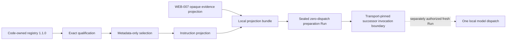

# SKILL-002: Proposal-only Selection and Split Projection

- Status: Implemented and locally verified
- Domain: Web
- Decision:
  [ADR-0303](../adr/0303-qualify-and-split-proposal-only-skill-projection-before-model-dispatch.md)
- Successor consumption decision:
  [ADR-0304](../adr/0304-pin-and-seal-one-shot-skill-bound-web-analysis-invocation.md)
- Provider dispatch: none
- Target actions: none

## Objective

SKILL-002 turns four exact, reviewed Web Skill definitions into bounded proposal guidance for a
WEB-007 proposal-only successor without granting any target or execution authority. It preserves
the existing WEB-007/v1alpha1 digest spine and produces a separate sealed preparation Run that the
transport-pinned successor strict-reloads.

## Installed identities

The historical catalog remains:

```text
registryId: pajin.analysis-skills
registryVersion: 1.0.0
registryDigest: 4ca94d3a34ae73f6e468656901151f20da2ec582e314e9f56afff25722412898
```

The cumulative proposal registry is:

```text
registryId: pajin.analysis-skills
registryVersion: 1.1.0
registryDigest: 88c3cf4d3127c1b8ef4cad1c57c7049277cb53a94c36e9aa660de60a71406343
```

Registry `1.1.0` contains the five historical catalogued records plus proposal-only `1.1.0`
successors for:

- `pajin.skill.web.assess-sqli`;
- `pajin.skill.web.assess-object-access`;
- `pajin.skill.web.assess-xss`; and
- `pajin.skill.web.compose-attack-path`.

`pajin.skill.web.write-security-finding` remains catalogued and is not projected because this
pre-execution stage has no validated Finding and does not run as Reporter.

The current qualification, Web selection policy, and four-Skill instruction projection digests
are respectively:

```text
qualification: 65c98f083ecb6d5c7e32cf8620e5f3efd528911f21451993e3e79cd19536e4e6
selection policy: a8a379cef12b5ee6999255b50921508089ac83a8152cf722dec8a2d94aa921d5
instruction projection: 5a1ae9195458bae3a07f98e6d88f8f8ee7bc175327d66b5aee980340c53a00c3
projected instruction bytes: 7475
```

## Lifecycle qualification

`qualify_proposal_only_skill_registry()` accepts exact predecessor and successor registries and
reconstructs every proposal-only record. It requires:

- a distinct exact Skill version;
- a catalogued predecessor with the same Skill ID;
- unchanged instruction semantics;
- unchanged domain, role, Surface, Hypothesis, required-Evidence, input-schema, and output-schema
  identity;
- unchanged source kind, source ID, license, and upstream identity; and
- the exact proposal-only lifecycle marker set with every authority marker still false.

The qualification also binds the selection-policy and instruction-projection validation schemas.
It is not a Recipe, release, Capability, Permit, or execution grant.

## Deterministic selection

The Web policy is resolved only from the installed proposal registry. Its inputs are:

```text
exact registry and qualification
exact four-Skill allowlist
AgentRole.PLANNER
registered Web classification
web.http-operation Surface
five code-owned WEB-007 diagnostic/path Hypothesis IDs
maxSelectedSkills = 4
maxProjectedInstructionBytes = 32768
```

Target content and opaque Evidence are not selection inputs. The selector resolves every exact
reference, checks proposal-only status, intersects domain, role, Surface, and all declared
Hypothesis IDs, applies canonical count/byte budgets, and emits a content-addressed receipt.
Before that intersection, it resolves both registry endpoints from the installed exact registry
set, reconstructs the complete qualification, and requires exact structured identity.
A caller-authored but self-consistent predecessor, binding subset, qualification digest, and policy
therefore cannot substitute for the installed qualification.

The generic pure helpers are deliberately named
`select_analysis_skills_from_code_owned_policy()` and
`build_analysis_skill_instruction_projection_from_code_owned_policy()`. Their precondition is an
already code-owned policy; they do not authenticate policy provenance and are not a production
trust boundary by themselves. The Web adapter establishes that boundary by reconstructing the
registered policy from the exact source projection, installed registry, and installed
qualification. The strict Run loader reconstructs it again and compares the independently supplied
expected policy digest. A direct or future transport consumer must use that registered adapter and
must not treat a caller-supplied policy or a low-level helper result as dispatch-qualified.

Every projected Skill says `requiredEvidenceSatisfied=false`. Passive discovery does not satisfy
independent replay, negative-control, semantic-oracle, path-hop, or validated-Finding requirements.

## Split projection boundary



The instruction projection is authorized only for the successor developer message. The unchanged
WEB-007 evidence projection remains tainted and is authorized only for its user message. The bundle
cannot be serialized as one authorized user message and cannot dispatch a Provider call by itself.

The implemented successor consumes those projections exactly as intended: instructions become one
developer message and Evidence becomes one user message. That consumer has its own request, draft,
compiler, receipt, event, artifact, transport-Pin, and strict-loader grammar. It does not change the
SKILL-002 preparation Run or grant that Run dispatch authority. One authorized operational attempt
ended before `model.call.started` because the exact successor request exceeded the Campaign
model-token budget; model dispatch and target dispatch both remained zero.

Only the four selected Skill bodies appear in the instruction projection. Full registry contents,
the Finding narrative body, target locator, routes, selectors, credentials, payloads, commands,
raw DOM/body, source Run/root, expected answers, and holdout material are absent.

## Preparation Run and strict reload

`create_web_analysis_skill_projection_run()` performs these local steps:

1. strict-reload the exact sealed WEB-007 discovery source;
2. rebuild the unchanged WEB-007/v1alpha1 Snapshot;
3. resolve exact installed registries and qualification;
4. select and project the four Skills;
5. write the four fixed JSON artifacts;
6. record the fixed start/completion events;
7. seal the Run; and
8. immediately strict-reload it under independent anchors.

The loader requires preparation Run/root, source Run/root, registry reference, and policy digest.
It rejects missing, extra, duplicate, oversized, noncanonical, stale, or cross-source artifacts and
events.

The Index fixes these counts to zero:

```text
modelInvocationCount
providerDispatchCount
targetRequestCount
toolRequestCount
actionPermitCount
findingCount
graphMutationCount
```

External delivery and execution, Finding, and Graph authority are also literally false.

## Validation boundary

Focused tests cover:

- preservation of the registry `1.0.0` digest and exact cumulative `1.1.0` identity;
- qualification lineage, caller-authored registry/qualification substitution, and
  catalogued/unqualified selection rejection;
- exact registry/ref/digest resolution without latest or substitution;
- role, domain, Surface, Hypothesis, count, and UTF-8 byte budgets;
- model-copy/stale-digest revalidation;
- complete qualification/policy/receipt/instruction lineage, nested model-copy revalidation, and
  cyclic/deep/oversized runtime-state rejection;
- selected-only disclosure and Finding-body exclusion;
- explicit unsatisfied required Evidence;
- target/source changes not changing the selected instruction projection;
- split message roles and literal authority denial;
- preparation Run seal, strict reload, and foreign anchor rejection;
- absence of Provider, Gateway, Worker, network, and subprocess imports; and
- unchanged WEB-007/v1alpha1 rejection of Skill sidecars.

This is structural conformance only. It does not measure live-model usefulness, actual
vulnerability discovery, transfer, precision, recall, or attack-path validity.

## Compatibility and next step

WEB-007/v1alpha1 Snapshot, projection, request, draft, compiler, receipts, events, artifact grammar,
and loaders remain unchanged. The additive successor now versions the Web-specific transport/runtime
and defines message/request/draft/compiler/receipt and sealed Run grammars that strict-load this
preparation Run, place the instruction projection in a developer message, place opaque Evidence in a
user message, and permit at most one new model dispatch. Its focused tests cover strict anchors,
terminal success/failure reload, one-dispatch behavior, no tools, foreign Pin rejection, and hidden
state rejection.

Distinct immutable Worker and proxy images are now built and independently pinned. The operational
entry point verifies them together with the sealed source, comparison plan, SKILL-002 Run, model
file, fresh output roots, and now the exact successor accounting bound before model startup. It also
fails closed when the conservative prompt-plus-completion bound exceeds the frozen 4,096-token
RuntimePin. The current request is rejected before runtime construction. Because this second guard
is not an exact tokenizer measurement, another separately authorized Provider dispatch still
requires pinned tokenizer/chat-template capacity proof, or an additive compact wire/new Web runtime
Pin. No target request, Recipe binding, Capability, Permit, Finding, Graph, report, or external
delivery authority is added.
