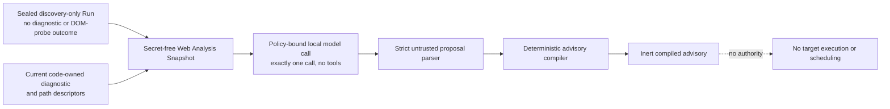

# WEB-007: LLM-Assisted Web Analysis Proposal

- Status: Implemented in shadow mode; successful live advisory not yet runtime-verified
- Domain: Web / AI-assisted analysis
- Predecessor:
  [WEB-006](WEB-006-installed-profile-and-authenticated-discovery-evidence.md)
- Decision:
  [ADR-0301](../adr/0301-bind-llm-web-analysis-to-inert-typed-proposals.md)
- Skill-bound successor decision:
  [ADR-0304](../adr/0304-pin-and-seal-one-shot-skill-bound-web-analysis-invocation.md)
- Compact capacity decision:
  [ADR-0317](../adr/0317-prove-compact-skill-bound-web-analysis-capacity-before-model-dispatch.md)
- Materialization and live-preparation decision:
  [ADR-0318](../adr/0318-attest-descriptor-bound-model-materialization-before-live-web-analysis.md)
- Prepared admission and live-authority decision:
  [ADR-0319](../adr/0319-separate-prepared-compact-admission-from-live-call-authority.md)

## Objective

WEB-007 restores the original LLM-guided analysis loop as PAJIN's central Web product
architecture while preserving the WEB-006 browser, discovery, evidence, and execution safety
substrate. The model is central to analysis and proposal formation. It is never the owner of
Campaign Scope, Capability, approval, Permit, Gateway dispatch, Finding promotion, Graph admission,
or external delivery authority.

The first version is intentionally narrower than the eventual autonomous loop. It uses the WEB-006
safety substrate to close a separate discovery-only source Run before any diagnostic or DOM probe,
projects its sealed Evidence with target-neutral code-owned hypothesis IDs and path topology into a
secret-free analysis Snapshot, performs exactly one policy-bound call to an installed local model,
strictly parses the response as untrusted data, and deterministically compiles an inert advisory. It
does not choose which checks execute, schedule an action, or invoke the target again.

## Evidence basis and present boundary

I inspected the current WEB-006 contract and the associated profile, diagnostic, semantic,
promotion, Graph, report, SARIF, and PoC boundaries. The following distinctions are important for
review:

- **Observed contract:** WEB-006 keeps production execution on the exact numeric-loopback Juice
  Shop profile, seals passive discovery separately, and binds the existing three diagnostics and
  two attack paths to code-owned execution.
- **Observed limitation:** WEB-006 records that full fresh governed runtime and PoC verification is
  still pending and that its downstream contracts retain fixed diagnostic and path cardinality.
- **Implemented source boundary:** a separate pre-diagnostic discovery Run is now sealed and strictly
  reloaded before projection. It is evidence for this analysis-only shadow turn, not for the full
  WEB-006 governed execution and PoC path.
- **Design constraint:** a model can safely influence the product only through a
  secret-free, taint-aware Snapshot and a deterministic compiler that owns every authoritative
  field.
- **Implemented behavior:** the WEB-007 wires, projection, local invocation boundary, strict parser,
  inert compiler, sealed success/failure Run readers, operational runner, and focused tests. One
  actual local dispatch reached the Provider but terminated on an upstream timeout before returning
  a draft, so the live successful advisory path remains unverified.
- **Implemented successor boundary:** the SKILL-002 split projections now have a distinct
  transport/runtime Pin, split-message request, draft/compiler, one-shot Provider/analysis Runs,
  terminal receipts, strict success/failure readers, and a strict operational entry point. The
  required immutable Worker/proxy images and independent Pin are verified. The first authorized
  successor attempt found that its conservative request bound exceeded the Campaign model-token
  budget before dispatch; the entry point now performs that exact check before model startup.
- **Confirmed capacity boundary:** the pinned tokenizer and embedded template measure the legacy
  full `[developer, user]` prompt at 4,208 tokens. Its 1,024-token completion ceiling produces a
  5,232-token total, so it cannot fit the frozen 4,096-token runtime. The template does not natively
  render `developer`. The additive compact `system` plus `user` projection and sealed offline
  capacity proof are implemented and strict-reloaded. The final proof measures
  `1,460 + 1,024 = 2,484`, leaves 1,612 context tokens, and also passes conservative Campaign
  accounting at `51,168 / 65,536`. Additive Capacity v2 now binds the exact no-follow descriptor
  bytes, staged and read-only-mounted runtime UID/GID/mode/size/SHA-256, and mandatory cleanup.
  Actual Capacity v2 strict-reloaded those measurements, and the separate proof-bound
  live-preparation Run bound that exact proof with zero model completion, Provider dispatch, target
  request, or downstream authority. The additive non-executing admission now strict-reloads that
  preparation and binds the exact compact request and prerequisite lineage. External one-call
  authorization, durable single-use claiming, descriptor-bound live runtime materialization, and
  an additive compact runtime/receipt remain P0 gates before dispatch.

WEB-007 does not make an arbitrary Web site executable. It does not add a production adapter,
broaden the exact loopback origin, accept caller credentials, or weaken any existing WEB-006
boundary.

## Central architecture

WEB-006 is the safety substrate beneath the product loop, not a replacement for model-assisted
analysis. The long-term control flow remains PAJIN-owned:

```text
perform bounded discovery and seal a discovery-only Run
-> project a bounded analysis Snapshot
-> let an LLM analyze and propose
-> deterministically compile only allowed semantics
-> authorize an exact action outside the model
-> execute through Permit and Gateway boundaries
-> independently validate fresh Evidence
-> admit Findings and Graph state
-> report and replan from the new sealed state
```

The model occupies the analysis-and-proposal step because that is where contextual judgment is
valuable. PAJIN Core owns every transition that can change authority or produce a product-level
security claim. A model response can therefore be useful, wrong, incomplete, or prompt-injected
without becoming an executable command.

WEB-007/v1alpha1 implements only one analysis turn and stops at the inert compiled advisory. It
does not yet close the rest of this loop.

## v1alpha1 flow



The implemented principal additive wires are:

- `pajin.dev/web-analysis-snapshot/v1alpha1`;
- `pajin.dev/web-analysis-model-projection/v1alpha1`;
- `pajin.dev/web-analysis-proposal-draft/v1alpha1`;
- `pajin.dev/web-analysis-compilation-policy/v1alpha1`; and
- `pajin.dev/compiled-web-analysis-proposal/v1alpha1`.

They must be stored in a new analysis Run. The discovery-only source Run is sealed before any
diagnostic or DOM-probe dispatch. Existing WEB-006 assessment Runs and their sealed artifacts remain
immutable.

## Secret-free analysis Snapshot

The local Snapshot is a deterministic private binding from an exact strictly reloaded, sealed
discovery-only source Run and the current installed diagnostic bundle and path builder. Only its
detached model projection is serialized into the Provider request. That allowlist contains only:

- schema and projection-policy versions;
- a content-addressed projection ID and digest carrying no lookup or execution authority;
- the target-neutral code-owned hypothesis IDs for all three diagnostics;
- the two code-owned path identities and ordered hypothesis bindings;
- bounded passive-discovery features expressed only as code-owned enum IDs with bounded Boolean,
  bucket, or count values, never target text or target-derived digests;
- opaque Evidence references produced with a domain-separated HMAC over private source identities,
  keyed by the sealed source root that is not sent to the model; and
- the fixed authority-denial declarations.

A code-owned private Snapshot, which is never serialized as the model message, binds the detached
projection and opaque Evidence references to the actual source Run/root, Campaign, installed profile,
adapter implementation, exact target, discovery Evidence, diagnostic bundle, and path builder
identities. The deterministic compiler uses that private lineage to reopen the source and catalog;
the model does not receive it.

The model-visible Snapshot never contains a bundle ID or digest, installed-profile ID, adapter ID or
implementation digest, path-builder ID or implementation digest, or any other product or target
label. Those exact identities exist only in the private Snapshot and compiler context.

The projection excludes credentials, tokens, cookies, Secret Lease material, request or response
bodies, query values, raw DOM, screenshots, selectors, route strings, local filesystem paths,
environment values, external delivery destinations, target locators, target identifiers, target
digests, source Run identifiers, source root digests, and other low-entropy hashes that could be
reversed by enumeration. Because the source is sealed before diagnostics, the Snapshot also contains
no diagnostic or DOM-probe outcome, status, severity, CWE, control result, path state, Finding, or
Graph fact. Artifact bytes remain behind their existing verified readers.

Secret-free does not mean trusted. The fixed discovery-feature values remain target-influenced even
though their keys and representation are code-owned and contain no target text. The model
instruction must delimit them as untrusted evidence, but prompt wording is not a security boundary;
the compiler must remain safe even when the model produces an adversarial proposal.

## One policy-bound local model call

One code-owned invocation policy binds the exact Snapshot, local provider, immutable model revision
or weights digest, structured-output schema, prompt template, token ceiling, elapsed-time ceiling,
and a call budget of exactly one. The call has no tools, function calling, browser handle, session,
credentials, target network access, or external destination.

The provider must be installed locally and the invocation boundary must deny external egress and
telemetry. The Snapshot, prompt, and response cannot be sent to a hosted model, plugin, analytics
service, or other external recipient under WEB-007/v1alpha1. Enabling any remote model later
requires a distinct data-classification review and explicit destination-bound authorization; it is
not a configuration toggle within this contract.

The model call is itself a governed local analysis operation, but it grants no target-execution
authority. Its receipt must bind the request digest, provider and model identity, conservative
budget charge, completion state, and raw response digest. Each analysis Run permits at most one
dispatched call attempt. A timeout, malformed output, provider failure, or post-dispatch uncertainty
is terminal for that Run and produces no compiled advisory. A subsequent attempt requires a new
analysis Run, a fresh strict reload of the sealed discovery source and current catalog, new opaque
Evidence references and a new Snapshot, and new invocation-policy and budget records. It is never an
in-place retry, fallback diagnostic dispatch, or Permit trigger.

## Strict untrusted proposal

The raw response is admitted only through an alias-exact, extra-forbid JSON parser with bounded
bytes, depth, nodes, string lengths, and list lengths. The proposal must contain:

- exactly three diagnostic-hypothesis assessments, identifying `sql-login`, `object-access`, and
  `dom-xss` exactly once;
- a unique diagnostic attention rank forming the exact permutation `1..3`;
- exactly two attack-path assessments in code-owned catalog order, identifying the
  `sql-login -> object-access` path and the `dom-xss` path exactly once;
- one path disposition per path from `investigate` or `insufficient-evidence`;
- literal false markers for Scope expansion, action selection, scheduling, Capability, approval,
  Permit, Gateway, execution, Finding, Graph, report publication, and external delivery authority.

All three diagnostics and both paths are present regardless of the projected discovery features.
The model may rank diagnostic attention and assign a closed path disposition; it cannot assert a
diagnostic outcome or rewrite the code-owned hypothesis, CWE mapping, canonical severity policy,
impact, remediation, executable identity, or path structure.

The following fields are forbidden rather than ignored: free-form rationale or explanation, routes,
selectors, credentials, payloads, HTTP methods, Tool arguments, executable imports, action times,
dependencies, concurrency, retries, destinations, and any instruction to run or deliver something.

The roadmap's v1alpha1 "priority only" constraint remains the authority rule. The closed path
disposition is bounded evaluation metadata; neither it nor diagnostic rank is a new hypothesis, an
observed fact, a subset choice, or an input to execution order or action compilation.

## Deterministic compiler and inert output

The compiler reopens the exact sealed discovery source, private Snapshot, detached projection, current
diagnostic bundle and path builder, and model invocation receipt before consuming the proposal. It
then:

1. verifies the source Run/root/projection/Snapshot/request/response and provider-model lineage;
2. requires exact membership, unique ranks for all three diagnostics, and code-owned order for both
   paths;
3. copies hypothesis identities and path structure only from the reopened code-owned catalog;
4. accepts only diagnostic rank and bounded path disposition from the typed proposal while
   preserving their untrusted origin;
5. emits a canonical compiler-authored envelope whose fields retain explicit code-owned,
   target-derived, or model-derived origin and taint; and
6. fixes every mutation, scheduling, execution, Finding, Graph, and delivery authority marker to
   false.

Schema validity proves only that the response fits this contract. It does not attest model quality,
semantic correctness, vulnerability confirmation, or causal contribution. The compiled advisory
may support a local operator view and future evaluation, but no WEB-005 or WEB-006 promotion gate
may consume its rank or assessment as evidence.

## Exact v1alpha1 cardinality and ordering

v1alpha1 deliberately follows the currently installed Juice Shop diagnostic bundle.

| Collection | Required members | Model freedom | Execution effect |
| --- | --- | --- | --- |
| Diagnostics | All three: `sql-login`, `object-access`, `dom-xss` | Rank exactly `1..3` | None |
| Attack paths | Both code-owned paths in catalog order | Assign `investigate` or `insufficient-evidence` | None |
| Discovery actions | Not represented | None | None |
| Diagnostic actions | Not represented | None | None |

The model cannot omit a low-priority item, select a subset, add a diagnostic, merge paths, or turn
rank into an execution order. This fixed contract gives us a narrow way to validate the LLM
boundary without silently generalizing WEB-006's downstream artifact formats.

## Failure and negative cases

The v1alpha1 flow fails closed when:

- the discovery-only source Run, root, discovery Evidence, profile, adapter, diagnostic bundle, or
  path builder cannot be strictly reloaded with the expected code-owned identity;
- Snapshot projection includes a forbidden secret-bearing, raw-content, target-identity, target-
  derived digest, or reversible low-entropy field;
- the selected provider is not the exact installed local provider or attempts external egress;
- the invocation exceeds one call or its token, time, or conservative budget ceiling;
- the response is absent, truncated, ambiguous after dispatch, non-JSON, schema-invalid, or uses
  unadvertised aliases;
- a diagnostic or path is missing, duplicated, foreign, renamed, or assigned a duplicate or
  out-of-range rank;
- the proposal contains action, scheduling, Scope, Capability, Permit, Tool, Gateway, Finding,
  Graph, reporting, or delivery material;
- a model-derived or target-derived value is relabeled as code-owned or copied into an
  authoritative field; or
- an inert advisory is presented to an existing action compiler, Gateway, promotion gate, Graph
  writer, SARIF exporter, or external-delivery API.

Failure does not modify the source Run and does not authorize another model call or target action.
After dispatch, it permanently closes the analysis Run as failed or uncertain.

## Skill-bound proposal-only successor

The additive Skill-bound successor consumes the sealed SKILL-002 preparation Run without changing
WEB-007/v1alpha1 and without using the action-oriented v1alpha2 namespace. It introduces these
independent wire identities:

- `pajin.dev/web-analysis-transport-runtime-pin/v1alpha1`;
- `pajin.web-analysis.provider-transport/v2` with Worker action
  `openai-chat-completion-v3`;
- `pajin.dev/skill-bound-web-analysis-invocation-pin/v1alpha1`;
- `pajin.dev/skill-bound-web-analysis-provider-execution-context/v1alpha1`;
- `pajin.dev/skill-bound-web-analysis-request/v1alpha1`;
- `pajin.dev/skill-bound-web-analysis-proposal-draft/v1alpha1`;
- `pajin.dev/compiled-skill-bound-web-analysis-proposal/v1alpha1`; and
- success/failure receipts under the corresponding Skill-bound v1alpha1 APIs.

The transport Pin binds the verified base model runtime digest, distinct newly built immutable
Worker and proxy image IDs, exact 180-second Worker-open/proxy-exchange/job ceilings, one-dispatch
semantics, and no external egress authority. Existing Provider actions keep their current behavior.
The proxy's general policy parser can represent a ceiling up to 3,600 seconds, but this successor
accepts only the independently anchored exact 180-second Pin. Source edits alone do not satisfy the
new-image requirement.

The successor execution context nests the exact existing local Provider context, retaining its
budget, reservation, Gateway, finalization, and cleanup authority. It layers only the independently
verified transport Pin and the proposal-only invocation contract. The registered SKILL-002 adapter
is strict-reloaded and reconstructs the exact source, registry, qualification, selection policy,
instruction projection, and Evidence projection before planning the request.

The implemented legacy successor constructs exactly two messages: selected code-reviewed Skill
instructions in a `developer` message and the unchanged tainted opaque Evidence projection in a
`user` message. The call permits no tools, streaming, parallel tool calls, fallback, or automatic
redispatch. It uses attempt 1, seed 0, temperature 0.0, top-p 1.0, and a 1,024-token completion
ceiling. Exact pinned-tokenizer measurement gives this full rendered prompt 4,208 tokens, for a
5,232-token prompt-plus-completion total. It therefore cannot be dispatched under the frozen
4,096-token RuntimePin. The historical wire and terminal Runs remain unchanged and are not retried.

The embedded Qwen template does not natively render `developer`. The implemented compact successor
projection is additive and uses one bounded code-owned instruction projection in a `system` message
and one bounded tainted Evidence projection in a `user` message. It places a distinct code-owned
sentinel in each message, and the sealed capacity proof confirms that both sentinels survive template
rendering in system-before-user order. The prototype measurement of 1,505 prompt tokens and a
preliminary 2,529-token total is retained only as historical design evidence. The final
strict-reloaded proof independently recomputed a 1,460-token prompt and 2,484-token total with the
same completion ceiling, leaving 1,612 tokens in the frozen context.

A success Run has seven exact artifacts and two events; a failure Run has four mandatory artifacts,
an optional Provider outcome, an optional bounded rejected draft, and two events. Both shapes seal
once and are immediately strict-reloaded against independently supplied source, SKILL-002, registry,
policy, transport, Provider Run, and context anchors. A rejected response larger than 256 KiB is not
copied into the analysis Run, while its Provider outcome digest and byte count remain verified.
Cancellation also terminalizes before propagation. Each runtime object can make only one attempt.

Every live successor receipt fixes one model dispatch and zero target requests. Automatic redispatch,
Scope expansion, Tool/Capability/Permit issuance, execution, Finding promotion, Graph admission,
report publication, SARIF/PoC generation, and external delivery remain literally unauthorized. No
live compact-successor dispatch has occurred. Its future integration must consume the exact
zero-dispatch preparation, which already binds the eligible Capacity v2 proof, before the built and
pinned images may be used by a separately authorized fresh Run.

### Offline compact-capacity checkpoint

The additive compact successor now has a sealed capacity proof produced through only the pinned
runtime's `/props`, `/apply-template`, and `/tokenize` endpoints. The proof path performed no
inference or completion and invoked no Provider, browser, or target. It binds the compact wire,
model/tokenizer/template/RuntimePin identities, completion ceiling, rendered-prompt digest, exact
token IDs, both message sentinels, and the checked context and Campaign inequalities. All execution
and downstream-authority markers remain false.

Capacity Run `run_20260921T021716Z_b3939e0c` sealed at root
`7991465747157b7ef4a75f79905955a4bc47bcb24915cf22438eab8150294383`. Its capacity Pin digest is
`998f7c8340d42715ddf462b0f7ce5e35c577cd5e2f12335c51e1c56641338677`, evidence digest is
`1a2ecb50f3d0b69fafcbf6d61c4bddf27eb6685e27df0b411ef372b353803b18`, proof digest is
`bf30a56e691a0ebd3e41a6a75570fc655aa4dc1d0d327c6160c161bae8b0e95f`, and Index digest is
`047c80c5fb56e0cf42c0b8bdec4259917cf4b715501effec7365c53cace66283`. The compact-projection
digest is `8ba7a786ca994ee7792a2f858c39a35470b1aa65e2e085961c8d66adee070b8b`, the exact chat-request
digest is `aae9d347ec353e911bf1d4ceb4535af485ae3e3556a13f414f75bb6665554244`, the template digest is
`61be32c41fcad4c4ed2a4b656577feef0d09c4bf37142ead33246e218945c4a6`, and the tokenizer-runtime
digest is `d32d223f88d4723b0a281df699f0c1df96e992d9c372c4664c893c33e6745326`.

The fifth evidence artifact seals the 5,593-byte formatted prompt, 2,630-byte chat template, and
all 1,460 token IDs. Strict reload independently recomputes their byte counts, digests, token count,
sentinel membership, and system-before-user order. The exact proof is
`1,460 + 1,024 = 2,484 <= 4,096`, with a 1,612-token margin. Conservative Campaign accounting is
`50,144 + 1,024 = 51,168 <= 65,536`. Strict reload succeeded, the tokenizer container was removed,
and completion, Provider-dispatch, and target-request counts were all zero. The earlier prototype
`1,505 + 1,024 = 2,529` remains preliminary history rather than proof evidence.

This historical v1 proof authorizes no model call and is not eligible as the live gate. ADR-0318
implements its successor as an attested Capacity v2 plus a separate zero-dispatch preparation.
Exactly one fresh completion may run only after that preparation is consumed by an additive
one-shot integration and after separate user approval. No such approval or completion exists yet.

### Attested Capacity v2 and zero-dispatch live preparation

The historical v1 proof remains readable but is not eligible as the live gate. Capacity v2 holds a
no-follow descriptor for the exact GGUF bytes across Docker copy into an owned volume. A pinned,
network-none, read-only-root seed drops every capability except `CAP_CHOWN`, normalizes only the
volume copy to UID/GID `10001:10001` and mode `0400`, and verifies size and SHA-256 as that runtime
user. The tokenizer then mounts the same volume read-only and independently repeats the metadata and
digest observations before its tokenizer endpoints are used. No host model path is bind-mounted and
the host file is never chmodded or chowned.

The first full attempt, partial Run `run_20260921T045515Z_314d9364`, copied the model and failed
closed when Docker preserved host `0600`/UID metadata that the capability-dropped seed could not
read. The next attempt, partial Run `run_20260921T051853Z_485fc572`, failed the topology check because
Docker inspect reports `CAP_CHOWN`, not the CLI spelling `CHOWN`. Both partial Runs remained unsealed,
performed no dispatch, and removed their owned container and volume. They were not retried in place.

The successful Capacity v2 Run is `run_20260921T052042Z_0932a478`, root
`d7864c15b7df572294fae99dfe65516543ac82672faab3ca84a53b1c47d8a574`. Its Pin is
`f9d52ba8cdf9c84bf91319642d9b1f33eb486c546c749b0cde8b9cb4b789295a`, Proof is
`f7f5f2566c397b3c459fd0701b39f6d80e81a1a4e32a81219af7b2f52ececedb`, and model-materialization
attestation is `d6aec01b2c4e5bd1f30c97aa6cf7a572fbaae95f8ccb87931fcf6ef5168741da`.
Strict reload reproduced the same 1,460 prompt tokens, 2,484 total, 1,612-token margin, and Campaign
51,168/65,536. Cleanup and absence verification found no owned tokenizer container or model volume.

The separate proof-bound preparation Run is `run_20260921T052213Z_801a9053`, root
`c2b77fd6a1b70fcf60fb13d5b3c8a4d436cfc219f8868c6dedb572009dd010d5`, with status
`prepared-not-authorized-no-dispatch`. It strict-reloads exact source, SKILL-002, transport, Capacity
v2 Run/root/Pin/Proof, and materialization-attestation anchors. Its model-runtime, model-invocation,
Provider, target, Tool, ActionPermit, Finding, Graph, report, and delivery counts are all zero; every
corresponding authority and future-call authorization is false.

The additive non-executing admission now consumes this preparation only as immutable evidence and
re-derives the exact compact request. It does not claim the preparation or authorize a dispatch.
The next step is the four-gate live boundary in ADR-0319; a fresh completion remains behind separate
authorization, and no WEB-008 action may start before a successful advisory is sealed and
strict-reloaded.

## v1alpha2 expansion

v1alpha2 is the first version intended to connect the central model loop to governed Web actions.
It must be additive and must not reinterpret a v1alpha1 advisory as an action proposal.

The future flow is:

```text
sealed discovery-only state
-> policy-bound model proposal
-> deterministic action compiler
-> compiled-plan digest

source chain:
compiled-plan digest
-> fresh source policy decision
-> distinct recorded source approval
-> exact single-use source ActionPermit
-> Gateway and isolated source Worker with a fresh login
-> sealed source outcome

validation chain:
the same compiled-plan digest, independently reinterpreted
-> fresh validation policy decision
-> distinct recorded validation approval
-> exact single-use validation ActionPermit
-> Gateway and isolated validation Worker with a fresh login
-> sealed validation Evidence
-> deterministic confirmation gate
-> Finding promotion and Graph admission
-> local report, SARIF, and redacted PoC
-> separately authorized external delivery, if any
```

Discovery and diagnostics become different action classes. A discovery proposal cannot carry a
diagnostic payload, and discovery completion cannot automatically schedule a diagnostic. Each
diagnostic action must name one installed code-owned diagnostic identity and remain within the
Campaign's already authorized Scope. If v1alpha2 permits subset selection or dependency ordering,
the deterministic compiler must derive an exact action graph from typed allowlisted identities;
raw rationale never supplies executable arguments.

Every discovery or diagnostic target action requires its own current compiler lineage, fresh policy
decision, distinct recorded approval, one-use Permit, Gateway dispatch, isolated Worker, and budget
reservation. The source and validation chains never share an approval or Permit, and both
independently reinterpret the same compiled-plan digest. Whether an approval actor must be human is
defined by the future risk policy; each chain always records a separate approval decision, and any
human-review requirement cannot be satisfied by the model or inherited from the other chain. A new
model turn after discovery also requires a fresh model-call budget and receipt. Neither discovery
nor prior Graph knowledge expands Scope.

Positive diagnostics do not become Findings from the source execution. Promotion still requires the
complete validation chain above, exact target and execution attestations, deterministic
reconciliation, and actual Graph admission. Report, SARIF, and PoC are downstream projections of
that verified state. Sending any artifact outside the local output root remains a separate
destination-bound action with explicit authorization and a delivery receipt.

## Security and engineering tradeoffs

| Dimension | v1alpha1 direction | Basis and validation need |
| --- | --- | --- |
| Security | Improves analysis containment; model quality risk remains | Adversarial parser, authority-denial, secret-scan, and failure-path tests pass; live success remains unverified |
| Performance | Adds one local inference to the analysis path | The old actual call hit the 30-second upstream I/O cap; the successor now pins 180 seconds at each relevant layer, but successful completion latency remains unmeasured |
| Memory | Adds a local model runtime and bounded prompt/response buffers | Qwen3 4B Q8 is selected and pinned; peak RSS remains unmeasured |
| Reliability | Model failure is isolated from target execution and closes its Run | Actual timeout was sealed terminally with no in-Run retry or target request |
| Operability | Adds model inventory, pinning, budget, receipt, and local-runtime health | Frozen source/model/SKILL-002 inputs, the independent Pin, and new immutable images pass structural checks; Capacity v2 reproduces 2,484/4,096 and 51,168/65,536, the zero-dispatch preparation binds that proof, and the non-executing admission binds the exact request; ADR-0319's four P0 live gates remain next |
| Migration | Additive sidecar Run; no existing artifact rewrite | Source and failure Runs strictly reload; legacy formats remain unchanged |

What makes the v1alpha1 shape attractive is that we can validate the LLM boundary without giving it
an action surface. What gives us pause is the operational weight of a pinned local model and the
risk of mistaking fluent prioritization for validated security evidence. I recommend keeping the
compiled output visibly advisory until adversarial containment and model-usefulness evaluation are
both available.

## Compatibility, migration, and rollback

WEB-007/v1alpha1 is additive. It does not alter existing WEB-003 through WEB-006 Result, Run,
promotion, Graph, validation, report, SARIF, or PoC schemas or digests. The analysis Run references
sealed source identities and never writes into the source Run.

Migration introduced a versioned Snapshot projector, local model registration and policy, invocation
and failure receipts, strict proposal parser, deterministic compiler, and strict analysis readers.
Existing WEB-006 processing remains independent while this shadow analysis is evaluated.

Rollback disables new analysis invocation and advisory consumption. Existing analysis Runs remain
inert audit artifacts; source evidence is neither deleted nor rewritten. v1alpha2 requires new wire
versions and explicit migration because v1alpha1 contains no action or scheduling semantics.

## Validation plan

Implementation is not complete until focused tests demonstrate:

- exact discovery-only source Run/root/profile/adapter/bundle/path-builder binding, proof that it
  closes before diagnostics or DOM probes, and stale-source rejection;
- a byte-bounded Snapshot secret scan and rejection of every forbidden field class, including target
  locators, target-derived digests, and reversible low-entropy hashes;
- exactly one dispatched local model call per analysis Run with no tools and no external network or
  telemetry, plus proof that failure or uncertainty is terminal and any later attempt uses a fresh
  source reload, Snapshot, budget, and Run;
- exact provider, immutable model, prompt, schema, request, response, usage, and receipt lineage;
- rejection of prompt-injected actions, extra fields, alternate aliases, missing or duplicate items,
  foreign IDs, invalid ranks, coercion, oversized text, and malformed JSON;
- deterministic compilation from the reloaded code-owned hypotheses and paths, with model-derived
  diagnostic rank and closed path disposition remaining untrusted and no free-form model text in the
  compiled artifact;
- literal false authority across Scope, scheduling, Capability, approval, Permit, Gateway,
  execution, Finding, Graph, reporting, and delivery fields;
- inability to pass the advisory into existing execution, promotion, Graph, SARIF, PoC, or delivery
  gates;
- legacy WEB-006 strict reload and digest compatibility; and
- latency, token use, peak memory, and output-stability measurements for the selected local model.

A later v1alpha2 validation must additionally exercise discovery and diagnostic action separation;
independent source and validation interpretations of one compiled-plan digest; distinct fresh policy
decisions, approval records, Permits, Gateway dispatches, isolated Workers, and fresh logins for both
chains; Graph admission; local report/SARIF/PoC generation; and a negative test proving that external
delivery cannot occur without its separate authorization and receipt.

## Current verification status

The schema, private Snapshot, detached projection, strict draft parser, inert compiler, local Provider
runtime, sealed Run readers, operational runner, and focused positive/adversarial tests are
implemented. The actual pre-diagnostic discovery source Run
`run_20260915T142836Z_95615cb9` was independently loaded at root
`7a9de15039883dc483caad6d9a3f84f5e1d76745bc10285986fbe741b939bb50` and projected into
`web-analysis-projection:457f025e3dc64d1e996095f7bc4638b706c1ae87b80728931257f7caeb6449b0`.
The model request contained the detached projection only and performed no new target request.

One actual Qwen3 4B Q8 local dispatch was made under the independently sealed EFFECT comparison-plan
Run `run_20260912T133511Z_79db48c7`. Provider Run
`run_20260915T160850Z_ee8ac5d7` sealed at root
`e8912d387f7e160cffd3b1ce9e4444850c9ce2cb2b7d3542348b1a2ac7f22b68`. Its Worker reached the
local Provider but failed with `stage=provider-open`, `category=timeout`: the current Worker and
egress proxy each impose a 30-second I/O ceiling even though the outer execution budget is 180
seconds. Analysis Run `run_20260915T160850Z_7ffb7521` sealed the terminal failure at root
`9a8121d756589d93e7b7bee9b201f55fffe95b6efa04bccc22f1bc29f442101e` with
`modelDispatchAttempted=true`, `proposalCompiled=false`, and
`automaticRedispatchAuthorized=false`. Both Runs strictly reload, owned runtime resources were
cleaned up, the output secret scan found no configured credential/target markers, and external
delivery remained false.

No raw draft or compiled advisory was produced, so model usefulness, successful completion latency,
peak memory, and output stability are unverified. No fallback diagnostic, Permit, target execution,
Finding, Graph admission, report, SARIF, or PoC was authorized or created by WEB-007. The pending full
WEB-006 governed runtime and PoC verification is also not satisfied by this analysis-only source Run.
The versioned Skill-bound transport/runtime Pin and successor Run grammar now honor the intended
180-second budget in code and focused tests. New linux/arm64 Worker and proxy images were built as
`sha256:e2cc36dfd8773570250577e16cafe453be9fdad1fb7f26d5721416e0c5e3e44c` and
`sha256:5ad3cf613c7847c43259d947e110d0defa13876002aa6a8e9e33fb0e8c3e0e82`. The separately retained
Pin digest is `2892027a7992a36693917d7b08f2354120a9ab620c46013fc5e2b321cd2fbe8a`; its strict operational
initial preflight reloaded the exact source, plan, SKILL-002 Run, registry/policy, model file, images,
and fresh output roots without starting a model or Provider process, but did not evaluate the exact
successor chat against the Campaign model-token budget. The first authorized successor attempt
therefore started the local runtime and then sealed a zero-dispatch terminal failure: prompt bound
`87,472` plus completion bound `1,024` exceeded the `65,536` Campaign limit. Provider Run
`run_20260916T082918Z_f94bc2f7` sealed at root
`acf308e7a23410f587a7458f8dc587b49ffa76e58e982190cfc25944bbf90f5e`; analysis Run
`run_20260916T082919Z_da33d46f` sealed at root
`ca495ab4d3fdb1cff4ac165fe4592cf6951738a732b3554ebae670bca3709720`. Both strictly reload with
dispatch count zero, no target request, no external delivery, and verified cleanup. The operational
preflight now reconstructs the same code-owned Provider registration and exact Skill-bound chat and
rejects this request before model startup. It also applies the same conservative accounting bound to
the frozen 4,096-token RuntimePin and rejects any request whose prompt-plus-completion upper bound
does not fit. This second gate is deliberately fail-closed and is not reported as an exact tokenizer
measurement. A separate exact pinned-tokenizer/template measurement now establishes that the legacy
full prompt is 4,208 tokens and cannot fit with its 1,024-token completion ceiling. The failed Runs
are never retried or reopened. The additive compact wire, attested Capacity v2, and exact
zero-dispatch preparation are complete. Capacity v2 Run `run_20260921T052042Z_0932a478`
strict-reloads the final `1,460 + 1,024 = 2,484 <= 4,096` result and conservative Campaign total
`51,168 <= 65,536`; preparation Run `run_20260921T052213Z_801a9053` binds that eligible proof without
reclassifying it as call authority. Both made zero completion, Provider-dispatch, and target requests
and left no owned tokenizer container or model volume. The non-executing admission now binds the
same preparation to the exact compact request while keeping authorization, durable claim, live
materialization, and dispatch false. ADR-0319's four P0 gates and separate approval remain required
before one fresh completion.

## Non-goals and open decisions

- No arbitrary-site, Internet-target, SSO, MFA, CAPTCHA, caller-credential, or generic form-action
  support is introduced.
- No hosted model or external model telemetry is allowed by v1alpha1.
- No target locator, target-derived digest, reversible low-entropy hash, or diagnostic outcome is
  exposed to or requested from the v1alpha1 model.
- No model-authored payload, selector, route, Tool argument, vulnerability status, severity,
  remediation, Finding, or report text becomes authoritative.
- No subset selection or execution scheduling is supported by v1alpha1.
- Qwen3 4B Instruct 2507 Q8_0 and its immutable revision are selected for this local v1alpha1 run.
  The frozen context is 4,096 tokens and the completion ceiling is 1,024. Exact pinned-tokenizer and
  embedded-template measurement proves the legacy full prompt does not fit: `4,208 + 1,024 = 5,232`.
  The additive compact `system` plus `user` prototype historically measured
  `1,505 + 1,024 = 2,529`; the final sealed proof independently recomputed
  `1,460 + 1,024 = 2,484`, leaving 1,612 tokens, and passed conservative Campaign accounting at
  `51,168 / 65,536`. The four-gate live integration in ADR-0319, hardware floor, successful latency,
  peak memory, output stability, and an acceptance threshold remain to be verified.
- The v1alpha2 action schemas, risk tiers, approval policy, maximum action graph, and replan cadence
  require a separate implementation contract before execution is enabled.
